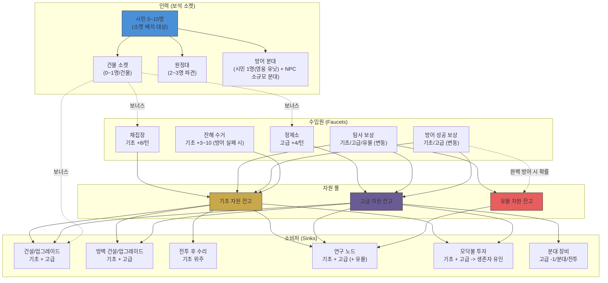
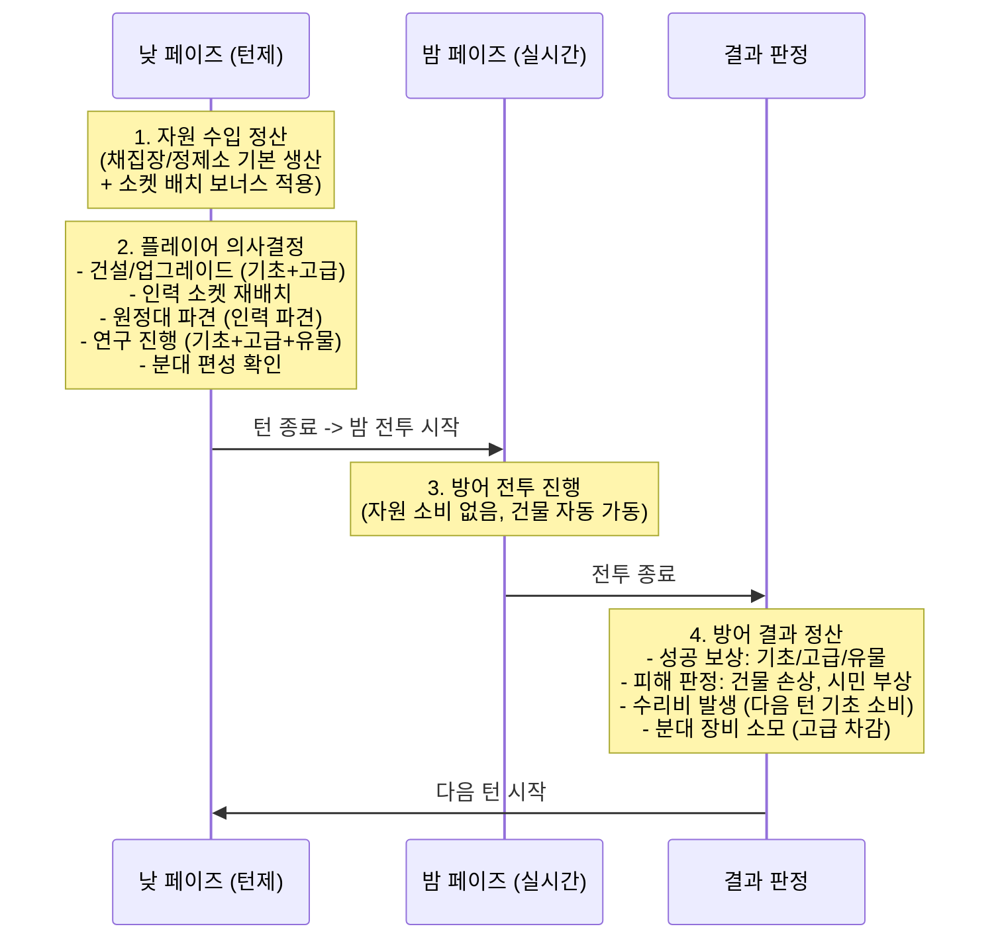
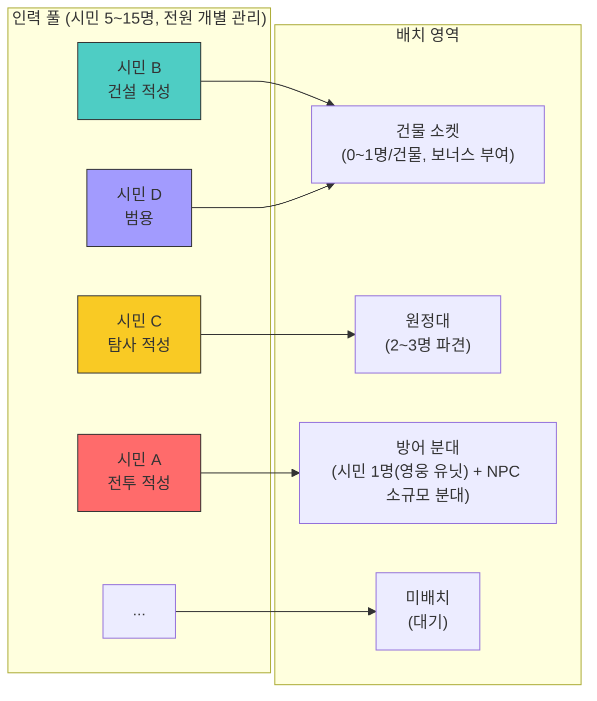

# 게임 경제 모델

- **작성일**: 2026-04-01
- **담당**: economy-designer
- **상태**: draft
- **버전**: v1.1 (희망/불만 폐기, 영웅 유닛 모델, 방벽 직선 강화, 돌파→피해 비율 용어 변경)
- **참조 문서**: Vision.md v2.4, StarCraft 2(자원 구조), Diablo(보석 소켓), Frostpunk.md, Thronefall.md
- **수치 안내**: 이 문서의 모든 수치는 **후보 수치(밸런스 테스트 시 조정)**이다. 확정이 아닌 초안이며, 프로토타입 플레이테스트에서 검증 후 확정한다.

---

## 1. 자원 정의

### 1.1 자원 총괄표

| 자원 | 역할 | SC2 비유 | 희소도 | Faucet (수입원) | Sink (소비처) | 저장 캡 |
|---|---|---|---|---|---|---|
| **기초 자원** | 모든 건설/연구/업그레이드의 기본 재화. 가장 범용적인 자원 | 미네랄 | 풍부 | 채집장, 탐사 보상, 방어 성공 보상, 잔해 수거 | 건설/업그레이드, 방벽 건설/업그레이드, 수리, 연구, 모닥불 투자 | 저장소 Lv에 따라 증가 (기본 100 -> Lv1 +60 -> Lv2 +90, 최대 250) |
| **고급 자원** | 기초와 함께 사용. 고급 건설/연구에 필수. 양을 조절하여 성장 속도를 제어하는 조절 밸브 | 가스 | 중간 | 정제소, 탐사 보상(희귀), 방어 성공 보상(소량) | 고급 건설/업그레이드, 방벽 건설/업그레이드, 고급 연구 노드, 분대 장비 | 저장소 Lv에 따라 증가 (기본 40 -> Lv1 +30 -> Lv2 +40, 최대 110) |
| **유물 자원** | 강력한 기능 해금 전용. 매우 희소하며 사용처가 엄선됨 | 없음 (특수) | 매우 희소 | 탐사 발견(주력), 방어 완벽 보상(소량), 특수 이벤트 | 엘리트 연구 노드, 특수 업그레이드, 건물 최종 분기 | 캡 없음 (희소성 자체가 제한) |

### 1.2 자원 간 관계

```
[기초 부족] --> 기본 건설/수리 불가 --> 방어력 약화 --> 전투 피해 증가
[고급 부족] --> 고급 건설/연구 불가 --> 성장 정체 (방어력 자체는 유지)
[유물 부족] --> 강력한 해금 불가 --> 후반 파워 스파이크 지연 (즉각적 위기는 아님)
```

- **직접 변환**: 불가. 자원 간 직접 교환은 존재하지 않는다.
- **간접 연동**: 기초와 고급은 대부분의 건설/연구에서 함께 소비된다. 기초만으로 가능한 행동(기본 건설, 수리)과 기초+고급이 필요한 행동(고급 건설, 업그레이드)이 분리되어, 고급 자원이 성장 속도의 조절 밸브 역할을 한다.
- **유물의 독립성**: 유물은 기초/고급과 함께 사용되지만, 유물 단독으로 소비되는 경우는 없다. 항상 기초+고급+유물의 조합이다.

### 1.3 자원별 설계 의도

| 자원 | 설계 의도 | 결핍-충족 연결 (Vision 3.2) |
|---|---|---|
| **기초 자원** | 범용 자원. 풍부하게 공급되지만 소비처가 많아 관리가 필요하다. 수리비, 건설, 연구 등 거의 모든 활동에 소비되므로 "충분하다고 느끼지만 실제로는 부족한" 상태를 유지한다. SC2 미네랄처럼 기본은 넉넉하되 모든 것에 쓰이므로 항상 바닥난다. | 결핍: "수리하려면 건설을 미뤄야 한다" / 충족: 채집장 추가, 탐사 보상 |
| **고급 자원** | 성장 속도 조절기. 기초 자원은 있지만 고급이 없어서 업그레이드를 못 하는 상황이 핵심 병목이다. SC2에서 가스가 테크 전환의 병목인 것과 동일한 역할. 생산 건물이 제한적이므로 어떤 업그레이드를 먼저 할지 우선순위 결정이 강제된다. | 결핍: "방벽을 업그레이드하고 싶지만 고급 자원이 부족" / 충족: 정제소 건설, 탐사 발견 |
| **유물 자원** | 전략적 투자 대상. 극도로 희소하며 사용처가 엘리트 연구/특수 업그레이드에 한정된다. "어디에 쓸 것인가"의 고민이 한 번의 사용마다 발생한다. 탐사의 핵심 보상이자 탐사 동기의 원천. | 결핍: "유물이 하나 있는데, A 연구에 쓸까 B 업그레이드에 쓸까" / 충족: 위험한 탐사 노드 도달, 완벽 방어 보너스 |

### 1.4 유물 자원 상세

유물 자원은 게임 경제에서 특별한 위치를 차지한다. 기초/고급이 "흐르는 자원"(턴마다 생산/소비)이라면, 유물은 "고이는 자원"(희귀하게 획득, 신중하게 사용)이다.

**획득 경로:**

| 경로 | 획득량 | 빈도 | 비고 |
|---|---|---|---|
| **탐사 발견** (주력) | 1~2개/노드 | 특정 탐사 노드(전체의 20~30%)에서 발견 | 먼 노드/위험 노드일수록 발견 확률 증가 |
| **방어 완벽 보상** | 1개 (확률 30%) | 완벽 방어 시 | 완벽 방어 인센티브. 확률이므로 보장되지 않음 |
| **특수 이벤트** | 1~3개 | 특정 인카운터 선택지 보상 | Scythe식 3선택지 중 "대가" 선택 시 유물 보상 |

**사용처:**

| 사용처 | 비용 (유물) | 함께 필요한 자원 | 효과 |
|---|---|---|---|
| **엘리트 연구 노드** | 1~2개 | 기초 20~40 + 고급 15~25 | 일반 연구보다 강력한 기능 해금 (예: 분대 특수 능력, 건물 3단계 업그레이드) |
| **특수 업그레이드** | 1개 | 기초 15~30 + 고급 10~20 | 기존 건물의 최종 분기 중 상위 옵션 해금 |
| **방벽 특수 강화** | 2개 | 기초 40 + 고급 25 | 방벽에 특수 효과 부여 (예: 접촉 피해, 감속 영역) |

**희소도 설계:**

- 25턴 기준 총 획득 예상: 6~10개 (탐사 4~6, 방어 보상 1~2, 이벤트 1~2)
- 사용 가능한 곳: 5~8군데
- 결과: 절반 이상의 사용처를 포기해야 하며, 어디에 투자할지가 핵심 전략 결정
- 인플레이션 방지: 희소성 자체가 캡 역할. 저장 캡이 별도로 필요하지 않음

---

## 2. 자원 흐름도

### 2.1 시스템 간 자원 이동 (전체)



### 2.2 턴 단위 자원 흐름 순서



**v0.2 대비 핵심 변경**: 고정 지출(시민 유지비) 단계가 제거되었다. 건물은 자동 활성화되므로 턴 시작 시 자원이 자동 차감되는 구조가 없다. 자원 소비는 플레이어의 능동적 의사결정(건설, 연구, 분대 장비)에서만 발생한다.

---

## 3. Faucet/Sink 분석

### 3.1 기초 자원 흐름

| 구간 | Faucet (수입) | Sink (지출) | 균형 상태 | 설계 의도 |
|---|---|---|---|---|
| 초반 (턴 1~5) | 채집장 1개 (+8/턴), 초기 잔고 60 | 건설 2~3건 (-12~20/건), 첫 수리(-3~5) | **변동 큼** | 초기 잔고를 소비하며 건설 순서가 핵심 의사결정. 채집장 2호 건설이 급선무 |
| 전환점 (턴 5~8) | 채집장 2개 (+16/턴), 소켓 보너스(+2~3) | 업그레이드(-15~25), 방벽 건설(-25~30), 수리(-5~10) | **대규모 지출 발생** | 방벽 건설이 초반 주요 싱크. "지금 방벽을 지을 것인가, 업그레이드를 먼저 할 것인가?" |
| 중반 (턴 8~15) | 채집장 2~3개(+16~26/턴), 소켓 보너스(+3~5), 잔해 수거(+3~6) | 업그레이드, 수리비(-8~15/턴), 연구(-10~20), 2차 확장 | **건설+연구 수요 > 수입** | 기초 자원이 풍부해 보이지만 소비처가 많아 항상 부족. 우선순위 결정 강제 |
| 후반 (턴 15~25) | 채집장 3개 업그레이드(+24~32/턴), 소켓 보너스(+4~6), 잔해 수거(+5~10) | 수리비 증가(-12~20/턴), 최종 확장(-40), 엘리트 연구 | **수리비가 주요 싱크** | 수리비 스케일링이 생산 증가를 상쇄. 잔해 수거가 데스 스파이럴 완화 |

### 3.2 고급 자원 흐름

| 구간 | Faucet (수입) | Sink (지출) | 균형 상태 | 설계 의도 |
|---|---|---|---|---|
| 초반 (턴 1~5) | 초기 잔고 20, 탐사 보상(간헐적 +2~3) | 첫 고급 건설(-5~8) | **매우 제한적** | 고급 자원은 초반에 거의 없음. 정제소 건설 시점이 핵심 |
| 전환점 (턴 5~8) | 정제소 1개 (+4/턴), 탐사 보상(+2~4) | 업그레이드(-8~15), 방벽 건설(-10~15), 분대 장비(-1~2) | **항상 부족** | 고급 자원이 성장의 병목. "어떤 업그레이드를 먼저?" |
| 중반 (턴 8~15) | 정제소 1~2개(+4~10/턴), 소켓 보너스(+1~2), 탐사(+2~4) | 고급 업그레이드(-10~20), 연구(-8~15), 분대 장비(-2~3) | **만성적 부족** | SC2에서 가스가 테크 전환 병목인 것과 동일 |
| 후반 (턴 15~25) | 정제소 2개 업그레이드(+10~16/턴), 소켓 보너스(+2~3) | 엘리트 연구, 최종 업그레이드, 분대 장비(-3~4) | **선택적 투자** | 고급 자원의 사용처를 엄선해야 함. 전략 분기점 |

### 3.3 유물 자원 흐름

| 구간 | Faucet (수입) | Sink (지출) | 균형 상태 | 설계 의도 |
|---|---|---|---|---|
| 초반 (턴 1~5) | 0~1개 (초반 탐사 보상) | 0 (사용처 미해금) | **축적 시작** | 유물의 존재를 인지시키되, 아직 사용할 곳이 없음 |
| 전환점 (턴 5~8) | 1~2개 (탐사 진행에 따라) | 0~1개 (첫 엘리트 연구 가능) | **첫 사용 판단** | "지금 쓸 것인가, 더 모을 것인가?" |
| 중반 (턴 8~15) | 2~4개 (탐사 주력 구간) | 1~3개 (엘리트 연구, 특수 업그레이드) | **핵심 의사결정** | 어디에 투자할지가 전략의 분기점 |
| 후반 (턴 15~25) | 1~3개 (남은 탐사 노드) | 2~4개 (최종 해금 경쟁) | **총량 부족 확정** | 모든 사용처를 채울 수 없음이 확정. 선택과 포기 |

### 3.4 인플레이션 체크

자원이 무한히 축적되지 않도록 다음 메커니즘이 인플레이션을 방지한다.

| 인플레이션 방지 메커니즘 | 대상 자원 | 작동 방식 |
|---|---|---|
| **저장 캡** | 기초, 고급 | 저장소 건물 레벨에 따라 최대 보유량이 제한된다. 캡을 초과하는 생산분은 소멸한다. 캡 초과 시 UI 경고 표시 |
| **웨이브 강도 스케일링** | 기초 | 후반 웨이브가 강해질수록 건물 피해가 증가하고, 수리비가 기하급수적으로 증가한다 |
| **방벽 업그레이드 비용 증가** | 기초, 고급 | 업그레이드 단계별 비용: 1차 기초25+고급10, 2차 기초35+고급20, 3차 기초45+고급30. 2차 이후 **분할 납부 가능** (2턴에 걸쳐 분할) |
| **연구 비용 스케일링** | 기초, 고급, 유물 | 후반 연구 노드일수록 비용이 증가. 엘리트 노드는 유물까지 요구 |
| **분대 장비 소모** | 고급 | 밤 전투에 투입된 분대의 장비가 소모된다. 분대 수 증가 = 고급 자원 압박 증가 |
| **유물 희소성** | 유물 | 총 획득량 자체가 제한적(25턴 기준 6~10개). 별도 캡 불필요 |
| **건물 자동 가동 + 다수 싱크** | 기초, 고급 | 유지비가 없는 대신 건설/연구/수리/분대 장비 등 다양한 싱크가 경쟁적으로 자원을 소비 |

---

## 4. 인력 보석 소켓 모델

### 4.1 인력 풀 구조 (소수 정예 5~15명)



**v0.2 대비 핵심 변경:**

- **인원 규모**: 10~25명 -> **5~15명**. 세계관상 인구가 적은 상황. 전원 개별 관리 (그룹 배치 제거)
- **건물 운영 방식**: 인력 배치 필수 -> **건물 자동 활성화**. 건설 완료 즉시 기본 기능/생산이 작동
- **인력 역할**: "건물 운영 인력" -> **"건물 소켓 보너스 제공자"**. 인력이 없어도 건물은 돌아가지만, 배치하면 보너스를 부여
- **관리 방식**: 핵심 5~8명 개별 + 나머지 그룹 -> **전원 개별 관리** (인원이 적으므로 가능)

**세계관 배경:**

모종의 이유로 세계의 인구가 극도로 줄어든 상황이다. 기지에 있는 5~15명은 각각 이름과 배경을 가진 귀중한 존재이며, 한 명의 손실이 곧 전략적 타격이다. 탐사를 통해 외부에서 생존자를 구출해오는 것이 인력 증원의 핵심 경로다.

**인력 규모 변동:**

| 구간 | 인력 수 | 증원 경로 | 비고 |
|---|---|---|---|
| 초기 | 5명 | 게임 시작 시 고정 | 각각 다른 적성 보유 |
| 턴 3~5 | 6~7명 | 첫 탐사 생존자 구출 (+1), 방어 보상 (+0~1) | 원정대 파견 시작 |
| 턴 6~10 | 8~10명 | 탐사 구출(+1~2), 방어 보상(+0~1), 모닥불(+0~1) | 소켓 배치 본격화 |
| 턴 11~20 | 10~13명 | 탐사 구출(+1~2), 방어 보상(+0~1) | 원정+방어+소켓 경쟁 심화 |
| 턴 21~25 | 12~15명 (최대) | 후반 탐사 보상, 특수 이벤트 | 전투 부상으로 가용 인력 제한 (영구 손실 없음) |

### 4.2 소켓 보너스 시스템

**핵심 개념: 디아블로 보석 소켓**

건물에는 0~1개의 인력 소켓이 있다. 시민 1명을 소켓에 배치하면, 해당 시민의 적성과 숙련도에 따른 보너스가 건물에 부여된다. 건물 자체는 소켓 없이도 기본 기능으로 작동한다.

**소켓 보너스 유형 (5종, Vision 3.4 상충 해결 원칙 준수: 8종 이하):**

| 보너스 유형 | 효과 | 적용 건물 예시 |
|---|---|---|
| **생산 증가** | 해당 건물의 기초/고급 자원 생산량 +20~50% | 채집장, 정제소 |
| **효율 개선** | 건물 운영 비용 감소 (수리비 -20~30%) 또는 연구 속도 +20~40% | 연구소, 방벽 |
| **방어 강화** | 방어 건물의 공격력/사거리/HP 증가 (+15~30%) | 감시탑, 방벽 |
| **특수 능력 해금** | 건물에 새로운 기능 추가 | 채집장(야간 채집), 감시탑(조명 효과) |
| **탐사 지원** | 원정 관련 보너스 (탐사 범위, 발견 확률 증가) | 전초 기지 |

**시민 적성 체계 (2~3종, Vision 3.4 준수: 3종 이하):**

| 적성 | 소켓 보너스 강화 영역 | 분대 보너스 |
|---|---|---|
| **전투** | 방어 건물 소켓 보너스 강화 (방어 강화 유형 +50% 효과) | 방어 분대 전투력 기여 +30% |
| **건설** | 생산/효율 건물 소켓 보너스 강화 (+50% 효과) | (분대 미적용) |
| **탐사** | 탐사 지원 소켓 보너스 강화 (+50% 효과) | 원정대 성공률/속도 +25% |

**보너스 수치 구조:**

| 항목 | 적성 불일치 시 | 적성 일치 시 | 적성 일치 + 숙련 Lv3 |
|---|---|---|---|
| 생산 증가 | +10% | +20% | +50% |
| 효율 개선 | -10% | -20% | -30% |
| 방어 강화 | +8% | +15% | +30% |
| 특수 능력 | 해금 불가 | 해금 (Lv2+) | 강화 버전 해금 |

### 4.3 숙련도 모델 (배치 시 성장)

FTL식 "쓸수록 는다" 원리를 소켓 시스템에 적용한다. 시민이 특정 건물 소켓에 배치된 채로 턴이 지나면, 해당 건물 유형에 대한 숙련도가 증가한다.

| 항목 | 스펙 | 설계 의도 |
|---|---|---|
| **숙련도 레벨** | 0(미숙) -> 1(적응) -> 2(숙련) -> 3(전문가) | 비선형 보너스: x1.0 -> x1.15 -> x1.3 -> x1.5 |
| **레벨업 소요** | Lv0->1: 2턴, Lv1->2: 3턴, Lv2->3: 4턴 (총 9턴) | 전문가 도달까지 9턴. 25턴 게임에서 중반~후반에 전문가 등장 |
| **적성 일치 가속** | 적성 일치 시 레벨업 소요 -1턴 (총 6턴으로 전문가 도달) | 적성에 맞는 배치의 추가 보상 |
| **레벨별 질적 변화** | Lv2에서 특수 능력 해금, Lv3에서 강화 버전 | 양적 보너스 + 질적 변화의 이중 보상 |
| **재배치 페널티** | 다른 건물 유형으로 이동 시 숙련도 1레벨 하락 (최저 0) | 이동의 기회비용. "옮기면 손해지만 때로는 필요하다" |

**숙련도 레벨별 질적 변화 예시:**

| 건물 유형 | Lv2 특수 능력 | Lv3 강화 |
|---|---|---|
| 채집장 | "효율 채집": 생산 시 10% 확률로 고급 자원 1 추가 획득 | "야간 채집": 밤 전투 중에도 50% 생산 유지 |
| 감시탑 | "조명 효과": 주변 방어탑 공격력 +10% | "경보 시스템": 웨이브 시작 시 적 경로 1개 추가 표시 |
| 연구소 | "병렬 연구": 연구 속도 +25% | "유레카": 연구 완료 시 15% 확률로 다음 연구 비용 -30% |
| 정제소 | "정밀 정제": 고급 자원 생산 +20% | "부산물 활용": 고급 생산 시 기초 +2 추가 획득 |

### 4.4 인력 소켓 배치 예시 (턴 10 기준, 인구 9명)

```
[총 인력: 9명]
  |
  |--> 건물 소켓 배치: 4명
  |      |- 채집장 소켓: 시민A (건설 적성, 숙련 Lv2) -- 기초 생산 +30%, 효율 채집 해금
  |      |- 정제소 소켓: 시민B (건설 적성, 숙련 Lv1) -- 고급 생산 +20%
  |      |- 감시탑 소켓: 시민C (전투 적성, 숙련 Lv2) -- 방어력 +25%, 조명 효과 해금
  |      +- 연구소 소켓: 시민D (탐사 적성, 숙련 Lv1) -- 연구 속도 +10% (적성 불일치)
  |
  |--> 방어 분대: 2분대 (시민 2명, 각각 영웅 유닛으로 NPC 분대 지휘)
  |      |- 분대1: 시민E (전투 적성) / 분대2: 시민G (전투 적성)
  |
  |--> 원정대: 2명
  |      |- 시민H (탐사 적성, 숙련 Lv2) + 시민I (범용)
  |
  |--> 미배치: 1명
  |      |- 시민F (범용)
  |
  "연구소의 시민D를 정제소로 옮기면 고급 자원이 더 나오지만,
   시민D의 연구소 숙련도(Lv1)를 잃고 정제소에서 Lv0부터 시작해야 한다.
   미배치 시민F를 분대에 배정하면 3분대로 방어력이 올라가지만,
   채집장 소켓의 시민A를 빼면 기초 자원 생산이 30% 감소한다."
```

---

## 5. 건물 경제 데이터

### 5.1 생산 건물

모든 건물은 건설 완료 시 자동 활성화된다. 소켓 배치는 선택적이며, 배치 시 보너스를 부여한다.

| 건물 | 건설 비용 | 기본 생산 (자동) | 소켓 보너스 (1명 배치 시) | 업그레이드 분기 |
|---|---|---|---|---|
| **채집장** | 기초 15 | 기초 +8/턴 | 건설 적성: 생산 +30%. Lv2: 효율 채집 해금 | A: 대형 채집장(기초 +12/턴) / B: 재활용소(기초 +9/턴, 수리비 -20%) |
| **정제소** | 기초 20 + 고급 5 | 고급 +4/턴 | 건설 적성: 생산 +30%. Lv2: 정밀 정제 해금 | A: 대형 정제소(고급 +6/턴) / B: 복합 정제소(고급 +4/턴, 기초 +3/턴) |
| **저장소** | 기초 18 | 없음 (저장 캡 증가) | 효율: 캡 +20% 추가. Lv2: 잉여 자원 경고 시스템 | A: 기초 특화(기초 캡 +60) / B: 고급 특화(고급 캡 +30) |

**업그레이드 비용:**

| 업그레이드 | 비용 | 비고 |
|---|---|---|
| 채집장 -> 대형 채집장 | 기초 20 + 고급 8 | 순수 생산 증가 |
| 채집장 -> 재활용소 | 기초 15 + 고급 10 | 방어 결과 연동형 (수리비 절감) |
| 정제소 -> 대형 정제소 | 기초 25 + 고급 12 | 고급 자원 집중 |
| 정제소 -> 복합 정제소 | 기초 20 + 고급 8 | 범용성 (기초+고급 동시 생산) |

### 5.2 방어 건물

방어 건물은 자동 가동되며, 자원을 소비하지 않는다. 소켓 배치로 전투 보너스를 부여한다.

| 건물 | 건설 비용 | 기본 효과 (자동) | 소켓 보너스 (1명 배치 시) | 업그레이드 분기 |
|---|---|---|---|---|
| **감시탑** | 기초 12 + 고급 3 | 밤 전투 시 원거리 공격 (DPS 기본값) | 전투 적성: 공격력 +25%. Lv2: 조명 효과 | A: 대형 탑(공격력 +50%) / B: 조명탑(적 이동속도 -20%, 시야 확대) |
| **방벽** | 기초 15 + 고급 5 | 적 진입 지연 (HP 기반). 자동 작동 | 전투 적성: HP +25%. Lv2: 반격 가시 | 분기 없음 (기본 -> 1차 -> 2차 -> 3차 직선 강화) |
| **병영** | 기초 25 + 고급 10 | 방어 분대 1개 편성 가능 | 전투 적성: 분대 전투력 +20%. Lv2: 분대 회복력 | A: 정예 병영(분대 전투력 +40%) / B: 민병 병영(분대 2개, 전투력 -20%) |

**방벽 건설/업그레이드 비용:**

| 업그레이드 단계 | 비용 | 분할 납부 | 효과 |
|---|---|---|---|
| 건설 (기본) | 기초 15 + 고급 5 | 불가 (일괄) | 적 진입 지연 (HP 기반), 기본 방어 |
| 1차 업그레이드 | 기초 25 + 고급 10 | 불가 (일괄) | 방어력 강화, HP/범위 증가 |
| 2차 업그레이드 | 기초 35 + 고급 20 | 가능 (2턴: 기초20+고급12 / 기초15+고급8) | HP 대폭 증가, 반격 가시 강화 |
| 3차 업그레이드 | 기초 45 + 고급 30 | 가능 (2턴: 기초25+고급18 / 기초20+고급12) | 최종 방어력, 특수 효과 극대화 |

### 5.3 특수 건물

| 건물 | 건설 비용 | 기본 효과 (자동) | 소켓 보너스 | 해금 조건 |
|---|---|---|---|---|
| **연구소** | 기초 30 + 고급 15 | 기술 트리 연구 가능 (기본 속도) | 연구 속도 +20~40%. Lv2: 병렬 연구 | 고정 슬롯 (레벨 디자이너 배치) |
| **의료소** | 기초 20 + 고급 8 | 부상 시민 회복 속도 2배 | 부상 회복 가속 +50%. Lv2: 예방 접종 (부상 확률 -15%) | 기본 해금 |
| **모닥불** | 기초 10 + 고급 3 | 생존자 유인 기능 (투자 -> 합류 확률) | 투자 효율 +30% (투자 비용 감소) | 기본 해금 |
| **전초 기지** | 기초 35 + 고급 15 | 원정 범위 확대, 탐사 속도 +20% | 탐사 적성: 탐사 범위 추가 확대, 발견 확률 +15% | 탐사 노드 특정 지점 도달 |

**모닥불 생존자 유인 메커니즘 (v0.2의 식량 투자 -> 기초/고급 투자로 변경):**

| 투자 | 비용 | 결과 | 대기 시간 |
|---|---|---|---|
| 소규모 투자 | 기초 8 + 고급 3 | 2턴 후 생존자 1명 합류 확률 50% | 2턴 |
| 대규모 투자 | 기초 15 + 고급 6 | 2턴 후 생존자 1명 합류 확률 80% | 2턴 |

---

## 6. 디자이너 조정 레버

게임 경제의 핵심 밸런스를 조정할 수 있는 파라미터를 정의한다. 이 레버들은 프로토타입 플레이테스트에서 우선 조정 대상이 된다.

### 6.1 핵심 레버 (Top 5)

| # | 레버 | 조정 대상 | 조정 범위 (후보) | 조정 시 기대 효과 |
|---|---|---|---|---|
| 1 | **턴당 기본 자원 생산량** | 채집장/정제소의 기본 생산값 | 기초 6~10, 고급 3~6 | 높이면 여유 증가(캐주얼), 낮추면 긴장감 증가(하드코어) |
| 2 | **소켓 보너스 배율** | 인력 소켓 배치 시 보너스 크기 | 기본 +10~30%, 적성 일치 +20~50% | 높이면 인력 배치의 전략적 가치 증가, 낮추면 건물 자체 성능이 중심 |
| 3 | **웨이브 피해 -> 수리비 계수** | 밤 전투 피해량을 기초 자원 수리비로 변환하는 비율 | 0.3~1.0 | 높이면 방어 실패 페널티 가중, 낮추면 회복 용이 |
| 4 | **인구 증가 속도** | 방어 보상/탐사 보상의 인구 획득 빈도와 수량 | +1명/2~4턴 | 높이면 후반 인력 여유, 낮추면 인력 희소성 강화 |
| 5 | **고급 자원 생산 대비 소비 비율** | 정제소 생산량 vs 업그레이드/분대 장비 비용 | 생산 4~6/턴, 소비 건당 5~15 | 고급 자원이 병목인 정도를 조절. 게임 템포 직결 |

### 6.2 보조 레버

| # | 레버 | 조정 대상 | 비고 |
|---|---|---|---|
| 6 | 초기 자원 잔고 | 게임 시작 시 기초/고급 보유량 | 초반 난이도 직결 |
| 7 | 숙련도 성장 속도 | 턴당 숙련도 경험 축적량 | 시민 재배치 기회비용 결정 |
| 8 | 유물 획득 빈도 | 탐사 노드의 유물 출현 비율 | 엘리트 연구 접근성 결정 |
| 9 | 건물 건설/업그레이드 비용 | 각 건물의 기초/고급 비용 | 건설 우선순위 의사결정 영향 |
| 10 | 방어 성공 보상량 | 완벽 방어/경미 피해 시 보상 차이 | 방어 인센티브 강도 |
| 11 | 방벽 업그레이드 비용 스케일링 | 업그레이드 단계별 기초/고급 비용 | 방어력 성장 속도 결정 |
| 12 | 재배치 숙련도 하락량 | 소켓 이동 시 숙련도 감소 정도 (0~2레벨) | 인력 유동성 vs 전문화 밸런스 |

### 6.3 난이도별 레버 프리셋 (후보)

| 레버 | 쉬움 | 보통 | 어려움 |
|---|---|---|---|
| 턴당 기초 생산 | 10 | 8 | 6 |
| 턴당 고급 생산 | 6 | 4 | 3 |
| 소켓 보너스 배율 | x1.2 (보너스 +20%) | x1.0 (기본) | x0.8 (보너스 -20%) |
| 수리비 계수 | 0.3 | 0.6 | 1.0 |
| 인구 증가 속도 | 빠름 (+1/2턴) | 보통 (+1/3턴) | 느림 (+1/4턴) |
| 초기 기초 잔고 | 80 | 60 | 40 |
| 초기 고급 잔고 | 30 | 20 | 10 |
| 유물 획득 빈도 | 높음 (노드 35%) | 보통 (노드 25%) | 낮음 (노드 15%) |
| 숙련도 성장 속도 | x1.5 | x1.0 | x0.75 |

---

## 7. 방어 결과와 경제 연동

### 7.1 방어 결과별 경제 효과 (Vision 4.2.1 연동)

| 방어 결과 | 보상 (수입) | 피해 (지출) | 인력 효과 |
|---|---|---|---|
| **완벽 방어** | 기초 +10~15, 고급 +4~6, 유물 +1(확률 30%), 인력 +1(확률) | 없음 | 없음 |
| **경미 피해** | 기초 +5~8, 고급 +2~3, 잔해 수거 +3~5 | 건물 1~2 손상 -> 수리비 발생 | 시민 0~1명 부상 |
| **중간 피해** | 기초 +4~6, 잔해 수거 +4~8 | 건물 3~5 손상 -> 수리비 가중 | 시민 0~1명 부상 |
| **대규모 피해** | 기초 +3~5, 잔해 수거 +5~10 | 건물 다수 손상 -> 대규모 수리 | 시민 1~2명 부상 |

**방어 결과 판정 기준:**

| 결과 | 판정 조건 |
|---|---|
| 완벽 방어 | 피해 비율 ~10% 이하 (건물 0~1개 손상, 약간의 유예) |
| 경미 피해 | 피해 비율 10~25% |
| 중간 피해 | 피해 비율 25~50% |
| 대규모 피해 | 피해 비율 50% 이상 |
| 기지 붕괴(게임오버) | 본부 HP 0 (별도 판정) |

### 7.2 수리비 스케일링

수리비는 **기초 자원**으로만 지불한다 (고급 자원 불필요). 이는 기초 자원의 "범용 소비재" 역할을 강화한다.

| 턴 구간 | 평균 웨이브 피해 (후보) | 평균 수리비 (기초) | 비고 |
|---|---|---|---|
| 턴 1~5 | 낮음 (건물 0~1 피해) | 0~5 | 초반 웨이브 약함 |
| 턴 6~10 | 중간 (건물 1~2 피해) | 5~12 | 방벽 업그레이드 필요성 대두 |
| 턴 11~15 | 높음 (건물 2~3 피해) | 12~18 | 기초 자원 압박 시작 |
| 턴 16~20 | 매우 높음 | 18~25 | 수리비가 주요 기초 자원 싱크 |
| 턴 21~25 | 극대 (최종 웨이브 포함) | 25~35 | 기초 자원 잔고 소진 위기 |

**수리비 공식 (후보):**

```
수리비 = 손상 건물 원가(기초 부분) x 수리비 계수(0.3~1.0) x 업그레이드 보정(Lv1: x1.0, Lv2: x1.3)
```

- 수리 시 업그레이드 상태는 유지된다 (재업그레이드 불필요)
- 건물은 **완전 파괴되지 않는다**. HP가 0이 되면 손상 상태로 전환되며, 수리비를 지불하여 복구한다. 수리는 플레이어 수동 지시 (→ 건설 시스템 GDD 참조)

---

## 8. 패배 조건 (v1.1 변경: 희망/불만 시스템 폐기)

v1.0의 희망/불만 게이지 시스템은 과도한 복잡도로 인해 폐기되었다.

### 8.1 게임오버 조건
- **본부 파괴 = 게임오버**. 본부 건물의 HP가 0이 되면 즉시 게임오버.
- 본부는 맵 중앙에 위치하며, 다른 건물이 먼저 손상되어야 접근 가능한 구조. --> 건설 시스템 GDD (Construction.md) 섹션 3.1 참조.
- 이외의 건물 손상은 게임오버가 아닌 "자원/기능 손실"로 처리.

### 8.2 폐기된 요소
- 희망 게이지 (0~100, 자연 감소, 이탈 트리거) — 삭제
- 불만 게이지 (0~100, 자연 증가, 생산 페널티, 반란) — 삭제
- 시민 이탈 (희망/불만 임계치 기반) — 삭제. 시민은 이탈하지 않음
- 모닥불 집회 (불만 감소 효과) — 삭제. 모닥불은 생존자 유인만 유지
- 자원 고갈 모드의 희망/불만 효과 (불만 +8/턴, 희망 -3/턴) — 삭제. 자원 고갈 시 건설/수리 불가만 유지

### 8.3 자원 고갈 모드 (v0.2 반배급 모드 재설계)

기초 자원 잔고가 0인 턴에는 즉시 게임오버가 아닌 **자원 고갈 모드**가 발동한다.

| 항목 | 효과 |
|---|---|
| 건설/업그레이드 | 불가 (기초 자원 0) |
| 수리 | 불가 (기초 자원 0) -> 손상된 건물 방치 |
| 생산 건물 | 기본 생산 유지 (건물 자동 가동이므로 생산은 계속됨) |
| 소켓 보너스 | 유지 (인력 배치는 자원을 소비하지 않음) |

**설계 의도**: 건물 자동 가동 시스템 덕분에 생산은 유지된다. 대신 건설/수리가 불가능해지면서 "방어력이 점진적으로 약화되는" 나선형 위기가 발생한다. 수리 불가 -> 건물 손상 지속 -> 본부 노출 -> 게임오버의 경로를 형성한다.

---

## 9. 데스 스파이럴 안전판

방어 실패가 회복 불가능한 경제 붕괴로 이어지는 데스 스파이럴을 방지하기 위한 메커니즘.

### 9.1 잔해 수거 시스템

| 항목 | 스펙 |
|---|---|
| **발동 조건** | 밤 전투에서 건물이 손상되었을 때 |
| **수거량** | 손상된 건물 수리비의 40~60%에 해당하는 기초 자원을 자동 획득 |
| **설계 의도** | 방어 실패 시에도 일부 기초 자원을 회수하여, 수리비 부담을 완화한다. "폐허에서 쓸 만한 것을 건져낸다"는 서사적 맥락 |
| **예시** | 건물 2개 손상 -> 수리비 기초 15 발생 -> 잔해 수거 기초 +6~9 -> 실질 수리비 기초 6~9 |

### 9.2 적응형 웨이브 약화

| 항목 | 스펙 |
|---|---|
| **발동 조건** | 연속 2턴 이상 "대규모 피해" 결과 발생 |
| **효과** | 다음 웨이브 강도 -15~20% (시각적으로 "적들도 피해를 입었다"로 표현) |
| **해제 조건** | "경미 피해" 이상의 방어 결과 달성 시 원래 강도로 복귀 |
| **설계 의도** | 자동 난이도 조절. 연속 실패 시 회복 기회를 주되, 성공하면 즉시 원래 난이도로 돌아와 긴장감 유지 |

### 9.3 비상 수리 면제

| 항목 | 스펙 |
|---|---|
| **발동 조건** | 기초 자원 잔고 0인 상태에서 건물 손상 발생 |
| **효과** | 손상된 건물 중 1개의 수리비를 50% 감면 (가장 싼 건물 우선 적용) |
| **설계 의도** | 기초 자원 0 상태에서의 추가 손상이 완전한 경제 붕괴로 이어지는 것을 방지. "최소한의 수리는 가능하다"는 회복 가능성 유지 |
| **제한** | 연속 3턴 초과 적용 불가 (지속적 의존 방지) |

### 9.4 데스 스파이럴 진행 단계와 안전판 대응

```
[1단계: 방어 실패]
  건물 손상 + 수리비 발생 (기초 자원)
  -> 안전판: 잔해 수거 (수리비의 40~60% 기초 자원 회수)

[2단계: 연속 실패]
  수리비 > 기초 수입 -> 건설/업그레이드 불가
  -> 안전판: 적응형 웨이브 약화 (-15~20%)

[3단계: 기초 자원 고갈]
  기초 0 -> 수리 불가 -> 건물 손상 지속
  -> 안전판: 비상 수리 면제 (1건 50% 감면)
  -> 건물 자동 가동은 유지 (생산은 계속됨)

[4단계: 회복 실패 (안전판 소진)]
  인력 부상 -> 소켓 보너스 감소 -> 방어력 약화
  건물 손상 지속 -> 본부 노출
  -> 게임오버: 본부 HP 0
```

**v0.2 대비 변경**: 건물 자동 가동 덕분에 "인력 감소 -> 생산 감소"의 직접적 데스 스파이럴이 완화되었다. 인력이 부상당해도 건물 기본 생산은 유지된다. 대신 소켓 보너스 감소 -> 방어력/생산 보너스 약화 -> 건물 손상 -> 본부 노출이라는 완만한 하락 곡선이 형성된다. 이는 의도적 설계로, 데스 스파이럴의 기울기를 완화하여 회복 기회를 넓힌다.

---

## 10. 연구 시스템과 자원 연동

### 10.1 기본 노드 (기초 + 고급)

대부분의 연구 노드는 기초와 고급 자원의 조합으로 연구한다.

| 연구 티어 | 비용 (기초) | 비용 (고급) | 소요 턴 | 예시 |
|---|---|---|---|---|
| Tier 1 (기초) | 10~15 | 5~8 | 1턴 | 채집 효율화, 기본 방어 강화 |
| Tier 2 (중급) | 20~30 | 10~15 | 2턴 | 건물 업그레이드 해금, 분대 장비 개선 |
| Tier 3 (고급) | 35~50 | 20~30 | 2~3턴 | 고급 건물 해금, 방벽 특수 기능 |

### 10.2 강력한 노드 (기초 + 고급 + 유물)

엘리트 연구 노드는 유물 자원을 추가로 요구한다. 이 노드들은 일반 노드보다 현저히 강력한 효과를 제공한다.

| 연구 노드 (후보) | 비용 | 효과 | 비고 |
|---|---|---|---|
| **정예 분대 훈련** | 기초 30 + 고급 20 + 유물 1 | 방어 분대 전투력 +30%, 특수 능력 해금 | 전투 특화 |
| **고급 정제 기술** | 기초 25 + 고급 15 + 유물 1 | 정제소 생산 +40%, 부산물 활용 해금 | 경제 특화 |
| **원정 마스터리** | 기초 20 + 고급 15 + 유물 1 | 원정 속도 +50%, 유물 발견 확률 +20% | 탐사 특화 |
| **방벽 마스터 설계** | 기초 40 + 고급 25 + 유물 2 | 방벽 HP x2, 자동 수리(턴당 HP 5% 회복) | 방어 특화 (고비용) |

### 10.3 연구 비용 스케일링

연구 비용은 티어가 올라갈수록 비선형으로 증가하여 인플레이션을 방지한다.

```
비용 공식 (후보):
  기초 비용 = 기본값 x (1.3 ^ 티어)
  고급 비용 = 기본값 x (1.4 ^ 티어)
  유물 비용 = 엘리트 노드에만 고정(1~2개)
```

**연구 속도 보정:**

| 조건 | 속도 보정 |
|---|---|
| 연구소 기본 | x1.0 |
| 연구소 + 소켓 배치 (건설 적성) | x1.2~1.4 |
| 연구소 소켓 Lv2 (병렬 연구) | x1.5 |

---

## 11. 방어 분대 유지비 모델

밤 전투에 투입되는 방어 분대의 경제적 비용을 정의한다.

### 11.1 분대 유지비 구조

| 비용 항목 | 수량 | 타이밍 | 비고 |
|---|---|---|---|
| **장비 소모** | 고급 -1/분대/전투 | 밤 전투 결과 정산 시 | 무기/방어구 마모. 대규모 피해 시 x1.5 |
| **부상 치료비** | 기초 -3/부상자 | 다음 턴 자동 차감 | 의료소가 있으면 기초 -2로 감소 |
| **부상** | 회복 필요 (의료소 가속) | 다음 낮부터 비활성 | 부상 중 소켓/분대 배치 불가. 회복 후 복귀. 영구 손실 없음 (→ 인력 GDD 참조) |

**v0.2 대비 변경**: "전투 식량" 비용 제거 (식량 자원 폐기). 분대 유지비는 고급 자원(장비)과 기초 자원(치료)으로 단순화.

### 11.2 분대 수에 따른 경제 부담

| 분대 수 | 인력 소요 | 장비 소모 (고급) | 부상 치료 (기초, 평균) | 총 추가 비용/턴 |
|---|---|---|---|---|
| 1분대 (시민 1명) | 시민 1명 (영웅 유닛) | 고급 -1 | 기초 -1~3 | 고급 1 + 기초 1~3 |
| 2분대 (시민 2명) | 시민 2명 (각각 영웅 유닛) | 고급 -2 | 기초 -2~6 | 고급 2 + 기초 2~6 |

**설계 의도**: 소수 정예(5~15명) 구조에서 시민을 분대에 배치하면 소켓 보너스에 쓸 인력이 줄어든다. 각 분대는 시민 1명(영웅 유닛)이 NPC 소규모 분대를 이끄는 구조이며, 분대 편성 자체가 "방어 vs 경제 보너스"의 트레이드오프다. 장비 소모(고급 자원)는 추가적인 경제 부담을 부여한다.

---

## 12. 경제 리스크 및 미결 사항

| # | 리스크/미결 사항 | 영향 | 해결 방향 |
|---|---|---|---|
| 1 | 건물 자동 가동이 긴장감을 줄일 수 있음 | 자원 관리 긴장감 감소 | 다양한 싱크(건설/연구/수리/장비)로 자원 경쟁 유지. 소켓 보너스의 전략적 가치로 보완 |
| 2 | 고급 자원 병목이 지나치면 게임 템포 정체 | 플레이어 답답함 | 정제소 생산량(레버 5) 조정. 탐사 보상에 고급 포함 |
| 3 | 유물 자원이 너무 희소하면 사용 결정이 과도한 부담 | 선택 마비 | 유물 획득 빈도(레버 8) 조정. 사용처별 효과 차이를 명확히 하여 비교 용이 |
| 4 | 소수 정예(5~15명)에서 1명 부상이 너무 가혹할 수 있음 | 좌절감 | 적응형 웨이브 약화 + 데스 스파이럴 안전판으로 완화. 난이도별 부상 확률 조정 |
| 5 | 소켓 보너스 유형이 5종으로 충분한 의사결정을 만드는지 미검증 | 단조로움 | 프로토타입에서 검증. 부족 시 숙련도 Lv2/Lv3 특수 능력으로 깊이 보강 |
| 6 | 자원명 세계관 반영 미결 | 몰입감 | 콘텐츠 디자인 단계에서 결정 (예: 기초 -> 물자, 고급 -> 정수, 유물 -> 유산) |
| 7 | 시민 유지비 제거로 "인구 증가 = 순수 이득" 문제 | 인구 확장 인센티브 과도 | 건물 소켓이 제한적(1명/건물)이므로 인구 자체보다 적성/숙련도가 중요. 추가로 주거 슬롯 제한 검토 |
| 8 | 모닥불 투자의 기대값이 탐사 대비 열등하면 사용되지 않음 | 사장 메커니즘 | 모닥불은 "확실한 투자"(자원으로 인력 구매), 탐사는 "불확실한 발견"으로 차별화 |

---

## 부록: 레퍼런스 경제 비교

| 항목 | Frostpunk | SC2 | Thronefall | Project_Sun (v1.0) |
|---|---|---|---|---|
| 자원 종류 | 4종 (석탄/목재/철/식량) | 2종 (미네랄/가스) | 1종 (골드) | 3종 (기초/고급/유물) |
| 핵심 희소 자원 | 석탄 (열 관리) | 가스 (테크 병목) | 골드 (단일) | 고급 자원 (성장 병목) + 유물 (전략 투자) |
| 인력 시스템 | 있음 (직군 분류, 다수) | 없음 (유닛은 자원) | 없음 | **소수 정예 소켓 시스템** (5~15명, 건물에 1명 배치) |
| 건물 가동 | 인력 필수 | 해당 없음 | 자동 | **자동** (소켓 배치는 보너스) |
| 자원 캡 | 없음 (무제한 축적) | 없음 | 없음 | 있음 (저장소 레벨) |
| 인플레이션 방지 | 온도 심화 (석탄 소비 증가) | 유닛 소모 | 적 스케일링 | 웨이브 수리비 + 연구 비용 스케일링 + 분대 장비 |
| 인구 경제 | 인구 유입 이벤트 (대규모) | 해당 없음 | 없음 | 점진적 증가 (탐사/방어/모닥불), 전원 개별 관리 |
| 세션 길이 | 4~8시간 | 15~30분 | 20~40분 | 1~2시간 |
| 경제 복잡도 | 중 | 낮음~중 | 매우 낮음 | 낮음~중 |
