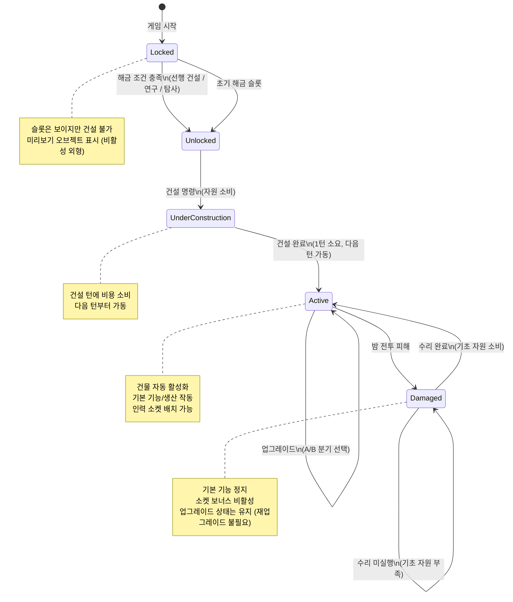
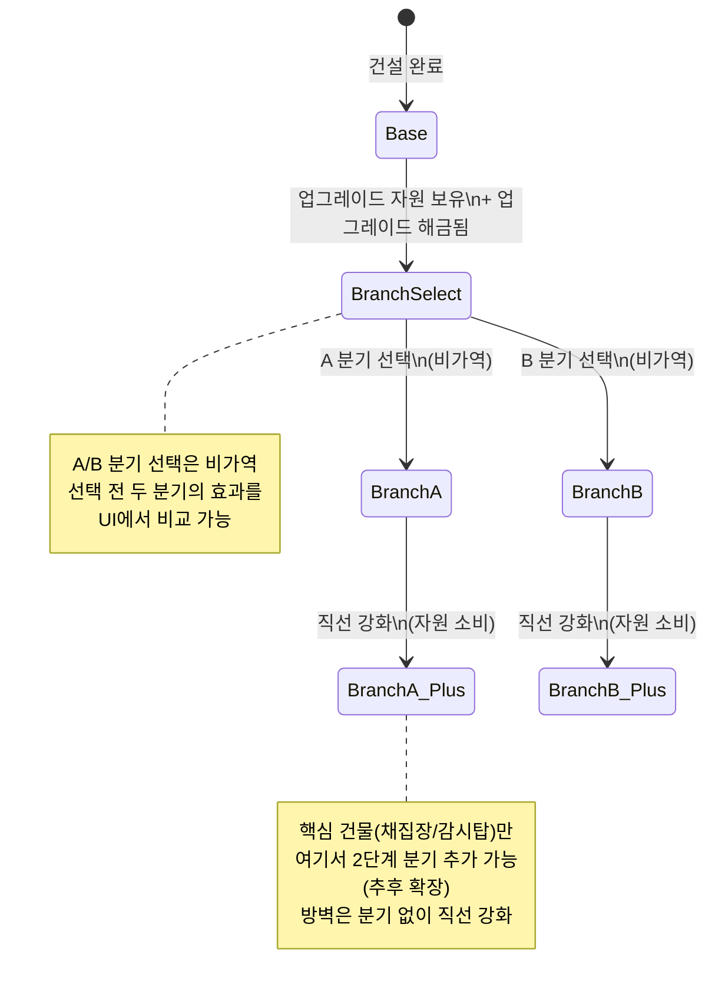
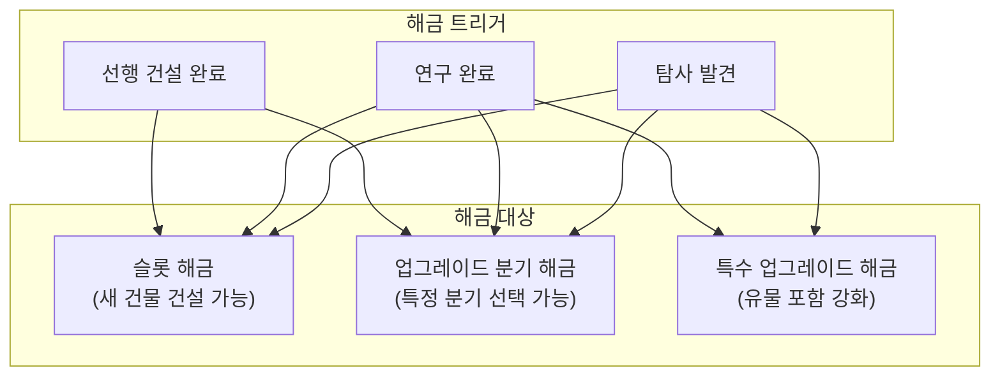
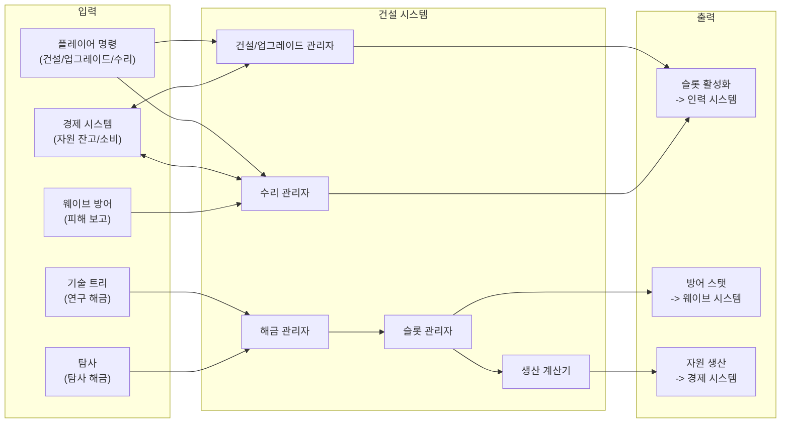

# 건설 시스템 GDD

- **작성일**: 2026-04-02
- **담당**: system-designer-v2
- **상태**: draft
- **버전**: v0.2
- **우선순위**: P0-core
- **참조 문서**: Vision.md v2.6, Economy-Model.md v1.0, Per-Turn-Budget.md v1.0, Cross-Reference-Matrix.md revision-4
- **수치 안내**: 이 문서의 건물 비용/효과 수치는 Economy-Model.md에서 인용한 **후보 수치(밸런스 테스트 시 조정)**이다.

---

## 1. 시스템 개요

### 1.1 Why / Objective / Volume / Detail

| 항목 | 내용 |
|---|---|
| **Why** | 플레이어에게 "기지를 관리한다"는 느낌의 핵심. 매 턴 건설/업그레이드 결정이 선택의 긴장감을 생성한다. 건물 하나를 지을 때마다 기지가 눈에 띄게 성장하며, 그 성장이 밤 전투의 생존 여부로 직결된다 |
| **Objective** | 고정 슬롯에 사전 지정된 건물을 건설/업그레이드하여 기지의 생산력/방어력/탐사력을 결정한다. 플레이어는 "무엇을 지을지"가 아닌 "언제 지을지"와 "어떤 방향으로 업그레이드할지"를 결정한다 |
| **Volume** | 건물 10종 + 본부(게임 시작 시 존재) 확정 (생산 2종 + 지원 1종 + 방어 3종 + 특수 4종 + 본부 1종). 업그레이드 분기 1~2단계 (방벽은 직선 강화). 기지당 슬롯 15~25개 (레벨 디자인에 따라 가변) |
| **Detail** | 고정 슬롯에 고정된 건물이 지정되어 있으며, 건설 완료 시 자동 활성화된다. 대부분의 건물은 A/B 분기 후 직선 강화 구조를 따르며, 방벽만 분기 없이 직선 강화(기본->1차->2차->3차)를 따른다. 건설 비용은 기초+고급 자원 2종이 기본이며, 특수 업그레이드에만 유물이 추가된다. 인력 소켓 배치는 건설 시스템이 아닌 인력 관리 시스템의 영역이다 |

### 1.2 핵심 경험

플레이어가 느껴야 하는 감정의 흐름:

1. **탐색과 기대** (턴 1~3): "다음에 뭘 지을 수 있지?" -- 슬롯을 살펴보며 건설 순서를 계획
2. **선택의 긴장감** (턴 4~9): "방벽을 먼저 지어야 하나, 정제소를 먼저 지어야 하나?" -- 자원이 부족한 상태에서 우선순위 결정
3. **분기의 고민** (턴 10~15): "대형 채집장이 좋을까, 재활용소가 좋을까?" -- 업그레이드 방향이 기지의 성격을 결정
4. **성장의 쾌감** (건설 완료마다): 스케일팝 + 파티클 + 사운드로 한 클릭의 권능감 전달
5. **수리 우선순위** (전투 후): "감시탑을 먼저 수리할까, 채집장을 먼저 수리할까?" -- 제한된 기초 자원으로 수리 순서 결정

### 1.3 Vision 연결

| Vision 요소 | 연결 방식 |
|---|---|
| **핵심 재미 1: 선택의 긴장감** | 매 턴 건설 순서와 업그레이드 분기 선택이 "사람을 미치게 만드는" 의사결정을 생성 |
| **핵심 재미 3: "한 턴만 더"** | "이번 턴에 방벽을 짓고, 다음 턴에 업그레이드하면..." -- 건설 계획이 다음 턴에 대한 호기심을 유발 |
| **디자인 필터 3.4: 건설=미니멀** | Thronefall 고정 슬롯 채택. 자유 배치 없음. 건설 단계에서 유물 자원 요구 없음 (업그레이드에서만 사용) |
| **"하지 않을 것": 자유 배치 건설** | 고정 슬롯이 진입 장벽 최소화의 핵심 (Vision 3.5) |
| **"하지 않을 것": 전투 중 건설** | 낮/밤 이원 구조의 핵심 원칙. 건설은 낮 페이즈에서만 가능 (Vision 3.5) |
| **3기둥 루프 연결** | 내정(건설) -> 방어(밤 전투력 직결), 탐사 -> 내정(해금/정보) |

### 1.4 5질문 필터 통과 확인

| # | 질문 | 답변 | 통과 |
|---|---|---|---|
| 1 | 핵심 재미를 강화하는가? | 선택의 긴장감, "한 턴만 더" 중독성의 직접적 원천 | 통과 |
| 2 | 진입 장벽을 높이지 않는가? | 고정 슬롯으로 Thronefall 수준의 최소 복잡도. 탭 점진적 해금(1일차 건설만)으로 학습 부담 분산 | 통과 |
| 3 | 내정-탐사-방어 3기둥 중 하나에 속하는가? | 내정 기둥의 핵심 | 통과 |
| 4 | 구현 비용 대비 플레이어 경험 가치는? | P0-core. 건설 없이 게임이 성립하지 않음 | 통과 |
| 5 | 빼도 게임이 성립하는가? | 아니오. 건설이 없으면 기지 경영의 핵심이 사라짐 | 통과 |

### 1.5 "하지 않을 것" 준수 확인

| "하지 않을 것" 항목 | 본 시스템에서의 준수 |
|---|---|
| 자유 배치 건설 | 고정 슬롯 = 고정 건물. 위치 선택 자유도 없음 |
| 전투 중 건물 건설 | 건설은 낮 페이즈에서만 가능 |
| 건설 단계에서 유물 요구 | 기초 건설은 기초+고급만. 유물은 특수 업그레이드에서만 사용 |
| RimWorld급 복잡도 | 건물 10종 + 본부, 업그레이드 2단계. Thronefall 수준의 미니멀리즘 |

---

## 2. 슬롯 시스템

### 2.1 핵심 원칙: 고정 슬롯 = 고정 건물

건설 시스템의 핵심 단순화 장치. Thronefall에서 직접 차용한 패턴이다.

- 각 슬롯에는 어떤 건물이 들어가는지 **미리 결정**되어 있다
- 플레이어는 "이 슬롯에 뭘 지을까"를 선택하지 않는다
- 플레이어의 의사결정은 **"언제 지을지"** (건설 타이밍)와 **"어떤 방향으로 업그레이드할지"** (분기 선택)에 집중된다
- 슬롯의 물리적 위치와 건물 할당은 **레벨 디자이너가 결정**한다 (본 GDD의 범위 밖)

### 2.2 슬롯 데이터 스키마

레벨 디자이너가 기지마다 설정하는 슬롯 데이터 구조.

```
SlotDefinition {
    slotId: string              // 고유 식별자 (예: "slot_gather_01")
    buildingType: BuildingType  // 이 슬롯에 건설되는 건물 종류 (예: GATHER)
    position: Vector3           // 월드 좌표 (레벨 데이터에서 설정)
    rotation: float             // 건물 회전 (레벨 데이터에서 설정)
    isInitiallyUnlocked: bool   // 게임 시작 시 해금 여부
    prerequisiteSlotIds: string[] // 선행 슬롯 (이 슬롯들의 건물이 건설되어야 해금)
    prerequisiteResearch: string[] // 선행 연구 노드 (이 연구가 완료되어야 해금)
    prerequisiteExploration: string[] // 선행 탐사 노드 (이 탐사 결과가 있어야 해금)
    visualPreviewPrefab: string // 건설 전 미리보기 오브젝트 (비활성 외형)
}
```

### 2.3 슬롯 해금 체인

슬롯은 처음부터 모두 열려 있지 않다. 게임 진행에 따라 점진적으로 해금된다.

**해금 트리거 유형:**

| 트리거 | 설명 | 예시 |
|---|---|---|
| **초기 해금** | 게임 시작 시 이미 해금된 슬롯 | 첫 채집장, 첫 감시탑 (3~5개) |
| **선행 건설** | 특정 슬롯의 건물을 건설하면 연관된 다른 슬롯이 해금 | 1번 채집장 건설 -> 2번 채집장 슬롯 해금 |
| **연구 해금** | 연구소에서 특정 연구를 완료하면 슬롯이 해금 | "고급 채집 기술" 연구 -> 3번 채집장 슬롯 해금 |
| **탐사 해금** | 탐사에서 기술/도면을 발견하면 슬롯이 해금 | 탐사 노드에서 "정제 도면" 발견 -> 정제소 슬롯 해금 |

**해금 체인 예시 (개념적 -- 구체적 값은 레벨 데이터에서 설정):**

```
[초기 해금]
  |- 채집장 1호 (초기)
  |- 감시탑 1호 (초기)
  |- 모닥불 (초기)
  +- 의료소 (초기)

[선행 건설 해금]
  |- 채집장 1호 건설 -> 채집장 2호 해금
  |- 감시탑 1호 건설 -> 방벽 1호 해금
  |- 방벽 1호 건설 -> 방벽 근처 방어 건물 해금
  +- 채집장 2호 건설 -> 정제소 해금

[연구 해금]
  |- "병영 설계도" 연구 완료 -> 병영 슬롯 해금
  +- "전초 기지 설계" 연구 완료 -> 전초 기지 슬롯 해금

[탐사 해금]
  |- 탐사 노드 "폐허 연구실" 도달 -> 연구소 슬롯 해금 (또는 특정 업그레이드 분기 해금)
  +- 탐사 노드 "고대 유적" 도달 -> 특수 건물/업그레이드 분기 해금
```

**해금의 범위**: 연구/탐사 해금은 슬롯 전체일 수도 있고, 특정 건물의 **업그레이드 분기**만 해금할 수도 있다. 예: 탐사에서 "정밀 정제 기술"을 발견하면 정제소의 B분기(복합 정제소)가 해금된다.

### 2.4 슬롯 상태 머신



**완전 파괴는 없다**: 건물은 "손상 상태"로 전환될 뿐 완전히 사라지지 않는다. 수리하면 원래 상태(업그레이드 포함)로 복구된다.

---

## 3. 건물 카탈로그

### 3.1 건물 종류 총괄 (10종 + 본부)

| 분류 | 건물 | 건설 비용 | 핵심 역할 |
|---|---|---|---|
| **핵심** | 본부 (HQ) | 없음 (게임 시작 시 존재) | 기지의 핵심 건물. HP 0 = 게임오버 |
| **생산** | 채집장 | 기초 15 | 기초 자원 생산 |
| **생산** | 정제소 | 기초 20 + 고급 5 | 고급 자원 생산 |
| **지원** | 저장소 | 기초 18 | 자원 저장 캡 증가 |
| **방어** | 감시탑 | 기초 12 + 고급 3 | 밤 전투 원거리 공격 |
| **방어** | 방벽 | 기초 15 + 고급 5 | 적 진입 지연 (HP 기반) |
| **방어** | 병영 | 기초 25 + 고급 10 | 방어 분대 편성 |
| **특수** | 연구소 | 기초 30 + 고급 15 | 기술 트리 연구 |
| **특수** | 의료소 | 기초 20 + 고급 8 | 부상 시민 회복 |
| **특수** | 모닥불 | 기초 10 + 고급 3 | 생존자 유인 |
| **특수** | 전초 기지 | 기초 35 + 고급 15 | 탐사 범위/속도 확장 |

**건물 10종 + 본부(특수) 확정.** 본부는 게임 시작 시 맵 중앙에 존재하며, 플레이어가 건설/파괴할 수 없다. 본부 HP 0 = 게임오버. 추가 건물은 추후 확장 가능하나, 현재 10종 + 본부가 MVP 확정 목록이다.

#### 본부 (HQ) — 핵심 건물

| 항목 | 값 |
|---|---|
| 건설 비용 | 없음 (게임 시작 시 맵 중앙에 존재) |
| 건설/파괴 | 불가 (플레이어가 건설하거나 파괴할 수 없음) |
| HP | 다른 건물보다 높음 (후보 수치, 밸런스 조정 대상) |
| 기본 효과 | 기지의 핵심 건물. HP 0 = 게임오버 |
| 업그레이드 | 없음 (추후 확장 가능) |
| 소켓 | 없음 |
| 수리 | 가능 (다른 건물과 동일하게 수리비 지불) |
| 특수 규칙 | 본부만 "파괴" 가능한 유일한 건물. 다른 건물은 "손상" 상태로 전환될 뿐 사라지지 않는다 |
| 설계 의도 | 점진적 패배 모델의 종착점. 외곽 건물부터 손상 -> 방어력 약화 -> 본부 위협 증가 -> 본부 파괴 = 게임오버. 적이 본부까지 도달하려면 외곽 건물을 먼저 돌파해야 하므로, 플레이어에게 회복 기회를 제공한다 |

### 3.2 생산 건물 상세

모든 건물은 건설 완료 시 **자동 활성화**된다. 소켓 배치는 선택적이며 보너스만 부여한다. 소켓 보너스 상세는 -> [인력 관리 시스템] GDD 참조.

#### 채집장

| 항목 | 값 |
|---|---|
| 건설 비용 | 기초 15 |
| 기본 생산 (자동) | 기초 +8/턴 |
| 소켓 보너스 요약 | 건설 적성: 생산 +30%. Lv2: "효율 채집" 해금 (10% 확률로 고급 자원 1 추가). Lv3: "야간 채집" (밤 전투 중 50% 생산 유지) |
| 업그레이드 분기 | A: 대형 채집장 / B: 재활용소 |
| 설계 의도 | 가장 기본적인 경제 건물. 초반 2~3턴 내 2호 건설이 기초 자원 안정화의 핵심. 기초 자원만으로 건설 가능하여 진입 장벽 최소화 |

#### 정제소

| 항목 | 값 |
|---|---|
| 건설 비용 | 기초 20 + 고급 5 |
| 기본 생산 (자동) | 고급 +4/턴 |
| 소켓 보너스 요약 | 건설 적성: 생산 +30%. Lv2: "정밀 정제" (고급 +20%). Lv3: "부산물 활용" (고급 생산 시 기초 +2 추가) |
| 업그레이드 분기 | A: 대형 정제소 / B: 복합 정제소 |
| 설계 의도 | 고급 자원의 유일한 안정적 생산원. 건설에 고급 5가 필요하여 초기 잔고(20)에서 투자 타이밍을 결정해야 한다. SC2의 가스 추출기와 동일한 역할 -- 테크 전환의 게이트키퍼 |

#### 저장소

| 항목 | 값 |
|---|---|
| 건설 비용 | 기초 18 |
| 기본 효과 (자동) | 자원 저장 캡 증가 |
| 소켓 보너스 요약 | 효율: 캡 +20% 추가. Lv2: 잉여 자원 경고 시스템 |
| 업그레이드 분기 | A: 기초 특화 (기초 캡 +60) / B: 고급 특화 (고급 캡 +30) |
| 설계 의도 | 저장 캡 초과 시 생산분이 소멸하므로, 생산 인프라 확대 전에 캡을 먼저 올려야 하는 구조. 기초 캡 100은 턴 7~9에 도달하므로 그 전에 건설이 필요 |

### 3.3 방어 건물 상세

방어 건물은 밤 전투 시 자동 가동되며, 운영에 자원을 소비하지 않는다.

#### 감시탑

| 항목 | 값 |
|---|---|
| 건설 비용 | 기초 12 + 고급 3 |
| 기본 효과 (자동) | 밤 전투 시 원거리 공격 (DPS 기본값) |
| 소켓 보너스 요약 | 전투 적성: 공격력 +25%. Lv2: "조명 효과" (주변 방어탑 공격력 +10%). Lv3: "경보 시스템" (웨이브 시작 시 적 경로 1개 추가 표시) |
| 업그레이드 분기 | A: 대형 탑 (공격력 +50%) / B: 조명탑 (적 이동속도 -20%, 시야 확대) |
| 설계 의도 | 타워디펜스의 기본 뼈대. 밤 전투 DPS의 핵심 원천이며, 배치 위치가 방어 라인의 효율을 결정 |

#### 방벽

| 항목 | 값 |
|---|---|
| 건설 비용 | 기초 15 + 고급 5 |
| 기본 효과 (자동) | 적 진입 지연 (HP 기반). 자동 작동 |
| 소켓 보너스 요약 | 전투 적성: HP +25%. Lv2: "반격 가시" |
| 업그레이드 | 직선 강화: 기본 -> 1차 -> 2차 -> 3차 (분기 없음) |
| 설계 의도 | 건설 시스템 내의 일반 건물로 취급. 다른 건물과 동일한 건설/업그레이드/수리 규칙을 따른다 |

**방벽은 A/B 분기 없이 직선 강화만 존재한다** (기본 -> 1차 -> 2차 -> 3차). 섹션 4 참조.

방벽 업그레이드 비용 스케일링 (Economy-Model.md 섹션 5.2):

| 업그레이드 단계 | 비용 | 분할 납부 | 효과 |
|---|---|---|---|
| 건설 (기본) | 기초 15 + 고급 5 | 불가 (일괄) | 적 진입 지연, 기본 방어 |
| 1차 업그레이드 | 기초 25 + 고급 10 | 불가 (일괄) | 방어력 강화, HP/범위 증가 |
| 2차 업그레이드 | 기초 35 + 고급 20 | 가능 (2턴) | HP 대폭 증가, 반격 가시 강화 |
| 3차 업그레이드 | 기초 45 + 고급 30 | 가능 (2턴) | 최종 방어력, 특수 효과 극대화 |

#### 병영

| 항목 | 값 |
|---|---|
| 건설 비용 | 기초 25 + 고급 10 |
| 기본 효과 (자동) | 방어 분대 1개 편성 가능 |
| 소켓 보너스 요약 | 전투 적성: 분대 전투력 +20%. Lv2: 분대 회복력 |
| 업그레이드 분기 | A: 정예 병영 (분대 전투력 +40%) / B: 민병 병영 (분대 2개, 전투력 -20%) |
| 설계 의도 | 분대 편성을 위한 전제 건물. 분대 편성/운용 상세는 -> [웨이브 방어 시스템] GDD 참조 |

### 3.4 특수 건물 상세

#### 연구소

| 항목 | 값 |
|---|---|
| 건설 비용 | 기초 30 + 고급 15 |
| 기본 효과 (자동) | 기술 트리 연구 가능 (기본 속도) |
| 소켓 보너스 요약 | 연구 속도 +20~40%. Lv2: "병렬 연구" (연구 속도 x1.5). Lv3: "유레카" (연구 완료 시 15% 확률로 다음 연구 비용 -30%) |
| 해금 조건 | 고정 슬롯 (레벨 디자이너 배치) |
| 설계 의도 | 게임 내 가장 비싼 단일 건물(기초30+고급15). 건설 타이밍이 전략의 핵심 분기점. 기술 트리 상세는 -> [기술 트리 시스템] GDD 참조 |

#### 의료소

| 항목 | 값 |
|---|---|
| 건설 비용 | 기초 20 + 고급 8 |
| 기본 효과 (자동) | 부상 시민 회복 속도 2배, 부상 치료비 기초 -3 -> -2로 감소 |
| 소켓 보너스 요약 | 부상 회복 가속 +50%. Lv2: "예방 접종" (부상 확률 -15%) |
| 해금 조건 | 기본 해금 |
| 설계 의도 | 소수 정예(5~15명) 체계에서 시민 1명의 부상이 전략적 타격. 의료소는 인력 손실에 대한 보험 |

#### 모닥불

| 항목 | 값 |
|---|---|
| 건설 비용 | 기초 10 + 고급 3 |
| 기본 효과 (자동) | 생존자 유인 투자 거점 |
| 소켓 보너스 요약 | 투자 효율 +30% (투자 비용 감소) |
| 해금 조건 | 기본 해금 |
| 설계 의도 | 생존자 유인 투자의 거점. 모닥불 집회(기초 5 + 고급 2)로 생존자를 유인한다. 가장 저렴한 건물(기초 10 + 고급 3) |

#### 전초 기지

| 항목 | 값 |
|---|---|
| 건설 비용 | 기초 35 + 고급 15 (후보 -- 비용 미확정) |
| 기본 효과 (자동) | 원정 범위 확대, 탐사 속도 +20% |
| 소켓 보너스 요약 | 탐사 적성: 탐사 범위 추가 확대, 발견 확률 +15% |
| 해금 조건 | 탐사 노드 특정 지점 도달 |
| 설계 의도 | 탐사/원정 시스템의 확장 건물. 탐사 상세는 -> [탐사/원정 시스템] GDD 참조 |

---

## 4. 업그레이드 시스템

### 4.1 분기 구조 원칙

업그레이드는 **1단계 A/B 분기 후 직선 강화**를 기본 구조로 한다.

```
[기본 건물]
     |
   건설 완료 (자동 활성화)
     |
  ┌──┴──┐
  A분기   B분기     <-- 1단계 분기: 방향성 선택 (택 1, 비가역)
  |       |
  A+      B+       <-- 직선 강화: 선택한 분기의 수치 강화
```

- **1단계 분기**: A와 B 중 택 1. 비가역적 선택. 건물의 특성을 결정하는 전략적 의사결정
- **직선 강화 (A+ / B+)**: 선택한 분기의 수치를 강화. 추가 분기 없이 직선 업그레이드
- **핵심 건물 예외**: 채집장, 감시탑은 2단계 분기까지 가능 (아래 4.2 참조). 방벽은 분기 없이 직선 강화(기본 -> 1차 -> 2차 -> 3차)

**설계 근거**: 다단계 분기 트리(최종 4갈래 이상)는 건물 수 x 분기 수의 조합이 과도한 밸런싱 복잡도와 아트 리소스를 요구한다. 1단계 분기 + 직선 강화가 "의미 있는 선택"과 "관리 가능한 복잡도"의 균형점이다.

### 4.2 핵심 건물의 2단계 분기

채집장, 감시탑은 게임의 핵심 축(생산/방어)을 담당하므로 2단계 분기까지 허용한다. 방벽은 분기 없이 직선 강화(기본 -> 1차 -> 2차 -> 3차)를 따른다.

```
[채집장] (예시)
     |
  ┌──┴──┐
  A: 대형 채집장        B: 재활용소
  (기초 +12/턴)        (기초 +9/턴, 수리비 -20%)
  |                    |
  ┌──┴──┐            ┌──┴──┐
  A1: 광산형           A2: 자동화형      B1: 전장 수거      B2: 자원 순환
  (추후 확장)          (추후 확장)        (추후 확장)         (추후 확장)
```

**현재 GDD에서 2단계 분기의 구체적 효과는 확정하지 않는다.** 1단계 분기의 밸런스가 검증된 후 2단계를 설계한다. MVP/프로토타입에서는 1단계 분기까지만 구현한다.

### 4.3 업그레이드 비용 체계

업그레이드 비용은 Economy-Model.md 섹션 5에 정의된 후보 수치를 따른다.

#### 생산 건물 업그레이드 비용

| 업그레이드 | 비용 | 효과 |
|---|---|---|
| 채집장 -> 대형 채집장 (A) | 기초 20 + 고급 8 | 기초 생산 +8 -> +12/턴 |
| 채집장 -> 재활용소 (B) | 기초 15 + 고급 10 | 기초 생산 +9/턴, 수리비 -20% |
| 정제소 -> 대형 정제소 (A) | 기초 25 + 고급 12 | 고급 생산 +4 -> +6/턴 |
| 정제소 -> 복합 정제소 (B) | 기초 20 + 고급 8 | 고급 +4/턴 유지, 기초 +3/턴 추가 |

#### 방어 건물 업그레이드 비용

감시탑, 병영은 1단계 분기 비용만 확정. 방벽은 3단계까지 정의 (Economy-Model.md 섹션 5.2).

| 업그레이드 | 비용 | 효과 |
|---|---|---|
| 감시탑 -> 대형 탑 (A) | 후보 (밸런스 테스트 시 확정) | 공격력 +50% |
| 감시탑 -> 조명탑 (B) | 후보 (밸런스 테스트 시 확정) | 적 이동속도 -20%, 시야 확대 |
| 병영 -> 정예 병영 (A) | 후보 (밸런스 테스트 시 확정) | 분대 전투력 +40% |
| 병영 -> 민병 병영 (B) | 후보 (밸런스 테스트 시 확정) | 분대 2개, 전투력 -20% |

#### 특수 업그레이드 (유물 자원 요구)

특수 업그레이드는 유물 자원을 추가로 요구한다. 이 경로는 연구/탐사 해금 후에만 접근 가능하다.

| 업그레이드 | 비용 | 효과 | 해금 조건 |
|---|---|---|---|
| 방벽 특수 강화 | 기초 40 + 고급 25 + 유물 2 | 방벽 직선 강화 최종 단계에 특수 효과 부여 (접촉 피해, 감속 영역) | 엘리트 연구 노드 완료 |
| 건물 최종 분기 상위 옵션 | 기초 15~30 + 고급 10~20 + 유물 1 | 기존 분기의 강화된 버전 | 탐사 발견 또는 엘리트 연구 |

### 4.4 업그레이드 상태 머신



### 4.5 업그레이드 소요 시간

모든 업그레이드는 건설과 동일하게 **1턴 소요**한다. 업그레이드 턴에 비용을 소비하고, 다음 턴부터 강화된 효과가 적용된다. 업그레이드 중에도 건물의 기본 기능은 유지된다 (생산 중단 없음).

---

## 5. 해금 시스템

### 5.1 해금 메커니즘 총괄

건물/업그레이드의 해금은 3가지 경로를 통해 이루어진다. 모든 경로는 **데이터 기반**으로 레벨 디자이너가 기지마다 다르게 설정할 수 있다.



### 5.2 슬롯 해금 체인 (선행 건설 기반)

가장 기본적인 해금 경로. 특정 슬롯의 건물을 건설하면 연관된 다른 슬롯이 자동 해금된다.

**레벨 디자이너 인터페이스:**

```
UnlockChainDefinition {
    sourceSlotId: string         // 선행 슬롯 (이 슬롯의 건물을 건설하면)
    targetSlotIds: string[]      // 해금되는 슬롯들
    requireUpgradeLevel: int     // (선택) 선행 슬롯이 특정 업그레이드 레벨에 도달해야 해금 (0 = 건설만으로 해금)
}
```

**설계 규칙:**

- 순환 의존 금지: A -> B -> A 같은 순환 체인은 허용되지 않는다
- 동일 종류 건물 체인: 채집장 1호 -> 채집장 2호 -> 채집장 3호 식의 동일 종류 체인이 가능하다
- 이종 건물 체인: 감시탑 건설 -> 방벽 해금 식의 이종 체인도 가능하다
- 모든 체인은 레벨 데이터에서 설정하며, 시스템은 체인 구조만 제공한다

### 5.3 연구 해금

연구소에서 특정 연구 노드를 완료하면 건물 슬롯이나 업그레이드 분기가 해금된다. 연구 시스템 상세는 -> [기술 트리 시스템] GDD 참조.

```
ResearchUnlockDefinition {
    researchNodeId: string       // 완료해야 할 연구 노드
    unlockedSlotIds: string[]    // 해금되는 슬롯들
    unlockedBranches: {          // 해금되는 업그레이드 분기들
        buildingType: BuildingType
        branchId: string         // "A" 또는 "B"
    }[]
}
```

### 5.4 탐사 해금

탐사에서 기술/도면을 발견하면 건물 슬롯이나 업그레이드 분기가 해금된다. 탐사 시스템 상세는 -> [탐사/원정 시스템] GDD 참조.

```
ExplorationUnlockDefinition {
    explorationNodeId: string    // 도달해야 할 탐사 노드
    discoveryType: string        // 발견물 종류 ("blueprint", "technology", "ancient_relic")
    unlockedSlotIds: string[]    // 해금되는 슬롯들
    unlockedBranches: {          // 해금되는 업그레이드 분기들
        buildingType: BuildingType
        branchId: string
    }[]
}
```

---

## 6. 수리 시스템

### 6.1 손상 모델

밤 전투에서 적이 방벽을 넘어 건물에 도달하면 건물이 **손상 상태**로 전환된다.

| 항목 | 규칙 |
|---|---|
| **완전 파괴 여부** | **없음.** 건물은 손상 상태로 전환될 뿐 사라지지 않는다. 단, 본부만 예외: 본부 HP 0 = 게임오버 (섹션 3.1 본부 참조) |
| **손상 상태 효과** | 건물의 기본 기능 정지. 소켓 보너스 비활성. 업그레이드 상태는 보존됨 |
| **생산 건물 손상 시** | 해당 건물의 자원 생산이 중단된다 |
| **방어 건물 손상 시** | 다음 밤 전투에서 해당 건물이 방어에 참여하지 못한다 |
| **복수 건물 동시 손상** | 피해 규모에 따라 1~다수 건물이 동시에 손상될 수 있다 |

### 6.2 수리 비용 구조

수리비는 **기초 자원**으로만 지불한다 (Economy-Model.md 섹션 7.2).

**수리비 공식 (후보):**

```
수리비 = 파괴 건물 원가(기초 부분) x 수리비 계수(0.3~1.0) x 업그레이드 보정(Lv1: x1.0, Lv2: x1.3)
```

- 수리비 계수는 디자이너 조정 레버 #3 (Economy-Model.md 섹션 6.1)
- 수리 시 업그레이드 상태는 유지된다 (재업그레이드 불필요)

**턴 구간별 수리비 스케일링 (후보, 보통 난이도):**

| 턴 구간 | 평균 웨이브 피해 | 평균 수리비 (기초) |
|---|---|---|
| 턴 1~5 | 건물 0~1 피해 | 0~5 |
| 턴 6~10 | 건물 1~2 피해 | 5~12 |
| 턴 11~15 | 건물 2~3 피해 | 12~18 |
| 턴 16~20 | 높음 | 18~25 |
| 턴 21~25 | 극대 (Final Wave 포함) | 25~35 |

### 6.3 수리 우선순위 의사결정

수리는 **플레이어 수동 지시**로 이루어진다. 자동 수리는 존재하지 않는다.

**이것이 의사결정인 이유:**

기초 자원이 충분하지 않은 상태에서 여러 건물이 동시에 손상되면, "어떤 건물을 먼저 수리할 것인가"가 핵심 의사결정이 된다.

| 수리 우선순위 상황 | 트레이드오프 |
|---|---|
| 채집장 vs 감시탑 | 경제 회복(채집장) vs 방어력 복구(감시탑) |
| 방벽 vs 병영 | 패시브 방어(방벽) vs 분대 방어(병영) |
| 업그레이드된 건물 vs 기본 건물 | 수리비가 더 비싸지만 효과도 큰 건물 vs 저렴한 건물 |

**수리 흐름:**

```
[밤 전투 종료]
    |
[피해 판정: 건물 N개 손상]
    |
[다음 턴 시작]
    |
[플레이어 수리 지시]
  |- 건물 A 수리 (기초 X 소비) -> 다음 턴 복구
  |- 건물 B 수리 (기초 Y 소비) -> 다음 턴 복구
  +- 건물 C 수리 보류 (기초 부족) -> 계속 비활성
```

### 6.4 데스 스파이럴 안전판 (수리 관련)

수리 시스템과 연동되는 데스 스파이럴 안전판은 Economy-Model.md 섹션 9에 정의되어 있다.

| 안전판 | 수리 연관 효과 |
|---|---|
| **잔해 수거** | 건물 손상 시 수리비의 40~60%에 해당하는 기초 자원 자동 회수 |
| **비상 수리 면제** | 기초 자원 0인 상태에서 손상 발생 시, 1개 건물 수리비 50% 감면 |
| **건물 자동 가동** | 손상되지 않은 건물은 인력 없이도 기본 생산을 유지하여 경제 붕괴 속도를 완화 |

---

## 7. 건설 시점 다양성

"같은 건물 10종(본부 제외)인데 매번 같은 순서로 짓는 것 아닌가?"에 대한 답변. 3가지 메커니즘이 건설 타이밍의 다양성을 보장한다.

### 7.1 기지별 차이 (레벨 디자인)

- 각 기지마다 초기 슬롯 구성이 다르다
- 기지 A는 채집장 2개 + 감시탑 1개로 시작하고, 기지 B는 채집장 1개 + 감시탑 2개 + 방벽 1개로 시작할 수 있다
- 슬롯 해금 체인도 기지마다 다르게 설정할 수 있다
- 이 차이가 기지별 건설 순서와 전략을 다르게 만든다

### 7.2 웨이브 사전 정보 대응

- "다음 밤에 남쪽에서 대규모 공격"이라는 사전 정보가 주어지면, 남쪽 방향의 방어 건물 건설/업그레이드를 우선해야 한다
- 사전 정보의 상세도는 탐사 수준에 따라 달라진다
- 웨이브 방향/구성이 매 턴 변하므로, 대응 건설의 우선순위도 매 턴 달라진다
- 웨이브 사전 정보 상세는 -> [웨이브 방어 시스템] GDD 참조

### 7.3 탐사 연동

- 탐사에서 발견한 기술/도면이 특정 건물이나 업그레이드 분기를 해금한다
- 탐사 경로에 따라 해금되는 건물/분기가 달라지므로, 건설 계획이 탐사 결과에 의존한다
- 예: 탐사 경로 A에서는 "정밀 정제 기술"을 발견하여 정제소 B분기(복합 정제소)가 해금되고, 탐사 경로 B에서는 "고급 감시 기술"을 발견하여 감시탑 B분기(조명탑)가 해금된다
- 탐사 시스템 상세는 -> [탐사/원정 시스템] GDD 참조

---

## 8. UI/UX

### 8.1 슬롯 중심 UI 흐름

건설 UI는 **슬롯 클릭 기반**이다. 건물 목록에서 선택하는 것이 아니라, 맵 위의 슬롯을 직접 클릭한다.

```
[맵 화면]
    |
[슬롯 클릭]
    |
  ┌─── 잠긴 슬롯 ───┐
  |  "해금 조건 표시"  |
  |  (선행 건물, 연구, |
  |   탐사 등)        |
  └──────────────────┘
    |
  ┌─── 해금된 슬롯 (미건설) ───┐
  |  건물 정보 패널:              |
  |  - 건물 이름/설명             |
  |  - 건설 비용 (보유량 대비)     |
  |  - 건설 후 기대 효과          |
  |  - [건설] 버튼               |
  └──────────────────────────┘
    |
  ┌─── 건설된 슬롯 (활성) ────────────────────┐
  |  건물 상태 패널:                              |
  |  - 현재 생산/효과 수치                        |
  |  - 소켓 배치 상태 (배치된 시민 정보)           |
  |  - 업그레이드 가능 여부                       |
  |    ├─ [A분기 업그레이드] 비용, 효과 미리보기    |
  |    └─ [B분기 업그레이드] 비용, 효과 미리보기    |
  └─────────────────────────────────────────┘
    |
  ┌─── 손상된 슬롯 ────┐
  |  - 수리 비용 표시     |
  |  - [수리] 버튼       |
  |  - 수리 후 복구 상태  |
  └────────────────────┘
```

### 8.2 건설/업그레이드 피드백

건물 배치/업그레이드 시 즉각적인 감각 피드백을 제공한다 (Vision 2.1 "건물 배치 피드백" 준수).

| 피드백 유형 | 트리거 | 효과 |
|---|---|---|
| **스케일 팝** | 건설/업그레이드 완료 | 건물이 0에서 목표 크기로 탄력적으로 확대 |
| **파티클** | 건설/업그레이드 완료 | 건물 주변 먼지/빛 파티클 방출 |
| **사운드** | 건설/업그레이드 완료 | 망치질/건축 효과음 + 완료 팡파르 |
| **수리 피드백** | 수리 완료 | 파손 이펙트 소멸 + 복구 사운드 |
| **해금 알림** | 새 슬롯 해금 | 해금된 슬롯 위치에 빛 기둥 + UI 알림 |

### 8.3 자원 부족 피드백

| 상황 | UI 표시 |
|---|---|
| 건설 비용 미달 | [건설] 버튼 비활성 + 부족 자원 빨간색 표시 |
| 저장 캡 근접 | 자원 바 옆 경고 아이콘 |
| 수리비 미달 | [수리] 버튼 비활성 + "기초 자원 N 부족" 표시 |

---

## 9. 다른 시스템과의 연동

### 9.1 인터페이스 계약 테이블

| 연동 시스템 | 방향 | 데이터 | 트리거 |
|---|---|---|---|
| **인력 관리 시스템** | 건설 -> 인력 | `SlotActivated(slotId, buildingType)` | 건설 완료 시. 인력 시스템에 새 소켓 슬롯이 열렸음을 통보 |
| **인력 관리 시스템** | 건설 <- 인력 | `SocketBonusApplied(slotId, bonusType, value)` | 인력 소켓 배치 시. 건설 시스템은 소켓 보너스를 수신하여 건물 효과에 반영 |
| **인력 관리 시스템** | 건설 -> 인력 | `SlotDamaged(slotId)` | 건물 손상 시. 해당 소켓의 시민을 미배치 상태로 전환 |
| **인력 관리 시스템** | 건설 -> 인력 | `SlotRepaired(slotId)` | 건물 수리 완료 시. 소켓이 다시 배치 가능해짐을 통보 |
| **웨이브 방어 시스템** | 건설 -> 웨이브 | `DefenseBuildingStats(slotId, attackPower, range, hp)` | 밤 전투 시작 시. 방어 건물의 현재 스탯을 웨이브 시스템에 전달 |
| **웨이브 방어 시스템** | 건설 <- 웨이브 | `BuildingDamageReport(slotIds[])` | 밤 전투 종료 시. 손상된 건물 목록을 수신하여 손상 상태로 전환 |
| **경제 시스템** | 건설 -> 경제 | `ResourceProduction(resourceType, amount)` | 매 턴 시작 시. 활성 생산 건물의 자원 생산량을 경제 시스템에 전달 |
| **경제 시스템** | 건설 <- 경제 | `ResourceConsumed(resourceType, amount)` | 건설/업그레이드/수리 시. 자원 소비를 경제 시스템에 요청 |
| **기술 트리 시스템** | 건설 <- 기술트리 | `ResearchUnlock(unlockedSlotIds[], unlockedBranches[])` | 연구 완료 시. 해금된 슬롯/분기 정보를 수신 |
| **탐사/원정 시스템** | 건설 <- 탐사 | `ExplorationUnlock(unlockedSlotIds[], unlockedBranches[])` | 탐사 발견 시. 해금된 슬롯/분기 정보를 수신 |

### 9.2 의존 시스템 (건설 시스템이 필요로 하는 시스템)

| 시스템 | 의존 내용 |
|---|---|
| **경제 시스템** | 자원 잔고 조회, 자원 소비/생산 처리 |
| **기술 트리 시스템** | 연구 기반 해금 트리거 수신 |
| **탐사/원정 시스템** | 탐사 기반 해금 트리거 수신 |
| **웨이브 방어 시스템** | 전투 후 건물 피해 보고 수신 |

### 9.3 피의존 시스템 (건설 시스템에 의존하는 시스템)

| 시스템 | 의존 내용 |
|---|---|
| **인력 관리 시스템** | 건설 완료된 건물에만 소켓 배치 가능. 건물 손상 시 소켓 비활성 통보 수신 |
| **웨이브 방어 시스템** | 방어 건물의 스탯(공격력/사거리/HP)이 밤 전투의 방어력을 결정 |
| **경제 시스템** | 생산 건물의 자동 생산이 턴별 자원 수입의 핵심 원천 |

### 9.4 데이터 흐름 다이어그램



---

## 10. 밸런스 가이드

### 10.1 핵심 파라미터 (Economy-Model.md 섹션 6 연동)

이 파라미터들은 Economy-Model.md의 디자이너 조정 레버와 연동된다. 모든 수치는 후보 수치이다.

| 파라미터 | 범위 | 기본값 | 설명 | Economy-Model 레버 |
|---|---|---|---|---|
| 건설 소요 시간 | 1턴 (고정) | 1턴 | 건설 턴에 비용 소비, 다음 턴 가동 | -- |
| 채집장 기본 생산 | 6~10 | 8 | 기초 자원 /턴 | 레버 #1 |
| 정제소 기본 생산 | 3~6 | 4 | 고급 자원 /턴 | 레버 #1 |
| 수리비 계수 | 0.3~1.0 | 0.6 | 건물 원가 대비 수리비 비율 | 레버 #3 |
| 업그레이드 보정 (수리) | Lv1: x1.0, Lv2: x1.3 | -- | 업그레이드된 건물일수록 수리비 증가 | -- |
| 초기 해금 슬롯 수 | 3~5개 | 레벨 데이터 | 게임 시작 시 건설 가능한 슬롯 | -- |
| 건물 건설/업그레이드 비용 | Economy-Model.md 섹션 5 참조 | -- | 각 건물별 기초+고급 비용 | 레버 #9 |

### 10.2 밸런스 기준

| 기준 | 목표 | 검증 방법 |
|---|---|---|
| **초반 건설 리듬** | 턴 1~3에 매 턴 1건 이상 건설 가능 | Per-Turn-Budget.md 턴 1~3 검증 |
| **중반 자원 압박** | 턴 10~15에 "건설 vs 업그레이드 vs 수리" 트레이드오프 발생 | 기초+고급 동시 부족 구간 확인 |
| **수리비 스케일링** | 후반 수리비가 기초 생산의 60~80% 수준 | 기초 수입 대비 수리비 비율 확인 |
| **업그레이드 분기 균형** | A/B 분기 중 한쪽이 압도적이지 않음 | 플레이테스트에서 A/B 선택 비율 50:50 근접 확인 |
| **해금 페이싱** | 새 슬롯이 2~3턴마다 1개 해금 | 25턴 기준 해금 슬롯 총 수 15~20개 |

---

## 11. 엣지 케이스

| 상황 | 처리 방법 |
|---|---|
| 자원 부족으로 건설 불가한 턴이 연속됨 | [건설] 버튼 비활성 + "자원이 부족합니다" 툴팁. 이 상태가 3턴 이상 지속되면 UI 알림("자원 생산을 늘려보세요") |
| 모든 슬롯이 건설 완료됨 | 건설 탭에서 업그레이드/수리만 표시. "모든 건물이 건설되었습니다" 상태 표시 |
| 해금 조건이 연구+탐사 복합인 슬롯 | 모든 조건이 충족되어야 해금. UI에서 각 조건의 달성 여부를 개별 표시 |
| 업그레이드 중 건물이 손상됨 | 업그레이드는 진행 중 취소되지 않는다. 건설 소요가 1턴이므로 건설 턴에 손상이 발생하는 경우는 없다 (건설은 낮, 손상은 밤). 이미 업그레이드된 건물이 손상 -> 수리 시 업그레이드 상태 유지 |
| 손상된 건물을 업그레이드 시도 | 손상 상태에서는 업그레이드 불가. "먼저 수리해야 합니다" 안내 |
| 저장 캡 초과 상태에서 생산 | 캡을 초과하는 생산분은 소멸. UI에서 "자원이 넘치고 있습니다" 경고 표시 |
| 수리비가 기초 잔고보다 많은 건물이 여러 개 | 부분 수리 불가 (건물별 일괄 수리). 저렴한 건물부터 수리 가능 여부 표시 |
| 방벽 분할 납부 중 자원 고갈 | 분할 1/2 완료 후 2/2를 납부하지 못하면 1/2 상태가 유지된다. 납부 시까지 현재 업그레이드 단계의 효과만 적용 |
| 선행 슬롯의 건물이 손상된 상태에서 후속 슬롯 | 선행 슬롯의 건설이 완료된 적이 있으면 해금 유지. 손상 상태가 해금을 취소하지 않는다 |

---

## 12. 참고 자료

| 레퍼런스 | 적용 방식 | 차용 요소 | 출처 |
|---|---|---|---|
| **Thronefall** | 직접 | 고정 슬롯 건설, 업그레이드 분기 2~3단계, 배치 피드백(스케일팝+파티클+사운드), 진입 장벽 최소화 | Cross-Reference-Matrix 섹션 2, 14 |
| **Frostpunk** | 변형 | 수리의 경제적 영향, 점진적 해금 패턴 | Cross-Reference-Matrix 섹션 2 |
| **StarCraft 2** | 영감 | 자원 2종(미네랄/가스) 구조를 기초/고급 자원에 적용, 정제소=가스 추출기의 병목 역할 | Economy-Model.md 섹션 1.1 |
| **Rising Demacia** | 영감 | 고정 슬롯 건설의 캐주얼 UX, 점진적 해금, 사전 정보 공개 패턴 | Cross-Reference-Matrix 섹션 0.3 |

---

## 부록 A: 건설 순서 레퍼런스 (Per-Turn-Budget.md 기반)

Per-Turn-Budget.md에서 시뮬레이션된 "보통 난이도, 경미 피해 가정"의 건설 순서를 참고용으로 기재한다. 이 순서는 최적 해가 아닌 밸런스 검증용 레퍼런스이다.

| 턴 | 건설/투자 | 비용 (기초+고급) | 비고 |
|---|---|---|---|
| 1 | 채집장 2호 | B15 | 기초 생산 확보 (경제 기반) |
| 2 | 감시탑 | B12 + A3 | 방어력 확보 (첫 밤 대비) |
| 4 | 정제소 | B20 + A5 | 고급 생산 시작 (턴 5 가동) |
| 6 | 방벽 건설 | B15 + A5 | 방어력 확보 |
| 7 | 저장소 | B18 | 기초 캡 100 -> 160 |
| 8 | 모닥불 | B10 + A3 | 집회 기능 해금 |
| 10 | 연구소 | B30 + A15 | 가장 비싼 단일 건물 |
| 12 | 채집장 업그레이드 | B20 + A8 | 기초 생산 +8 -> +12 (턴 13 적용) |
| 14 | 병영 | B25 + A10 | 2분대 편성 가능 (턴 15 가동) |
| 17 | 정제소 업그레이드 | B25 + A12 | 고급 생산 +4 -> +6 (턴 18 적용) |
| 19 | 방벽 업그레이드 분할 1/2 | B20 + A12 | 엘리트 연구 병행 (유물 1 소비) |
| 21 | 방벽 업그레이드 분할 2/2 | B15 + A8 | 모닥불 집회 병행 |

---

## 부록 B: 건설 시스템 검증 체크리스트

프로토타입 단계에서 건설 시스템의 핵심 가설을 검증하기 위한 체크리스트.

| # | 검증 가설 | 검증 방법 | 성공 기준 |
|---|---|---|---|
| 1 | 건설 순서 결정이 유의미한 의사결정인가? | 플레이테스트에서 건설 순서를 바꿔도 결과가 달라지는지 확인 | 최소 3가지 이상의 유효한 건설 순서가 존재 |
| 2 | 업그레이드 분기가 균형 잡혀 있는가? | A/B 분기 선택 비율 추적 | 30:70 이내 (어느 한쪽이 70% 이상 선택되지 않음) |
| 3 | 수리 의사결정이 긴장감을 주는가? | 수리 순서를 바꿔도 결과가 달라지는지 확인 | 턴 15+ 이후 수리 순서에 따른 승률 차이 존재 |
| 4 | 해금 페이싱이 적절한가? | 새 슬롯 해금 간격 측정 | 2~3턴마다 1개 해금, 동시 해금 과다(3개+) 없음 |
| 5 | 고정 슬롯이 지루하지 않은가? | 기지 3개 이상에서 건설 패턴 비교 | 기지마다 상이한 건설 순서/전략이 관찰됨 |
