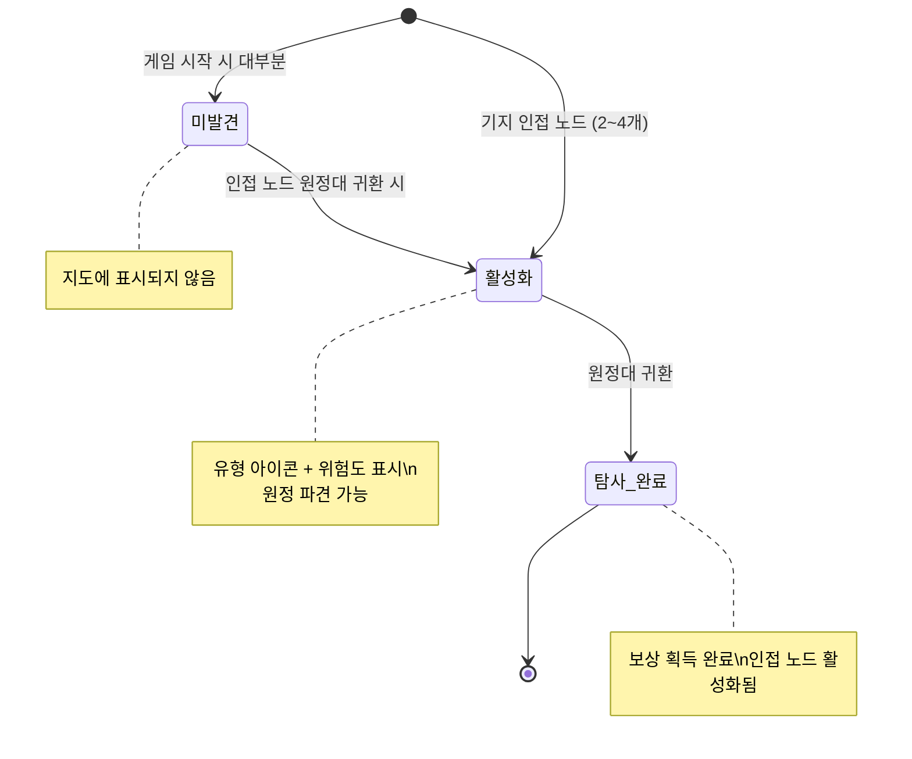
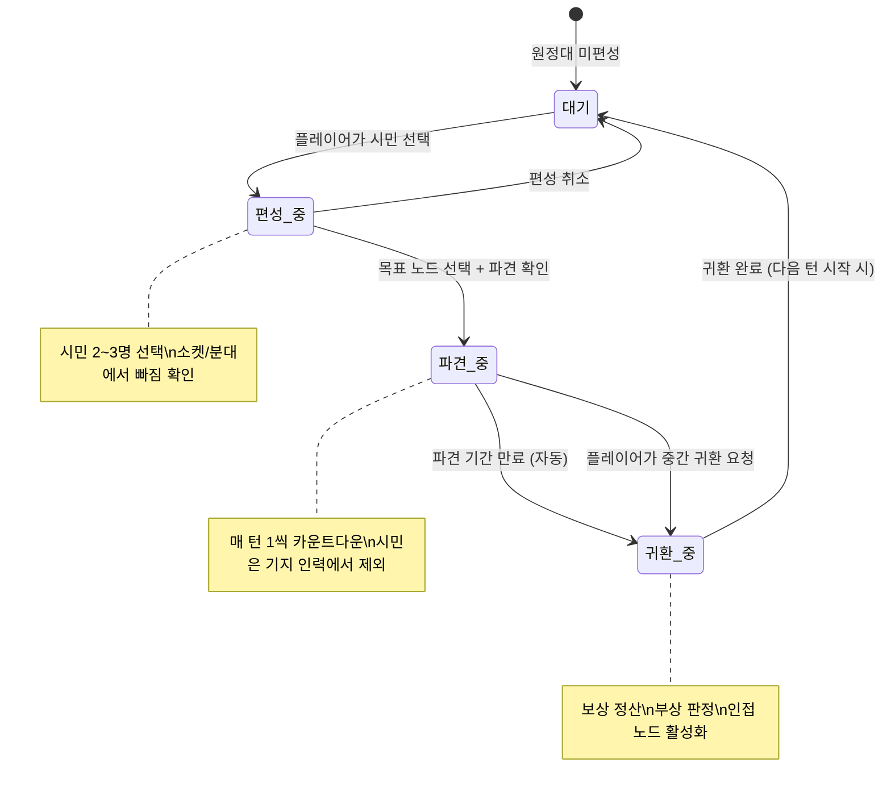
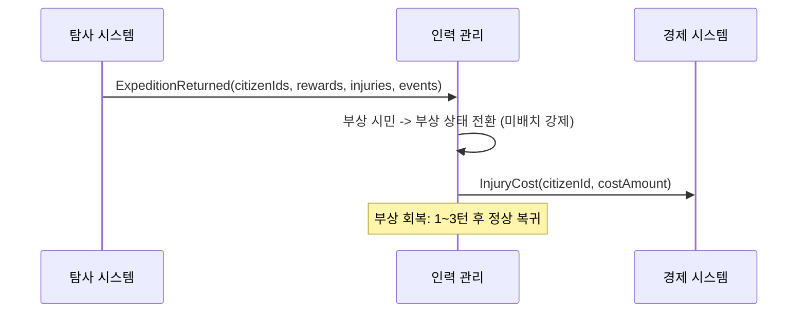
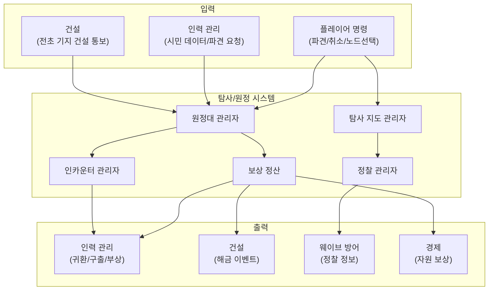

# 탐사/원정 시스템 GDD

- **작성일**: 2026-04-02
- **상태**: draft
- **slug**: exploration
- **버전**: v0.2
- **담당**: system-designer-v2
- **참조 문서**: Vision.md (v2.5), Economy-Model.md (v0.3), Per-Turn-Budget.md, Workforce.md (v0.1), Construction.md (v0.1), WaveDefense.md (v0.1), Cross-Reference-Matrix.md

---

## 1. 시스템 개요

### 1.1 목적 (Why)

탐사/원정 시스템은 내정-탐사-방어 3기둥 루프에서 **"정보와 자원의 외부 공급원"** 역할을 한다. 플레이어는 기지 내부의 건설/인력 관리로 밤 방어를 준비하는 동시에, 기지 외부로 원정대를 파견하여 정보를 수집하고 자원을 확보한다. 탐사의 핵심 비용은 자원이 아닌 **인력의 부재**이며, 이 기회비용 구조가 "탐사 vs 내정" 트레이드오프를 만든다.

### 1.2 핵심 경험

| 감정 | 발생 시점 | 설계 수단 |
|---|---|---|
| **호기심** | 새 노드가 드러날 때 | 안개 해제 연출 + 노드 유형 미리보기 |
| **발견의 기쁨** | 원정대가 유물/생존자를 가지고 귀환할 때 | 귀환 보고 연출 + 즉시 배치 가능한 시민 |
| **정보 기반 의사결정** | 적 웨이브 구성을 확인하고 방어를 준비할 때 | 정찰 정보 -> 웨이브 미리보기 상세도 증가 |
| **고뇌** | 원정대를 보내면 기지 인력이 줄어들 때 | 소켓/분대에서 빠지는 시민의 부재감 |
| **긴장** | 위험 노드에 원정대를 보낼지 결정할 때 | 높은 보상 vs 부상 확률 |

### 1.3 Vision 연결

| 연결 대상 | 연결 방식 |
|---|---|
| **3기둥 중 "탐사" 기둥** | 탐사 기둥의 핵심이자 유일한 시스템. 내정->방어의 인과관계를 풍성하게 하는 제3기둥 (Vision 4.3) |
| **필러: 호기심 + 선택의 긴장감** | 탐사/정찰 결과로 새로운 정보가 드러날 때의 호기심 충족 (Vision 2.1). 원정대 파견 vs 기지 인력 유지의 선택 긴장감 (Vision 2.2) |
| **결핍-충족 이론** | 정보 부족(적 구성 미지)이 의도적 결핍. 탐사로 부분 해소가 충족 수단 (Vision 3.2) |
| **핵심 재미: Mastery(Strategy)** | 탐사 경로 선택, 원정 타이밍 결정이 전략적 사고의 대상 (Vision 1.4) |
| **핵심 재미: Discovery** | 노드 탐사로 기술/유물/생존자 발견 (Vision 1.4 Immersion-Discovery) |
| **인카운터 이원화** | 중요 인카운터(Scythe식 3선택지)가 탐사 노드에서 발생 (Vision 4.4) |

### 1.4 Volume/Detail

| 항목 | 내용 |
|---|---|
| **Volume** | 노드 맵 20~40 노드/기지. 인카운터 이벤트 50~100종 (P1 콘텐츠) |
| **Detail** | 노드 그래프 맵에서 원정대를 직선 이동으로 파견. 인접 노드 활성화(안개 해제). 중요 인카운터는 Scythe식 3선택지 |
| **레퍼런스** | Frostpunk(Frostland 노드 탐험) -- 직접 차용, Scythe(3선택지 이벤트) -- 직접 차용 |
| **리스크** | 노드 맵 콘텐츠 양. 탐사와 내정 간 인력 배분 밸런스 |
| **우선순위** | P0-full (프로토타입에서는 3~5노드 + 고정 이벤트 3개 스텁) |

---

## 2. 탐사 지도

### 2.1 노드 그래프 구조

탐사 지도는 Frostpunk의 Frostland를 직접 차용한 **노드 그래프 맵**이다. 기지당 20~40개의 노드가 배치되며, 노드 간 연결(엣지)은 레벨 디자이너가 데이터로 정의한다.

```
[기지]
  |
  +-- 노드 A (자원, 안전) ---- 노드 D (생존자, 보통)
  |                              |
  +-- 노드 B (정찰, 안전) ---- 노드 E (기술, 위험) ---- 노드 G (유물, 위험)
  |                              |
  +-- 노드 C (자원, 보통) ---- 노드 F (적 웨이브, 보통) -- [적 접근 방향]
```

**핵심 규칙:**

- 기지에서 가까운 노드부터 탐사 가능. 먼 노드일수록 보상이 크고 위험도가 높다.
- 원정대 **귀환 시** 해당 노드에 인접한 미발견 노드가 **활성화**(안개 해제)된다. 탐사 완료 즉시가 아닌 귀환 시점에 활성화되므로, 귀환 전까지는 새 노드가 보이지 않는다.
- 노드 그래프 연결은 **양방향**이다. 노드 A를 탐사하면 A에 연결된 미발견 노드가 모두 활성화된다.
- 게임 시작 시 기지에 직접 인접한 2~4개 노드만 활성화(가시) 상태이다.

### 2.2 노드 속성

모든 노드는 **유형(Type)**과 **위험도(Hazard)** 두 축의 혼합 속성을 가진다.

**유형 (6종):**

| 유형 | 아이콘 | 주요 보상 | 빈도 |
|---|---|---|---|
| 자원 노드 | 광석/결정 | 기초/고급/유물 자원 | 높음 (40~50%) |
| 생존자 노드 | 사람 실루엣 | 신규 시민 +1명 합류 | 중간 (15~20%) |
| 기술(도면) 노드 | 청사진 | 건물/업그레이드 해금 | 낮음 (10~15%) |
| 유물 노드 | 고대 상징 | 유물 자원 1~2개 | 낮음 (10~15%) |
| 정찰 노드 | 망원경 | 웨이브 정보 + 영구 정찰 효과 | 낮음 (5~10%) |
| 적 웨이브 노드 | 해골 | 적 구성 정보 + 방어 시간 확보 | 낮음 (5~10%) |

**위험도 (3단계):**

| 위험도 | 보상 배율 | 부상 확률 | 설명 |
|---|---|---|---|
| 안전 | x1.0 | 0% | 기지 근처. 낮은 보상이지만 부상 위험 없음 |
| 보통 | x1.5 | 10~20% | 중간 거리. 보상과 위험의 균형 |
| 위험 | x2.0 | 30~50% | 먼 거리. 높은 보상이지만 부상 위험 높음 |

> 위험도별 부상 확률과 보상 배율은 레벨 디자이너가 노드 단위로 설정할 수 있다. 위 표는 기본 가이드라인이다.

### 2.3 이동 모델: 직선 이동

원정대는 노드 그래프의 경로를 따라 이동하지 않는다. **기지에서 목표 노드까지 직선 이동**한다.

```
[기지] --------직선이동--------> [목표 노드]
        거리에 비례하는 턴 수
```

**직선 이동 규칙:**

- 원정 소요 턴 수는 기지와 목표 노드 사이의 **지도상 물리적 거리**에 비례한다 (노드 홉 수가 아님).
  - 근거리 (지도상 가까운 노드): 2턴
  - 원거리 (지도상 먼 노드): 3턴
- 이미 방문한 노드를 경유하는 경로가 있으면 소요 시간이 대폭 감소한다 (최대 -1턴).
- 중간 노드를 "통과"하거나 "경유"하는 개념이 없다. 파견하면 목표 노드에 직행한다.
- 활성화된(안개가 해제된) 노드만 목표로 선택할 수 있다.

> **Vision.md 불일치 기록**: Vision.md 5.4에서 "Frostpunk식 노드 그래프 이동"으로 기술되어 있으나, 인터뷰를 통해 "직선 이동 + 인접 노드 활성화"로 변경되었다. Frostpunk에서는 스카우트가 노드를 순서대로 방문하는 방식이지만, Project_Sun에서는 이동의 복잡도를 최소화하기 위해 직선 이동을 채택한다. 노드 그래프 구조 자체(노드+엣지)와 안개 해제 메커니즘은 유지된다. Vision.md v2.5에서 정합성 수정이 필요하다.

### 2.4 인접 노드 활성화 (안개 해제)



**활성화 시 공개 정보:**
- 노드 유형 아이콘 (자원/생존자/기술/유물/정찰/적 웨이브)
- 위험도 등급 (안전/보통/위험)
- 예상 보상 범위 (정확한 수치는 탐사 완료 시 결정)
- 기지로부터의 거리 (원정 소요 턴 수)

### 2.5 적 웨이브 노드 시각화

탐사 지도 위에 적 웨이브 노드가 기지 방향으로 다가오는 시각적 구조를 표현한다.

```
[적 발생 지점] --- 적 웨이브 노드 F --- 적 웨이브 노드 G --- ... --- [기지]
                        ^                      ^
                   (탐사 가능)            (탐사 가능)
```

- 적 웨이브 노드는 지도의 **외곽에서 기지 방향**으로 배치된다.
- 각 적 웨이브 노드는 특정 밤 웨이브의 진입 방향과 연관된다.
- 적 웨이브 노드에 원정대를 파견하면 해당 방향에서 오는 웨이브의 **구성 상세를 확인**할 수 있다.
- 시각적으로 적 웨이브 노드는 붉은 색조의 경고 아이콘으로 구분된다.

### 2.6 레벨 디자이너용 데이터 스키마

```
NodeDefinition {
    nodeId: string               // 고유 식별자 (예: "base1_node_07")
    displayName: string          // 노드 이름 (예: "폐허 연구실", "고대 유적")
    position: Vector2            // 지도 위 2D 좌표
    adjacentNodeIds: string[]    // 인접 노드 ID 목록 (양방향)
    nodeType: NodeType           // RESOURCE | SURVIVOR | BLUEPRINT | RELIC | SCOUT | ENEMY_WAVE
    hazardLevel: HazardLevel     // SAFE | MODERATE | DANGEROUS
    isInitiallyVisible: bool     // 게임 시작 시 활성화 여부
    distanceFromBase: int        // 기지로부터 지도상 물리적 거리 (1~6, 원정 턴 수 계산용)

    // 보상 정의
    rewards: NodeReward {
        basicResource: int       // 기초 자원 보상량 (0~15)
        advancedResource: int    // 고급 자원 보상량 (0~8)
        relicResource: int       // 유물 자원 보상량 (0~2)
        survivorCount: int       // 생존자 수 (0~1)
        blueprintId: string?     // 해금되는 기술/도면 ID (nullable)
        scoutLevel: int          // 정찰 효과 레벨 (0~2, 정찰 노드 전용)
        enemyWaveId: string?     // 연관 웨이브 ID (적 웨이브 노드 전용)
    }

    // 위험 설정
    hazardConfig: HazardConfig {
        injuryChance: float      // 부상 확률 (0.0 ~ 0.5)
        injuryDuration: int      // 부상 시 회복 턴 수 (1~3)
    }

    // 인카운터 (nullable, P1 콘텐츠)
    encounterId: string?         // 발생하는 인카운터 ID

    // 해금 연동 (건설 시스템과 연동)
    explorationUnlock: ExplorationUnlockDefinition? {
        unlockedSlotIds: string[]
        unlockedBranches: {
            buildingType: BuildingType
            branchId: string
        }[]
    }
}
```

```
ExplorationMapDefinition {
    mapId: string                // 맵 식별자 (기지 ID와 연동)
    nodes: NodeDefinition[]      // 전체 노드 배열
    startingVisibleNodeIds: string[]  // 게임 시작 시 활성화 노드 목록
    totalNodeCount: int          // 20~40
}
```

---

## 3. 원정대 시스템

### 3.1 구성

| 항목 | 스펙 |
|---|---|
| **인원** | 시민 2~3명. 최소 2명 필요 |
| **파견 비용** | 자원 비용 없음. 핵심 비용은 **인력의 부재** (기회비용) |
| **파견 기간** | 2~3턴 (노드 거리에 따라 가변) |
| **동시 파견** | 기본 1팀. 전초 기지 건설 시 2팀 파견 가능 |
| **귀환** | 파견 기간 종료 시 자동 귀환. 중간 귀환(취소) 가능 |

### 3.2 파견/귀환 흐름



**파견 절차 상세:**

1. **편성**: 플레이어가 원정대에 포함할 시민 2~3명을 선택한다. 선택된 시민이 소켓/분대에 배치된 상태라면 해당 배치에서 빠진다.
2. **목표 선택**: 활성화된(안개 해제) 노드 중 미탐사 노드를 목표로 선택한다.
3. **파견 확인**: 파견 시 "이 시민들이 빠지면 기지에 미치는 영향" 경고를 표시한다 (소켓 보너스 소실, 분대 전투력 감소 등).
4. **이동 중**: 파견된 시민은 기지 인력에서 제외된다. 소켓/분대에 배치할 수 없다.
5. **도착 및 탐사**: 파견 기간이 만료되면 탐사가 완료된다.
6. **귀환**: 다음 턴 시작 시 보상이 반영되고 시민이 기지 인력으로 복귀한다.

### 3.3 파견 기간

| 노드 거리 (기지로부터) | 소요 턴 수 | 비고 |
|---|---|---|
| 1~2 | 2턴 | 기지 근처 노드. 빠른 귀환 |
| 3~4 | 3턴 | 중간 거리. 탐사 적성 시민이면 -0.5턴(반올림) |

> 전초 기지 건설 시 탐사 속도 +20% (소수점 이하 반올림으로 1턴 단축 효과).
> 탐사 적성 시민이 원정대에 포함되면 원정 성공률/속도 +25% (Workforce GDD 6.3).

### 3.4 중간 귀환 (취소)

원정 중 플레이어가 원정을 취소하면 원정대는 **즉시 귀환을 시작**한다.

| 상황 | 처리 |
|---|---|
| 파견 1턴 차에 취소 | 다음 턴 시작 시 귀환 완료. 보상 없음 |
| 파견 2턴 차 이후에 취소 | 다음 턴 시작 시 귀환 완료. 보상 없음 |
| 취소 사유 | 플레이어 판단 (위험 노드 직전 회수, 기지 방어 인력 보충 등) |

**설계 의도**: 중간 귀환은 탐사의 "보험"이다. 위험한 노드를 향해 파견했지만 상황이 바뀌면 손절할 수 있다. 다만 이미 투입한 턴(인력 부재 기간)은 매몰 비용이 된다.

### 3.5 동시 다수 파견

- **기본**: 원정대 1팀만 파견 가능.
- **전초 기지 건설 후**: 2팀까지 동시 파견 가능 (Construction GDD 전초 기지 참조).
- 두 팀 이상 동시 파견 시 완료 타이밍이 엇갈려, **매 턴 탐사 결과 확인 기회**가 생긴다. 이는 탐사 행위의 리듬감을 높인다.

### 3.6 기회비용 구조

원정대 파견의 핵심 비용은 자원이 아닌 **인력의 부재**이다 (Workforce GDD 6.2).

```
[원정대 파견 시]
  소켓에서 빠짐: 해당 건물의 소켓 보너스 소멸 (생산량 감소)
  분대에서 빠짐: 방어력 감소 (밤 전투 위험 증가)
  
  -> "원정을 보낼 것인가, 기지를 지킬 것인가"의 트레이드오프
```

**기회비용 체감 예시** (Per-Turn-Budget.md 턴 6 참조):
- 턴 6에 원정대 2명 파견 시: 인력 7명 중 2명이 빠져 5명만 가용. 소켓 2곳 + 분대 3명으로 운영해야 함.
- 이 시점에서 소켓 보너스 1개 포기 + 분대 인원 1명 감소는 밤 전투의 체감 난이도를 높인다.

---

## 4. 노드 유형 카탈로그

### 4.1 자원 노드

| 항목 | 설명 |
|---|---|
| **보상** | 기초 자원 5~15, 고급 자원 2~8 (위험도에 비례) |
| **출현 빈도** | 가장 빈번 (전체 노드의 40~50%) |
| **설계 의도** | 탐사의 기본 보상. 건설/업그레이드 자원을 보충하는 안정적 경로 |

```
ResourceNodeReward {
    basicResource: 5~15     // 안전 5~8, 보통 8~12, 위험 12~15
    advancedResource: 2~8   // 안전 2~3, 보통 3~5, 위험 5~8
}
```

### 4.2 생존자 노드

| 항목 | 설명 |
|---|---|
| **보상** | 신규 시민 +1명 합류 (랜덤 적성 + 랜덤 패시브) |
| **출현 빈도** | 중간 (전체 노드의 15~20%) |
| **설계 의도** | 인력 증원의 주력 경로. 탐사 동기의 핵심 (Workforce GDD 7.1) |

```
SurvivorNodeReward {
    survivorCount: 1
    // 시민 생성은 Workforce GDD 7.3 규칙을 따름
    // 적성: 전투 33% / 건설 33% / 탐사 33% (균등 분포)
    // 패시브: 패시브 풀에서 랜덤 선택
}
```

**보상 반영 시점**: 귀환 시 합류. 귀환 턴의 다음 낮부터 배치 가능.

### 4.3 기술(도면) 노드

| 항목 | 설명 |
|---|---|
| **보상** | 건물 슬롯 해금 또는 업그레이드 분기 해금 |
| **출현 빈도** | 낮음 (전체 노드의 10~15%) |
| **설계 의도** | 건설 시스템과의 핵심 연동. 탐사 경로에 따라 다른 건물/분기가 해금되어 리플레이 가치 제공 |

```
BlueprintNodeReward {
    blueprintId: string
    explorationUnlock: ExplorationUnlockDefinition {
        unlockedSlotIds: string[]     // 해금되는 건물 슬롯
        unlockedBranches: {           // 해금되는 업그레이드 분기
            buildingType: BuildingType
            branchId: string
        }[]
    }
}
```

**예시** (Construction GDD 5.4):
- 탐사 노드 "폐허 연구실" 도달 -> 연구소 슬롯 해금
- 탐사 노드 "고대 유적" 도달 -> 특수 건물/업그레이드 분기 해금
- 탐사 경로 A에서 "정밀 정제 기술" 발견 -> 정제소 B분기(복합 정제소) 해금
- 탐사 경로 B에서 "고급 감시 기술" 발견 -> 감시탑 B분기(조명탑) 해금

### 4.4 유물 노드

| 항목 | 설명 |
|---|---|
| **보상** | 유물 자원 1~2개 |
| **출현 빈도** | 낮음 (전체 노드의 10~15%) |
| **설계 의도** | 유물 자원의 주력 획득 경로 (Economy-Model.md 1.4). 위험/먼 노드일수록 발견 확률 증가 |

```
RelicNodeReward {
    relicResource: 1~2      // 보통 1, 위험 1~2
}
```

**Economy-Model.md 연동**: 25턴 기준 탐사를 통한 유물 획득 예상치는 4~6개. 전체 유물 노드의 20~30%가 유물을 보유 (Economy-Model.md 섹션 1.4).

### 4.5 정찰 노드

| 항목 | 설명 |
|---|---|
| **보상** | 웨이브 정보 상세도 증가 + **정찰탑 효과** (영구 자동 정찰) |
| **출현 빈도** | 낮음 (전체 노드의 5~10%) |
| **설계 의도** | 정보 수집의 효율화. 해당 방향의 웨이브를 탐사 없이도 자동으로 파악 가능 |

```
ScoutNodeReward {
    scoutLevel: 1~2          // 정찰 효과 레벨
    scoutDirection: Direction // 정찰 커버 방향
    permanent: true           // 영구 효과
}
```

**정찰탑 효과**: 정찰 노드 탐사 완료 시, 해당 노드가 커버하는 방향에서 오는 적 웨이브를 **탐사 없이도 자동으로** 구성 확인 가능한 영구적 정찰 효과를 제공한다. 섹션 6 참조.

### 4.6 적 웨이브 노드

| 항목 | 설명 |
|---|---|
| **보상** | 특정 밤 웨이브의 적 구성 상세 확인 |
| **출현 빈도** | 낮음 (전체 노드의 5~10%) |
| **설계 의도** | 탐사->방어 연결의 핵심 수단. 적 정보를 사전에 파악하여 방어 준비에 반영 |

```
EnemyWaveNodeReward {
    enemyWaveId: string         // 연관 웨이브 ID
    enemyComposition: {         // 적 구성 정보
        archetype: string       // 적 아키타입
        tier: int               // 1/2/3
        count: int              // 수량
    }[]
    approachDirection: Direction // 접근 방향
}
```

**시각적 구조**: 적 웨이브 노드는 지도 외곽에서 기지 방향으로 배치된다. 웨이브가 다가오는 시기에 맞춰 붉은 경고 아이콘이 점멸하여 긴박감을 조성한다.

---

## 5. 보상 시스템

### 5.1 귀환 시 반영 원칙

모든 탐사 보상은 **원정대 귀환 시 반영**된다. 탐사 완료 즉시 획득이 아니다.

```
[파견] ---(2~3턴 이동)---> [탐사 완료] ---(귀환)---> [보상 반영]
                                                    ^
                                              이 시점에서 자원/시민/해금 적용
```

**설계 의도**: 귀환 시 반영은 두 가지 목적이 있다.
1. **기대감**: 원정대가 돌아올 때까지 "무엇을 가져올까"의 기대감이 턴을 이어가는 동기가 된다.
2. **계획 불확실성**: 보상이 즉시 반영되지 않으므로, 현재 턴의 자원 계획에 탐사 보상을 확정적으로 포함할 수 없다. 이는 "넉넉한 것 같지만 모자라는" 자원 긴장감을 유지한다.

### 5.2 보상 종류별 흐름

| 보상 종류 | 흐름 | 수신 시스템 |
|---|---|---|
| **기초/고급 자원** | 원정대 귀환 -> 자원 잔고에 직접 추가 | 경제 시스템 |
| **유물 자원** | 원정대 귀환 -> 유물 잔고에 직접 추가 | 경제 시스템 |
| **생존자** | 원정대 귀환 -> 신규 시민 생성 -> 미배치로 합류 | 인력 관리 시스템 |
| **기술/도면** | 원정대 귀환 -> 건설 해금 이벤트 발생 | 건설 시스템 |
| **적 정보** | 원정대 귀환 -> 웨이브 미리보기 상세도 갱신 | 웨이브 방어 시스템 |
| **인카운터 결과** | 탐사 중 발생 -> 선택 결과가 귀환 시 반영 | 인력/경제 |

### 5.3 Economy-Model.md 연동

탐사 보상은 Economy-Model.md의 턴별 자원 흐름에 통합된다.

| 자원 | 탐사를 통한 턴별 획득 (추정) | 전체 수입 대비 비중 | 출처 |
|---|---|---|---|
| 기초 자원 | +2~5/원정 귀환 | 10~15% | Economy-Model.md 3.1 |
| 고급 자원 | +2~4/원정 귀환 | 15~25% | Economy-Model.md 3.2 |
| 유물 자원 | 1~2/원정 귀환 (유물 노드에서만) | 주력 경로 (60~70%) | Economy-Model.md 1.4, 3.3 |

**Per-Turn-Budget.md 참조:**
- 턴 9: 유물+1 (탐사). 소켓 3건물. 고급 비축 중 (Per-Turn-Budget.md 턴 9)
- 턴 10: 원정 복귀. 인력+1 (Per-Turn-Budget.md 턴 10)
- 턴 12: 유물+1 (탐사). 채집장 업그레이드 (Per-Turn-Budget.md 턴 12)

---

## 6. 정찰과 웨이브 정보

### 6.1 적 웨이브 노드 접근

적 웨이브 노드에 원정대를 파견하면 해당 웨이브의 **구성 상세**를 확인하고 귀환한다.

**정보 공개 레벨:**

| 조건 | 공개 정보 | 대응 |
|---|---|---|
| 미정찰 (기본) | 적 진입 방향 + "소규모/중규모/대규모" | WaveDefense GDD 5.5 기본 수준 |
| 적 웨이브 노드 탐사 완료 | 기본 + 적 아키타입 아이콘 (Tier 1/2/3 구분) | WaveDefense GDD 5.5 상세 수준 |
| 정찰 노드 탐사 완료 (영구) | 상세 + 적 종류별 수량 + 추가 경로 표시 | WaveDefense GDD 5.5 정밀 수준 |

### 6.2 정찰탑 효과 (영구 자동 정찰)

정찰 노드 탐사 완료 시 부여되는 영구적 효과이다.

**메커니즘:**
1. 정찰 노드를 탐사 완료한다.
2. 해당 노드가 커버하는 방향이 **영구적으로 정밀 정찰 상태**가 된다.
3. 이후 해당 방향에서 오는 모든 웨이브에 대해, 탐사를 추가로 하지 않아도 구성을 자동으로 확인할 수 있다.

**설계 의도:**
- 정찰 노드는 탐사의 "투자 대상"이다. 초기에 정찰 노드를 탐사하면 이후 모든 웨이브에 대해 정보 이점을 얻는다.
- 정찰 노드가 지도의 다른 방향에 분산 배치되므로, 어느 방향을 먼저 정찰할지가 전략적 결정이 된다.
- 감시탑(건설 시스템)의 업그레이드도 정찰 효과를 제공하지만, 탐사 기반 정찰은 **방향 특정적**이고 **더 높은 상세도**를 제공한다.

### 6.3 웨이브 방어 GDD 연동

탐사 시스템은 WaveDefense GDD 5.5의 웨이브 미리보기 시스템에 `ScoutInfo` 데이터를 제공한다.

```
ScoutInfo {
    detailLevel: DetailLevel    // BASIC | DETAILED | PRECISE
    enemyComposition: {         // detailLevel이 DETAILED 이상일 때 유효
        archetype: string
        tier: int
        count: int              // detailLevel이 PRECISE일 때만 유효
    }[]
    additionalPaths: Direction[] // detailLevel이 PRECISE일 때만 유효
}
```

| WaveDefense 정보 수준 | 조건 (탐사 기반) | 조건 (건설 기반) |
|---|---|---|
| 기본 (BASIC) | 항상 | 항상 |
| 상세 (DETAILED) | 적 웨이브 노드 탐사 완료 또는 정찰 노드 Lv1 | 감시탑 Lv2+ |
| 정밀 (PRECISE) | 정찰 노드 Lv2 (영구 자동 정찰) | 감시탑 Lv3 ("경보 시스템") |

---

## 7. 인카운터 시스템 (개요)

> 인카운터/이벤트 시스템의 상세는 P1에서 별도 GDD로 작성된다. 여기서는 탐사 노드에서 발생하는 **중요 인카운터의 구조**만 정의한다.

### 7.1 Scythe식 3선택지 구조

탐사 노드 도달 시 발생하는 중요 인카운터는 Scythe의 3선택지 구조를 직접 차용한다 (Vision 4.4, Cross-Reference-Matrix 8.4).

| 선택지 | 특성 | 예시 |
|---|---|---|
| **1번: 안전** | 소소한 보상. 리스크 없음 | "식료품 조금을 가져간다" (기초 자원 +5) |
| **2번: 투자** | 자원을 소비하여 더 큰 보상 | "합류를 위해 보급품을 나누어 준다" (기초 자원 -10 -> 생존자 +1) |
| **3번: 대가** | 큰 보상이지만 부상 위험 등 대가 | "위험을 무릅쓰고 깊이 탐사한다" (유물 +1, 부상 확률 +30%) |
| **(조건부 4번)** | 특수 조건 달성 시 추가 선택지 (P1) | "고수의 판단으로 안전하게 최대한 확보한다" |

### 7.2 인카운터 유형 (P1 콘텐츠)

| 유형 | 발생 조건 | 볼륨 | 비고 |
|---|---|---|---|
| **탐사 인카운터** | 특정 탐사 노드 도달 시 | 30~50종 | 탐사 노드 유형에 따라 다른 인카운터 풀 |
| **랜덤 인카운터** | 원정 중 확률적 발생 | 20~50종 | 원정 거리/위험도에 따라 발생 확률 가변 |

> P1에서 확장: 인카운터 50~100종, 맥락 의존 발생 조건, 선택지 분기 결과의 장기적 영향 등을 별도 인카운터/이벤트 시스템 GDD에서 정의한다.

### 7.3 인카운터 결과의 시민 영향

인카운터 선택 결과가 참여 시민의 **패시브에 영향**을 줄 수 있다 (Workforce GDD 3.3).

| 결과 유형 | 효과 | 빈도 |
|---|---|---|
| **패시브 추가** | 인카운터에서 새로운 패시브를 획득 | 희귀 |
| **패시브 변화** | 기존 패시브가 강화되거나 변형 | 매우 희귀 |
| **숙련도 보너스** | 탐사 숙련도 추가 경험치 | 인카운터 참여 시 항상 |

> P1에서 확장: 시민별 인카운터 히스토리에 따른 고유 패시브 분기, 관계 시스템 등.

---

## 8. 위험과 부상

### 8.1 위험도별 부상 확률

위험도가 높은 노드 탐사 시 원정대 시민이 **부상**할 수 있다. **전멸(시민 사망)은 없다** -- 영구 손실 없음 원칙.

| 위험도 | 부상 확률 (기본) | 부상 대상 | 부상 회복 |
|---|---|---|---|
| 안전 | 0% | -- | -- |
| 보통 | 10~20% | 원정대 중 랜덤 1명 | 1~2턴 |
| 위험 | 30~50% | 원정대 중 랜덤 1~2명 | 2~3턴 |

**부상 확률 보정:**
- 탐사 적성 시민 포함 시: 부상 확률 -10%p
- 원정대 3명 구성 시: 부상 확률 -5%p (2명 대비 안전 마진)

### 8.2 부상 처리 흐름



**부상 상태** (Workforce GDD 5.3):
- 부상된 시민은 소켓/분대/원정에 배치할 수 없다. 미배치로 강제 전환된다.
- 의료소(건설 시스템)에서 회복 기간을 단축할 수 있다 (P1).
- 부상 회복 비용: 기초 자원 소비 (Workforce GDD InjuryCost).

### 8.3 전멸 없음 원칙

| 원칙 | 설명 |
|---|---|
| 시민 사망 없음 | 탐사에서 시민이 영구적으로 손실되지 않는다 |
| 최악의 결과 | 원정대 전원 부상 + 보상 미획득 (귀환은 항상 된다) |
| 설계 근거 | 시민 5~15명의 소수 정예 구조에서 영구 손실은 플레이어에게 과도한 패널티. Vision 4.2의 점진적 패배 원칙과 일관 |

---

## 9. 프로토타입 스텁 (P0-full)

### 9.1 최소 노드 맵

프로토타입에서는 탐사 시스템의 핵심 루프만 검증한다.

| 항목 | 스펙 |
|---|---|
| **노드 수** | 3~5개 |
| **노드 유형** | 자원 1~2, 생존자 1, 기술(도면) 1, 유물 0~1 |
| **위험도** | 안전 2, 보통 1~2, 위험 0~1 |
| **인카운터** | 고정 이벤트 3개 (하드코딩) |
| **적 웨이브 노드** | 0~1개 (정찰 연동 검증용) |
| **정찰 노드** | 0~1개 |

**프로토타입 노드 배치 예시:**

```
[기지]
  |
  +-- 노드 A (자원, 안전) ---- 노드 C (생존자, 보통) ---- 노드 E (기술, 위험)
  |
  +-- 노드 B (자원, 안전) ---- 노드 D (유물, 보통)
```

### 9.2 고정 이벤트 3개

| 이벤트 | 발생 노드 | 선택지 |
|---|---|---|
| **폐허의 생존자** | 생존자 노드 C | 1) 기초+5 / 2) 기초-5 -> 생존자+1 / 3) 유물+1, 부상 확률 50% |
| **잊혀진 저장소** | 자원 노드 A/B | 1) 기초+8 / 2) 고급+4 / 3) 기초+15, 부상 확률 20% |
| **파손된 설계도** | 기술 노드 E | 1) 기초+3 / 2) 고급-3 -> 도면 해금 / 3) 도면 해금 + 유물+1, 부상 확률 40% |

### 9.3 핵심 검증 항목

| # | 검증 항목 | 성공 기준 | 실패 시 조치 |
|---|---|---|---|
| 1 | **원정 파견 -> 기지 인력 감소 트레이드오프** | 원정 파견 시 플레이어가 기지 내 인력 부족을 체감 | 기회비용 조절 (파견 인원 수, 파견 기간 조정) |
| 2 | **귀환 시 보상 반영의 기대감** | 플레이어가 귀환 턴을 기다리는 행동 관찰 | 보상 가시성/연출 강화 |
| 3 | **탐사 vs 내정 인력 배분 판단** | 플레이어마다 다른 파견 타이밍/구성 선택 | 밸런스 파라미터 조정 |
| 4 | **3선택지 인카운터의 의사결정 무게** | 3개 선택지 중 하나가 80% 이상 선택되지 않음 | 선택지 보상/비용 리밸런스 |

---

## 10. UI/UX

### 10.1 탐사 지도 화면

탐사 지도는 낮 페이즈의 "탐험 탭"에서 접근한다 (Vision 6.2, Frostpunk 노드 그래프 UI 차용).

```
+---------------------------------------------------------------+
|  [탐험 탭]                                                     |
|                                                                |
|  +----- 탐사 지도 (노드 그래프) -----+   +-- 원정대 현황 --+   |
|  |                                    |   |                 |   |
|  |  (노드 A) --- (노드 D)            |   | 1팀: 이동 중    |   |
|  |     |            |                 |   |   시민 H, I     |   |
|  |  [기지] --- (노드 B) --- (노드 E)  |   |   목표: 노드 E  |   |
|  |     |            |                 |   |   남은 턴: 1    |   |
|  |  (노드 C) --- (노드 F)            |   |                 |   |
|  |              [적 접근]             |   | 2팀: 대기       |   |
|  |                                    |   |                 |   |
|  +------------------------------------+   +-----------------+   |
|                                                                |
|  [선택된 노드 정보]                                            |
|  노드 E: "고대 유적" | 유물 노드 | 위험 | 거리 3 | 예상 3턴     |
|  [파견] [취소]                                                  |
+---------------------------------------------------------------+
```

**지도 표시 요소:**
- 활성화된 노드: 유형 아이콘 + 위험도 색상 (녹색/황색/적색)
- 미발견 노드: 안개 처리 (비가시)
- 탐사 완료 노드: 흐린 처리 + 체크 표시
- 원정대 이동 중: 기지와 목표 노드 사이 점선 경로 + 원정대 아이콘
- 적 웨이브 노드: 붉은 해골 아이콘 + 접근 방향 화살표

### 10.2 원정대 편성 UI

```
+-----------------------------------------------+
|  원정대 편성                                    |
|                                                |
|  가용 시민:                                     |
|  +-------------------+  +-------------------+  |
|  | 시민 H (탐사)      |  | 시민 I (범용)      |  |
|  | 패시브: 탐험가의직감|  | 패시브: 물자조달자  |  |
|  | 현재: 미배치       |  | 현재: 소켓(정제소) |  |
|  | [추가]             |  | [추가]             |  |
|  +-------------------+  +-------------------+  |
|                                                |
|  원정대 구성 (2/3명):                           |
|  [시민 H] [비어있음] [비어있음]                   |
|                                                |
|  [!] 시민 I를 추가하면 정제소 소켓 보너스 소실    |
|      (고급 자원 생산 -2/턴)                      |
|                                                |
|  [파견 확인]  [취소]                              |
+-----------------------------------------------+
```

**핵심 UX 원칙:**
- 시민 선택 시 해당 시민이 빠질 때의 **영향을 즉시 표시** (소켓 보너스 소실, 분대 전투력 변화)
- 탐사 적성 시민은 별도 표시 (원정 보너스 +25%)
- 부상 중인 시민은 선택 불가 (회색 처리)

### 10.3 귀환 보고 화면

원정대 귀환 시 전용 보고 화면을 표시한다.

```
+-----------------------------------------------+
|  원정 귀환 보고                                  |
|                                                |
|  목표: 노드 E "고대 유적" (유물, 위험)            |
|  기간: 3턴                                      |
|                                                |
|  === 획득 보상 ===                               |
|  유물 +1                                        |
|  기초 자원 +8                                    |
|                                                |
|  === 발견 ===                                    |
|  인접 노드 2개 활성화                             |
|    - 노드 G (생존자, 보통)                        |
|    - 노드 H (적 웨이브, 위험)                     |
|                                                |
|  === 인카운터 ===                                |
|  "파손된 설계도" 선택 결과:                        |
|    감시탑 B분기(조명탑) 해금!                       |
|                                                |
|  === 원정대 상태 ===                              |
|  시민 H: 정상 (탐사 숙련도 +)                     |
|  시민 I: 부상 (회복 2턴)                          |
|                                                |
|  [확인]                                          |
+-----------------------------------------------+
```

### 10.4 적 웨이브 접근 시각화

적 웨이브 노드가 기지에 접근하는 시각을 탐사 지도 위에 표현한다.

| 요소 | 시각적 표현 |
|---|---|
| 적 웨이브 노드 | 붉은 해골 아이콘 + 접근 방향 화살표 |
| 접근 타이밍 경고 | "N턴 후 이 방향에서 웨이브 진입" 텍스트 |
| 정찰 완료 방향 | 파란 쉴드 아이콘 (정찰탑 효과 활성화) |
| 미정찰 방향 | 물음표 아이콘 (정보 부족) |

---

## 11. 다른 시스템과의 연동

### 11.1 인터페이스 계약 테이블

| 연동 시스템 | 방향 | 데이터 | 트리거 |
|---|---|---|---|
| **인력 관리** | 인력 -> 탐사 | `ExpeditionDispatched(citizenIds[], targetNode)` | 원정 파견 시. 파견된 시민 ID와 목표 노드 |
| **인력 관리** | 탐사 -> 인력 | `ExpeditionReturned(citizenIds[], rewards[], injuries[], events[])` | 원정 귀환 시. 귀환 시민, 보상, 부상 정보, 이벤트 결과 |
| **인력 관리** | 탐사 -> 인력 | `SurvivorRescued(citizenData)` | 생존자 구출 시. 신규 시민 데이터 전달 |
| **건설** | 탐사 -> 건설 | `ExplorationUnlock(unlockedSlotIds[], unlockedBranches[])` | 기술/도면 노드 탐사 시. 해금된 슬롯/분기 정보 |
| **웨이브 방어** | 탐사 -> 웨이브 | `ScoutInfo(detailLevel, enemyComposition)` | 웨이브 미리보기 시. 탐사 수준에 따른 적 정보 상세도 |
| **경제** | 탐사 -> 경제 | `ExplorationReward(basicResource, advancedResource, relicResource)` | 원정 귀환 시. 자원 보상 정산 |
| **건설** | 건설 -> 탐사 | `OutpostBuilt(outpostLevel)` | 전초 기지 건설/업그레이드 시. 동시 파견 팀 수 + 탐사 속도 보너스 |

### 11.2 의존 시스템 (탐사가 데이터를 받는 시스템)

| 시스템 | 의존 내용 |
|---|---|
| **인력 관리** | 원정대 편성 시 시민 데이터(적성, 패시브, 상태). 탐사 적성 보너스 적용 |
| **건설** | 전초 기지 건설 여부가 동시 파견 팀 수와 탐사 속도를 결정 |

### 11.3 피의존 시스템 (탐사 결과를 받는 시스템)

| 시스템 | 의존 내용 |
|---|---|
| **인력 관리** | 원정 귀환 결과(생존자 구출, 부상, 숙련도) 수신 |
| **건설** | 탐사 해금 이벤트(슬롯/분기 해금) 수신 |
| **웨이브 방어** | 정찰 수준이 웨이브 미리보기 상세도를 결정 |
| **경제** | 탐사 자원 보상 수신 |

### 11.4 데이터 흐름 다이어그램



---

## 12. Vision.md 정합성 체크

### 12.1 5질문 필터

Vision.md 섹션 3.3의 5질문 필터로 시스템 검증:

| # | 질문 | 답변 | 판정 |
|---|---|---|---|
| 1 | 핵심 재미를 강화하는가? | 호기심 충족(단기 재미), 정보 기반 의사결정(중기 재미), 탐사->내정->방어 연결(장기 재미) | 통과 |
| 2 | 진입 장벽을 높이지 않는가? | 탐험 탭 점진적 해금 (1일차 건설만 -> 이후 탐험 탭 해금). 노드 선택 + 파견으로 조작 단순 | 통과 |
| 3 | 내정-탐사-방어 3기둥 중 하나에 속하는가? | 탐사 기둥의 핵심 시스템 | 통과 |
| 4 | 세션(1~2시간)에 적합한가? | 원정 2~3턴. 25턴 기준 4~6회 원정 가능. 각 원정의 결정/귀환이 세션 내 적절히 분산 | 통과 |
| 5 | "하지 않을 것"을 위반하지 않는가? | 아래 참조 | 조건부 통과 |

### 12.2 "하지 않을 것" 준수 확인

| "하지 않을 것" 항목 | 준수 여부 | 근거 |
|---|---|---|
| 고도의 APM 요구 | 준수 | 탐사는 턴제 내 의사결정. 실시간 조작 없음 |
| 4X 확장 / 영토 경쟁 | 준수 | 탐사는 정보/자원 수집이 목적. 영토 확장이 아님 |
| RimWorld급 시뮬레이션 | 준수 | 노드 유형 6종 + 위험도 3단계로 단순화. 경로 계획 없음 (직선 이동) |
| Civ5급 인력 관리 복잡도 | 준수 | 원정대 2~3명. 적성 1종만 영향 |
| 자유 배치 건설 | 해당 없음 | 탐사 시스템에 건설 요소 없음 |

### 12.3 불일치 목록

| # | 불일치 항목 | Vision.md 기술 | 본 GDD 확정 | 조치 |
|---|---|---|---|---|
| 1 | 이동 모델 | "Frostpunk식 노드 그래프 이동" (5.4 Detail) | "직선 이동 + 인접 노드 활성화" | Vision.md v2.5에서 수정 필요 |
| 2 | 동시 파견 | Workforce GDD 6.2에서 "1팀만 파견 가능 (전초 기지 시 2팀 검토 중)" | "기본 1팀, 전초 기지 건설 시 2팀 확정" | Workforce GDD 갱신 필요 |
| 3 | 파견 기간 | Workforce GDD 6.1에서 "2~4턴" | "2~3턴" (최대 3턴으로 단축) | Workforce GDD v0.2에서 갱신 완료 |

---

## 13. 밸런스 가이드

### 13.1 핵심 파라미터

| # | 파라미터 | 범위 | 기본값 | 설명 |
|---|---|---|---|---|
| 1 | 원정대 인원 | 2~3명 | 2명 | 원정대 최소/최대 구성 인원 |
| 2 | 파견 기간 (근거리) | 1~3턴 | 2턴 | 거리 1~2 노드의 파견 소요 턴 |
| 3 | 파견 기간 (원거리) | 2~4턴 | 3턴 | 거리 3~4 노드의 파견 소요 턴 |
| 4 | 동시 파견 팀 수 (기본) | 1~2 | 1 | 전초 기지 없이 가능한 동시 파견 수 |
| 5 | 동시 파견 팀 수 (전초) | 2~3 | 2 | 전초 기지 건설 후 동시 파견 수 |
| 6 | 노드 총 수 (기지당) | 15~50 | 25 | 레벨 디자이너 설정. 기지 규모에 비례 |
| 7 | 유물 노드 비율 | 10~30% | 20% | 전체 노드 중 유물을 보유한 노드 비율 |
| 8 | 생존자 노드 비율 | 10~25% | 15% | 전체 노드 중 생존자를 보유한 노드 비율 |
| 9 | 안전 노드 부상 확률 | 0% | 0% | 안전 등급 노드의 부상 확률 |
| 10 | 보통 노드 부상 확률 | 5~30% | 15% | 보통 등급 노드의 부상 확률 |
| 11 | 위험 노드 부상 확률 | 20~60% | 40% | 위험 등급 노드의 부상 확률 |
| 12 | 탐사 적성 부상 감소 | 5~15%p | 10%p | 탐사 적성 시민 포함 시 부상 확률 감소 |
| 13 | 전초 기지 속도 보너스 | 10~30% | 20% | 전초 기지의 원정 속도 증가 |
| 14 | 정찰탑 커버 범위 | 1~2 방향 | 1 방향 | 정찰 노드 1개가 커버하는 웨이브 방향 수 |

### 13.2 탐사 vs 내정 인력 배분 밸런스

탐사/원정 시스템의 핵심 밸런스 축은 **"탐사에 인력을 투입하는 것 vs 기지 내정/방어에 인력을 유지하는 것"**이다.

**밸런스 목표:**
- 25턴 기준 총 4~6회 원정 파견 (Per-Turn-Budget.md 참조)
- 원정 파견 시 기지 가용 인력이 **60~75%** 수준으로 감소하여 체감 가능한 부족함 발생
- 탐사 보상(자원 + 유물 + 시민 + 해금)의 합산 가치가 파견 기간 동안의 기회비용(소켓 보너스 소실 + 분대 약화)보다 **약간 높아야** 한다 (탐사 동기 보장)
- 단, 탐사를 하지 않아도 2기둥(내정+방어)만으로 게임 클리어 가능해야 한다 (Vision 4.3). 탐사는 "더 쉽게/효율적으로" 클리어하는 수단

**인력 배분 모델** (Per-Turn-Budget.md 기반):

| 구간 | 총 인력 | 소켓 | 분대 | 원정 | 미배치 |
|---|---|---|---|---|---|
| 초기 (턴 1~3) | 5명 | 1~2명 | 3명 | 0명 | 0~1명 |
| 성장기 (턴 4~9) | 6~8명 | 2~3명 | 3명 | 2명 | 0~1명 |
| 안정기 (턴 10~14) | 9~10명 | 3~4명 | 3~5명 | 0~2명 | 0~1명 |
| 압박기 (턴 15~20) | 10~12명 | 4명 | 5명 | 0~2명 | 0~1명 |
| 클라이맥스 (턴 21~25) | 12~15명 | 4명 | 5~7명 | 0명 | 0~1명 |

**밸런스 레버:**
- 파견 기간을 늘리면 기회비용 증가 -> 탐사 빈도 감소
- 보상을 높이면 탐사 동기 증가 -> 기지 내정 약화 감수 유도
- 부상 확률을 높이면 위험 노드 기피 -> 안전한 탐사 선호
- 동시 파견 팀 수를 늘리면 탐사 효율 증가 -> 기지 인력 극도로 부족

### 13.3 밸런스 기준

| 기준 | 목표 | 검증 방법 |
|---|---|---|
| 원정 빈도 | 25턴 기준 4~6회 | Per-Turn-Budget 시뮬레이션 |
| 유물 획득 총량 | 25턴 기준 4~6개 (탐사 경로) | Economy-Model.md 1.4 대조 |
| 생존자 구출 총량 | 25턴 기준 3~5명 | Workforce GDD 7.4 인력 변동표 대조 |
| 탐사 노드 탐사율 | 25턴 기준 전체 노드의 40~60% | 노드 총 수 25 기준 10~15개 탐사 |
| 인카운터 발생 횟수 | 25턴 기준 3~5회 | 인카운터 비율 노드의 30~40% |

---

## 14. 참고 자료

| 게임 | 차용 요소 | 차용 수준 | 비고 |
|---|---|---|---|
| **Frostpunk** | Frostland 노드 탐험 | 직접 차용 | 노드 그래프 구조, 스카우트 파견, 자원/생존자 획득 (Cross-Reference-Matrix 3, 8.2) |
| **Scythe** | 3선택지 인카운터 구조 | 직접 차용 | 안전/투자/대가 3선택지 + 조건부 4번째 (Cross-Reference-Matrix 8.4, Vision 4.4) |
| **Against the Storm** | 글레이드 탐험, 리스크-보상 이벤트 | 영감 | 탐사 이벤트 설계 참고 (Cross-Reference-Matrix 8.2) |
| **Civilization V** | 유닛 이동 탐험, 지형 발견 | 영감 | 안개 해제 감각. 단, Civ5의 자유 이동은 채택하지 않음 |
| **Rising Demacia** | 정찰로 적 병력 사전 확인 | 영감 | 정찰->웨이브 정보 연동. Rising Demacia는 정찰이 무료이지만 Project_Sun은 인력 비용 필요 (Cross-Reference-Matrix 3) |
