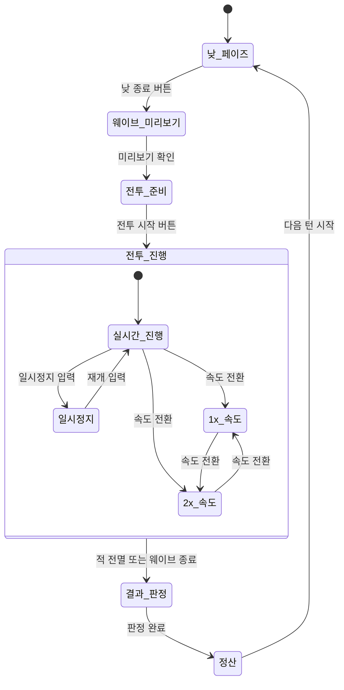
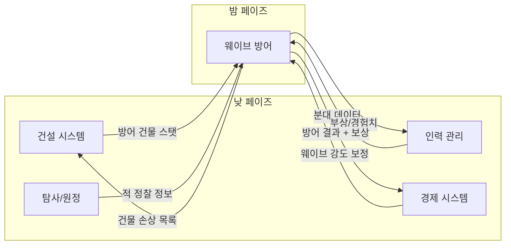

# 웨이브 방어 시스템 GDD

- **작성일**: 2026-04-02
- **최종 수정일**: 2026-04-03
- **상태**: draft
- **slug**: wave-defense
- **담당**: system-designer-v2
- **버전**: v0.3
- **참조 문서**: Vision.md (v2.6, 섹션 5.3/5.3.1/5.3.2/5.8), Economy-Model.md (v1.2, 섹션 7/9/11), Per-Turn-Budget.md (v1.0), Construction.md (v0.2), Workforce.md (v0.2), Cross-Reference-Matrix.md (revision-4)

---

## 1. 시스템 개요

### 목적

웨이브 방어 시스템은 밤 페이즈의 핵심이다. 낮 동안 플레이어가 내린 모든 결정(건설, 인력 배치, 자원 배분)을 **실시간 전투**로 검증하는 장이며, "물량 카타르시스"와 "안도감"을 직접 전달하는 수단이다.

| 항목 | 내용 |
|---|---|
| **Why** | "물량 카타르시스"와 "안도감"의 직접적 전달 수단. 낮의 준비를 검증하는 장. 밤의 가벼운 전술 조작으로 에이전시 부여 |
| **Objective** | 밤마다 DOTS 기반 대규모 적 웨이브가 기지를 공격. 타워디펜스가 기본 뼈대이고, 플레이어는 분대를 방어 위치에 배치/이동시키는 가벼운 RTS 마이크로로 개입 |
| **Volume** | 적 종류 10~15종 (아키타입 5종 + 변종), 웨이브 구성 패턴 다수 |
| **Detail** | 타워디펜스 + 가벼운 RTS 마이크로. ECS 기반 수천 엔티티 동시 시뮬레이션. 방어탑/방벽은 자동 공격하되, 플레이어는 분대를 선택하여 방어 위치에 배치하거나 위협 지점으로 이동시킨다. 일시정지 중 명령 입력 가능. 마이크로 없이도 전투 자동 진행 |

### 핵심 경험

1. **물량 카타르시스**: 수천 개체의 적이 밀려오는 장관을 타워와 분대가 저지하는 시각적/청각적 쾌감
2. **안도감**: 웨이브를 막아냈을 때의 "살아남았다"는 안도의 팡파르
3. **에이전시**: 분대 배치/이동으로 위기 상황에 개입할 수 있다는 통제감
4. **인과관계 시각화**: "낮에 건설한 감시탑이 이렇게 활약하는구나" -- 낮의 의사결정이 밤의 전투 결과로 이어지는 인과관계를 직접 목격

### Vision 연결

| 필러 | 연결 | 근거 |
|---|---|---|
| **핵심 재미 2: 물량 방어 카타르시스** | 직접 대응 | Vision 2.2: "어마무시한 적 물량을 막아냈을 때의 안도감과 성취감" |
| **핵심 재미 3: "한 턴만 더"** | 간접 지원 | 방어 결과 보상이 다음 턴 계획의 동기 |
| **3기둥 루프: 내정 -> 방어** | 핵심 루프 | Vision 4.3: "건물 배치/업그레이드/인력 소켓 배치가 밤 전투력 직결" |
| **P0-core 가설 1** | 검증 대상 | "가벼운 RTS 마이크로 + 수천 엔티티가 카타르시스와 에이전시를 동시에 주는가?" |
| **P0-core 가설 3** | 기술 검증 | DOTS 기반 수천 엔티티 동시 시뮬레이션 성능 |

---

## 2. 밤 페이즈 흐름

### 2.1 전체 진행 순서

```
[낮 페이즈 종료] --> [웨이브 미리보기] --> [전투 준비] --> [전투 진행] --> [결과 판정] --> [다음 낮]
```

| 단계 | 설명 | 플레이어 행동 |
|---|---|---|
| **1. 웨이브 미리보기** | 적 진입 방향과 대략적 규모 표시. 탐사 수준에 따라 구성 상세도 증가 | 정보 확인. 분대 배치 계획 수립 |
| **2. 전투 준비** | 분대 초기 배치 확정. 일시정지 상태에서 시작 | 분대를 원하는 위치에 배치. 준비 완료 시 전투 시작 |
| **3. 전투 진행** | 실시간 진행. 적 웨이브가 기지로 접근하며 타워와 분대가 교전 | 분대 이동/공격/정지 명령. 일시정지/배속 조절 |
| **4. 결과 판정** | 모든 적 소멸 또는 공격 종료 시 피해 비율 계산 | 결과 확인. 보상 수령 |
| **5. 정산** | 피해 비율에 따른 보상/피해, 분대 장비 소모 (상세는 Economy-Model.md 섹션 11 참조), 부상 판정 | 다음 낮으로 전환 |

### 2.2 시간 모델

| 항목 | 스펙 |
|---|---|
| **진행 방식** | 실시간 |
| **속도 조절** | 1x (기본) / 2x (빠르게) |
| **일시정지** | 가능. 일시정지 중 분대 명령 입력 가능 |
| **시간 압박** | 없음. 일시정지가 "가벼운 마이크로"의 핵심 보장 |

> **Vision.md 동기화 완료**: Vision.md v2.5에서 속도 조절이 "1x / 2x + 일시정지 가능"으로 변경되어 본 GDD와 일치한다.

### 2.3 전투 길이 가이드라인

전투 길이는 웨이브 구성에 따라 가변적이나, 다음 범위를 목표로 한다.

| 턴 구간 | 목표 전투 길이 (1x 기준) | 비고 |
|---|---|---|
| 초반 (턴 1~5) | 30~60초 | 적 소수. 학습 구간 |
| 중반 (턴 6~15) | 60~120초 | 다방향 공격 시작 |
| 후반 (턴 16~24) | 90~180초 | 대규모 웨이브, 복수 방향 |
| Final Wave (턴 25) | 180~300초 | 극적 클라이맥스 |

### 2.4 상태 다이어그램



---

## 3. 전투 메커니즘

### 3.1 전투력 비율

타워/건물 자동공격이 전투의 주력이다. 분대는 보조 전력으로 "미세 조정" 역할을 담당한다.

| 전투력 원천 | 비율 | 설명 |
|---|---|---|
| **타워/건물 자동공격** | 70~80% | 감시탑, 방벽(반격), 기타 방어 건물이 자동으로 적을 공격. 낮의 건설/업그레이드 결정이 이 비율을 결정 |
| **분대 (플레이어 조작)** | 20~30% | 분대의 이동/공격/정지로 위기 지점을 보강. 마이크로 없이도 전투 자동 진행 |

**핵심 설계 원칙**: "타워가 자동 공격하고, 유닛 분대는 플레이어가 방어 위치에 배치/이동. 잘 배치하면 거의 안 건드려도 되지만, 위기 시 재배치로 대응한다."

### 3.2 타워/건물 자동공격 시스템

방어 건물은 밤 전투 시 자동으로 작동한다. 운영에 자원을 소비하지 않는다.

| 건물 | 공격 방식 | 자동 행동 |
|---|---|---|
| **감시탑** | 원거리 단일 대상 공격 | 사거리 내 가장 가까운 적을 자동 조준/공격 |
| **방벽** | 적 진입 지연 (HP 기반) | 적이 방벽에 도달하면 방벽 HP를 소모하며 진입 지연. 강화 시 HP 증가 및 반격 가시 |
| **병영** | 직접 공격 없음 | 분대 편성/주둔 시설 |

> 건물별 상세 스탯과 업그레이드 분기는 --> [건설 시스템] GDD (Construction.md) 참조.

### 3.3 분대 조작

분대는 **분대 단위**로 조작한다. 개별 유닛 선택은 불가능하다.

#### 분대 명령 3종

| 명령 | 조작 | 효과 | SC2 대응 |
|---|---|---|---|
| **이동** | 분대 선택 후 지점 클릭 | 지정 위치로 이동. 이동 중 교전하지 않음 | Move (M) |
| **공격** | 분대 선택 후 대상/지점 클릭 | 지정 대상을 공격하거나 지정 지점으로 이동하며 경로상 적을 공격 | Attack Move (A) |
| **정지** | 분대 선택 후 정지 버튼 | 현재 위치에서 정지. 사거리 내 적만 공격하며 위치 유지 | Hold Position (H) |

> **Vision.md 동기화 완료**: Vision.md v2.5에서 분대 명령이 3종(이동/공격/정지)으로 변경되어 본 GDD와 일치한다.

#### 분대 조작 스펙

| 항목 | 스펙 |
|---|---|
| **분대 수** | 3~5개 (병영 수에 따라 결정. 병영 1개 = 1분대, 민병 병영 = 2분대) |
| **조작 단위** | 분대 단위. 개별 유닛 선택 불가 |
| **명령 횟수 제한** | 없음. 단, 배치만 잘하면 최소 개입으로 클리어 가능 |
| **마이크로 없이 전투** | 가능. 분대에 아무 명령을 내리지 않아도 전투는 자동 진행됨 (분대는 초기 배치 위치에서 자동 교전) |
| **일시정지 중 명령** | 가능. 이것이 "가벼운 마이크로"의 핵심 보장 |

### 3.4 대미지 계산 (후보 공식)

전투 시스템은 단순 전투력 합산 기반이다. 역할 분담(탱커/딜러/힐러)은 없다.

#### 타워 대미지

```
타워 DPS = 기본 공격력
         x 업그레이드 보정 (Lv1: x1.0, Lv2: x1.3, Lv3: x1.6)
         + 소켓 보너스 (전투 적성 시민 배치 시 공격력 +25%)
         + Lv2 특수 효과 (예: "조명 효과" -- 주변 방어탑 공격력 +10%)
```

#### 분대 대미지

```
분대 전투력 = 기본 전투력
            x 숙련도 배율 (Lv0: x1.0, Lv1: x1.15, Lv2: x1.3, Lv3: x1.5)
            x 적성 보너스 (전투 적성: x1.3, 기타: x1.0)
            + 고유 패시브 보너스 (해당 시)
            + 병영 소켓 보너스 (해당 시)
```

> 분대 전투력 산출 상세는 --> [인력 관리 시스템] GDD (Workforce.md) 섹션 5.3 참조.

#### 적 대미지 (건물 대상)

```
건물 피해 = 적 공격력 x 공격 횟수 x (1 - 건물 방어율)
```

건물 HP가 0에 도달하면 **손상 상태**로 전환된다 (완전 파괴되지 않음). 손상된 건물은 다음 밤 전투에서 방어에 참여하지 못한다.

---

## 4. 적 시스템

### 4.1 아키타입 분류

적은 4개의 축으로 분류된다. 이 축들의 조합으로 다양한 적 유형을 생성한다.

| 축 | 범위 | 설명 |
|---|---|---|
| **공격거리** | 근접 / 원거리 | 적이 공격하는 거리 |
| **이동속도** | 저속 / 중속 / 고속 | 기지까지의 도달 시간 |
| **체력** | 저체력 / 중체력 / 고체력 / 초고체력 | 적 제거에 필요한 총 대미지 |
| **공격유형** | 단일 / 범위(AoE) | 한 대상만 공격 vs 범위 피해 |

### 4.2 적 유형 카탈로그 (12종 제안)

적 유형은 5개 아키타입과 그 변종으로 구성된다. 후반 턴일수록 상위 아키타입이 등장한다.

#### Tier 1: 기본형 (턴 1~5 등장)

| # | 이름 (후보) | 공격거리 | 이동속도 | 체력 | 공격유형 | 특수 행동 | 설계 의도 |
|---|---|---|---|---|---|---|---|
| 1 | **유충 (Larva)** | 근접 | 중속 | 저체력 | 단일 | 없음 | 가장 기본적인 적. 학습용. 물량으로 등장 |
| 2 | **질주자 (Sprinter)** | 근접 | 고속 | 극저체력 | 단일 | 이동속도 +50%. 방벽 우회 시도 (우회 가능 경로가 있으면 선택) | 방어선 빈틈을 노린다. 빠르지만 취약 |
| 3 | **비대충 (Bloater)** | 근접 | 저속 | 중체력 | 범위 (사망 시) | 사망 시 주변 범위 피해 (건물/분대 모두) | 밀집 배치를 견제. 분대 이동 동기 부여 |

#### Tier 2: 강화형 (턴 6~12 등장)

| # | 이름 (후보) | 공격거리 | 이동속도 | 체력 | 공격유형 | 특수 행동 | 설계 의도 |
|---|---|---|---|---|---|---|---|
| 4 | **돌격충 (Charger)** | 근접 | 고속 | 중체력 | 단일 | 방벽에 x2 피해. 돌진 시 경로상 유닛에 넉백 | 방벽 손상 전문. 방벽 수리/강화 동기 |
| 5 | **뱉어충 (Spitter)** | 원거리 | 저속 | 저체력 | 단일 | 사거리 내 가장 가까운 타워를 우선 공격 | 타워 제거 전문. 분대로 우선 처리 필요 |
| 6 | **갑충 (Armored)** | 근접 | 저속 | 고체력 | 단일 | 원거리 피해 -40% (장갑). 근접 피해는 정상 | 분대의 근접 교전 가치를 높인다 |
| 7 | **굴진충 (Burrower)** | 근접 | 중속 | 중체력 | 단일 | 방벽을 무시하고 지하로 통과. 방벽 내부에서 출현 | 방벽 뒤 방어 배치의 필요성. 분대 재배치 긴장감 |

#### Tier 3: 정예형 (턴 13~20 등장)

| # | 이름 (후보) | 공격거리 | 이동속도 | 체력 | 공격유형 | 특수 행동 | 설계 의도 |
|---|---|---|---|---|---|---|---|
| 8 | **포격충 (Bombardier)** | 원거리 | 저속 | 중체력 | 범위 | 장거리 범위 공격. 건물 대상 x1.5 피해 | 건물 손상 전문. 우선 처리 대상. 분대로 견제 필수 |
| 9 | **여왕충 (Matriarch)** | 근접 | 저속 | 고체력 | 단일 | 주변 아군 이동속도 +20%, 공격력 +10% (버프 오라) | 우선 처리 시 주변 적 약화. 전략적 분대 운용 |
| 10 | **잠복충 (Stalker)** | 근접 | 고속 | 저체력 | 단일 | 은신 상태로 접근. 감시탑 시야 내에서만 감지 가능 | 감시탑 배치의 전략적 가치. "조명 효과" 소켓 보너스 시너지 |
| 11 | **차폐충 (Shield)** | 근접 | 중속 | 중체력 | 단일 | 전방 쉴드로 원거리 피해 흡수. 뒤에서 공격하면 쉴드 무효 | 분대의 측면 공격/우회 기동 동기 부여 |

#### Tier 4: 보스형 (턴 20+ 및 Final Wave)

| # | 이름 (후보) | 공격거리 | 이동속도 | 체력 | 공격유형 | 특수 행동 | 설계 의도 |
|---|---|---|---|---|---|---|---|
| 12 | **파멸충 (Devastator)** | 근접 | 극저속 | 초고체력 | 범위 | 공격 시 주변 범위 피해. 방벽 즉시 손상. 일정 HP 이하로 분노 (공격력 +50%) | Final Wave의 극적 긴장감. 모든 분대를 동원해야 하는 최종 보스급 |

### 4.3 적 스탯 범위 (후보 수치)

정확한 수치는 밸런스 테스트에서 확정한다. 아래는 상대적 비율 기준이다.

| 스탯 | 기준값 (유충=1.0) | 범위 |
|---|---|---|
| HP | 1.0 | 0.5 (질주자) ~ 20.0 (파멸충) |
| 이동속도 | 1.0 | 0.3 (파멸충) ~ 1.8 (질주자) |
| 공격력 | 1.0 | 0.5 ~ 5.0 |
| 공격속도 | 1.0 | 0.5 ~ 2.0 |

### 4.4 AI 행동 패턴

적 AI는 단순한 우선순위 기반이다. 복잡한 전술 AI는 적용하지 않는다.

| 행동 | 기본 규칙 | 유형별 변형 |
|---|---|---|
| **이동** | 기지 방향 직선 이동. 방벽에 도달 시 공격 | 질주자: 우회 가능 경로 탐색. 굴진충: 방벽 무시 |
| **타겟 선택** | 가장 가까운 유닛 -> 건물 순서로 공격 | 뱉어충: 타워 우선. 포격충: 건물 우선. 돌격충: 방벽 우선 |
| **그룹 행동** | 개별 AI (집단 지능 없음) | 여왕충: 버프 오라로 간접적 시너지 |

### 4.5 내러티브 테마 방향

적의 내러티브 테마는 **미정**이다. 현재 방향성은 다음과 같다.

- **유기체/군단 계통**: Warhammer 40K 타이라니드, StarCraft 2 저그와 유사한 방향. 벌레/생체 기반의 물량 군단
- **서사적 이유**: 유기체 테마는 "물량"을 자연스럽게 정당화한다. "끝없이 밀려오는 군단"이라는 비주얼이 카타르시스에 기여
- **확정 시점**: 아트 디렉션 단계에서 확정. 시스템 설계는 테마에 독립적으로 진행

---

## 5. 웨이브 구성

### 5.1 웨이브 데이터 구조 (레벨 디자이너용 스키마)

각 턴의 밤 웨이브는 레벨 데이터에서 정의한다. 다음 스키마를 따른다.

```
WaveData {
    turnNumber: int                     // 웨이브 발생 턴
    subWaves: SubWave[]                 // 서브 웨이브 배열 (다방향 공격)
    specialModifiers: Modifier[]        // 특수 변형 (안개, 폭풍 등)
}

SubWave {
    direction: Direction                // 공격 방향 (N/S/E/W/NE/NW/SE/SW)
    spawnDelay: float                   // 전투 시작 후 등장까지 대기(초)
    enemies: EnemyGroup[]               // 적 그룹 배열
}

EnemyGroup {
    enemyType: EnemyTypeId              // 적 유형 ID (유충, 질주자 등)
    count: int                          // 개체 수
    spawnPattern: SpawnPattern          // 등장 패턴 (일괄/연속/산개)
    spawnInterval: float                // 연속 등장 시 간격(초)
}
```

### 5.2 스케일링 곡선 (턴 1 -> 25)

아래는 기본 난이도(보통) 기준의 후보 웨이브 구성이다. 정확한 수치는 밸런스 테스트에서 조정한다.

| 턴 | 총 적 수 (후보) | 공격 방향 수 | 적 구성 | 설계 의도 |
|---|---|---|---|---|
| 1 | 20~30 | 1 | 유충 100% | 학습 웨이브. 타워만으로 클리어 가능 |
| 2 | 30~50 | 1 | 유충 80% + 질주자 20% | 질주자 소개. 빠른 적 대응 학습 |
| 3 | 50~70 | 1 | 유충 60% + 질주자 20% + 비대충 20% | 비대충 소개. 밀집 배치 위험 학습 |
| 4~5 | 70~100 | 1~2 | Tier 1 혼합 | 2방향 공격 시작 (5턴) |
| 6~8 | 100~200 | 2 | Tier 1 + 돌격충/뱉어충 소수 | Tier 2 적 첫 등장. 방벽/타워 위협 |
| 9~12 | 200~400 | 2 | Tier 1 다수 + Tier 2 증가 + 갑충/굴진충 소개 | 분대 운용 중요도 증가. 다양한 적 대응 전략 |
| 13~16 | 400~800 | 2~3 | Tier 1~2 + 포격충/여왕충 소수 | 3방향 공격 시작. 분대 재배치 빈도 증가 |
| 17~20 | 800~1,500 | 3 | Tier 1~3 혼합 + 잠복충/차폐충 소개 | 대규모 물량. 감시탑 시야 전략 중요 |
| 21~24 | 1,500~2,500 | 3~4 | 전 Tier 혼합. Tier 3 비율 증가 | 극심한 압박. 안전판 발동 가능성 |
| 25 (Final) | 2,500~3,000 | 4 | 전 Tier + 파멸충 1~2체 | 최종 클라이맥스. 모든 자원 동원 |

### 5.3 다방향 동시 공격 시스템

후반으로 갈수록 공격 방향이 증가하여 분대 재배치의 전략적 가치를 높인다.

| 턴 구간 | 최대 동시 공격 방향 | 설계 의도 |
|---|---|---|
| 턴 1~4 | 1방향 | 학습. 방어 건물 배치 방향 결정 |
| 턴 5~12 | 2방향 | 분대 분산 배치 필요 시작 |
| 턴 13~20 | 3방향 | 방어 건물 부족 체감. 분대 기동 중요 |
| 턴 21~25 | 4방향 | 전 방향 압박. 우선순위 판단 강제 |

다방향 공격 시 각 방향의 웨이브 규모는 동일하지 않다. **주공(主攻) 1방향 + 양동(陽動) 1~3방향** 구조를 기본으로 한다.

```
주공: 전체 병력의 50~60%
양동 1: 20~30%
양동 2: 10~15%
양동 3: 5~10%
```

### 5.4 Final Wave 특수 구성

각 기지의 최종 밤(턴 25)은 특별한 웨이브로 구성된다.

| 항목 | 스펙 |
|---|---|
| **규모** | 일반 웨이브의 2~3배 (2,500~3,000 개체) |
| **보스** | 파멸충 1~2체 등장 |
| **방향** | 4방향 동시 공격 |
| **특수 연출** | 전투 시작 전 경고 연출. 지면 진동, 경고 팡파르 |
| **보상** | 클리어 시 유물 +1 보장. 기지 세션 완료 |

### 5.5 웨이브 미리보기 시스템

밤 시작 전 적의 진입 방향과 규모를 미리보기로 제공한다. 정보의 상세도는 **탐사 수준**에 따라 증가한다.

| 정보 수준 | 조건 | 표시 내용 |
|---|---|---|
| **기본** | 항상 | 적 진입 방향 (화살표) + "소규모/중규모/대규모" 텍스트 |
| **상세** | 탐사 Lv1+ 또는 감시탑 Lv2+ | 기본 + 적 아키타입 아이콘 (Tier 1/2/3 구분) |
| **정밀** | 탐사 Lv2+ 또는 감시탑 Lv3 ("경보 시스템") | 상세 + 적 종류별 수량 + 추가 경로 1개 표시 |

---

## 6. 방어 결과 판정

### 6.1 피해 비율 기준

방어 결과는 **피해 비율**(손상된 건물 수 / 전체 건물 수)로 판정한다.

```
피해 비율 = 손상된 건물 수 / 전체 건물 수 x 100%
```

> **용어**: 방어 결과는 "피해 비율"로 판정한다. 과거 "돌파"로 표현하던 용어는 "피해"로 통일한다.

### 6.2 4단계 판정

| 판정 | 피해 비율 | 설명 |
|---|---|---|
| **완벽 방어** | ~10% 이하 | 건물 0~1개 손상 (약간의 유예). 방벽 외곽에서 적 전멸 |
| **경미 피해** | 10~25% | 건물 2~3개 손상. 국지적 피해 |
| **중간 피해** | 25~50% | 건물 다수 손상. 수리비 부담 가중 |
| **대규모 피해** | 50% 이상 | 기지 심각한 타격. 본부 파괴 시 게임오버 --> 건설 시스템 GDD (Construction.md) 섹션 3.1 참조 |

> **4단계 판정 구조**: 완벽 방어 / 경미 피해 / 중간 피해 / 대규모 피해. 게임오버 조건은 본부 파괴이다.

### 6.3 경제 효과 (Economy-Model.md 연동)

각 판정 구간별 경제 효과는 Economy-Model.md 섹션 7.1에서 정의한다. 아래는 요약이다.

| 판정 | 보상 (수입) | 피해 (지출) | 인력 효과 |
|---|---|---|---|
| **완벽 방어** | 기초 +10~15, 고급 +4~6, 유물 +1(확률 30%), 인력 +1(확률) | 없음 | 없음 |
| **경미 피해** | 기초 +5~8, 고급 +2~3, 잔해 수거 +3~5 | 건물 1~2 손상 -> 수리비 발생 | 시민 0~1명 부상 |
| **중간 피해** | 기초 +4~6, 잔해 수거 +4~8 | 건물 3~5 손상 -> 수리비 가중 | 시민 0~1명 부상 |
| **대규모 피해** | 기초 +3~5, 잔해 수거 +5~10 | 건물 다수 손상 -> 대규모 수리 | 시민 1~2명 부상 |

### 6.4 완벽 방어 유예

"완벽 방어"의 기준은 피해 비율 0%가 아닌 **~10% 이하**로 설정한다. 이는 소수 건물(1~2개)의 경미한 손상을 허용하여, 약간의 실수에도 완벽 방어 보상을 받을 수 있게 하는 관대한 설계이다.

설계 근거:
- 대규모 물량전에서 건물 피해 0을 달성하는 것은 극도로 어렵다
- 피해 비율 0% 기준 시 완벽 방어 달성률이 너무 낮아 보상이 사실상 무의미해진다
- ~10% 유예는 "잘 싸웠다"는 느낌을 주면서도 보상 인센티브를 유지

---

## 7. 방어 건물 연동

방어 건물은 건설 시스템에서 관리하며, 웨이브 방어 시스템은 밤 전투 시 이들의 스탯을 수신하여 전투에 반영한다.

### 7.1 건물별 역할

| 건물 | 웨이브 방어에서의 역할 | 상세 |
|---|---|---|
| **감시탑** | 자동 원거리 공격 | 사거리 내 적 자동 조준/공격. 업그레이드 시 공격력/사거리 증가. 소켓 보너스로 추가 강화 |
| **방벽** | 적 진입 지연 (HP 기반) | 적이 방벽에 도달하면 HP를 소모하며 진입 지연. 직선 강화로 HP 증가 및 반격 가시 강화 |
| **병영** | 분대 편성 | 분대 슬롯 제공. 분기 A(정예 병영: 전투력 +40%), 분기 B(민병 병영: 분대 2개, 전투력 -20%) |

> 건물별 상세 스탯, 업그레이드 경로, 비용은 --> [건설 시스템] GDD (Construction.md) 섹션 3.3 참조.

### 7.2 건물 손상/수리

| 상태 | 조건 | 효과 |
|---|---|---|
| **정상** | HP > 0 | 밤 전투에 정상 참여 |
| **손상** | HP = 0 | 다음 밤 전투에서 방어 불참. 수리비(기초 자원) 지불 후 복구 |
| **미수리** | 손상 상태 + 수리비 미지불 | 계속 방어 불참 |

건물은 **완전 파괴되지 않는다**. HP가 0이 되면 손상 상태로 전환된다.

> 수리 메커니즘 상세는 --> [건설 시스템] GDD (Construction.md) 섹션 6 참조.

---

## 8. 분대 연동

분대는 인력 관리 시스템에서 편성하며, 웨이브 방어 시스템은 밤 전투 시 분대 데이터를 수신하여 전투에 투입한다.

### 8.1 영웅 유닛 + NPC 분대 모델

| 항목 | 스펙 |
|---|---|
| **분대 구성** | 시민 1명 (영웅 유닛) + NPC 분대원 5~10명 |
| **인구 소비** | 시민 1명만 인구 차지. NPC 분대원은 인구 불포함 |
| **전투력** | 시민의 전투력이 분대 전체에 영향. 단순 전투력 합산 (역할 분담 없음) |
| **편성** | 병영 건설 -> 분대 슬롯 해금 -> 시민 배치 |

### 8.2 전투 숙련도 -> 분대 성능

| 전투 숙련도 | NPC 분대 규모 | 전투력 배율 | 해금 능력 |
|---|---|---|---|
| Lv0 (미숙) | 5명 | x1.0 | -- |
| Lv1 (적응) | 6명 | x1.15 | -- |
| Lv2 (숙련) | 8명 | x1.3 | 분대 특수 능력 1종 |
| Lv3 (전문가) | 10명 | x1.5 | 강화 분대 능력 |

### 8.3 부상 처리

| 시점 | 효과 |
|---|---|
| **밤 전투 중** | 부상 판정은 전투 종료 후. 전투 중에는 정상 전투력 유지 |
| **다음 낮** | 부상 시민은 비활성. 분대에서 자동 제외. 3턴 회복 (의료소 시 2턴) |
| **회복 후** | 재배치 가능. 전투 숙련도는 유지됨 |

> 시민은 **사망하지 않는다**. 영구 손실은 발생하지 않으며, 부상만 존재한다.

> 분대 시스템 상세는 --> [인력 관리 시스템] GDD (Workforce.md) 섹션 5 참조.

---

## 9. 안전판 시스템

방어 실패가 회복 불가능한 경제 붕괴(데스 스파이럴)로 이어지는 것을 방지하는 메커니즘이다.

### 9.1 잔해 수거

| 항목 | 스펙 |
|---|---|
| **발동 조건** | 밤 전투에서 건물이 손상되었을 때 |
| **수거량** | 손상된 건물 수리비의 40~60%에 해당하는 기초 자원을 자동 획득 |
| **설계 의도** | 방어 실패 시에도 일부 기초 자원을 회수. "폐허에서 쓸 만한 것을 건져낸다"는 서사적 맥락 |
| **예시** | 건물 2개 손상 -> 수리비 기초 15 발생 -> 잔해 수거 기초 +6~9 -> 실질 수리비 기초 6~9 |

### 9.2 적응형 웨이브 약화

| 항목 | 스펙 |
|---|---|
| **발동 조건** | 연속 2턴 이상 "대규모 피해" 결과 발생 |
| **효과** | 다음 웨이브 강도 -15~20% (시각적으로 "적들도 피해를 입었다"로 표현) |
| **해제 조건** | "경미 피해" 이상의 방어 결과 달성 시 원래 강도로 복귀 |
| **설계 의도** | 자동 난이도 조절. 연속 실패 시 회복 기회를 주되, 성공하면 즉시 원래 난이도로 복귀하여 긴장감 유지 |

### 9.3 비상 수리 면제

| 항목 | 스펙 |
|---|---|
| **발동 조건** | 기초 자원 잔고 0인 상태에서 건물 손상 발생 |
| **효과** | 손상된 건물 중 1개의 수리비를 50% 감면 (가장 싼 건물 우선 적용) |
| **제한** | **연속 3턴 초과 적용 불가** (지속적 의존 방지) |
| **설계 의도** | 기초 자원 0 상태에서의 추가 손상이 완전한 경제 붕괴로 이어지는 것을 방지 |

### 9.4 안전판 작동 순서

```
[1단계: 방어 실패]
  건물 손상 + 수리비 발생 (기초 자원)
  -> 안전판: 잔해 수거 (수리비의 40~60% 기초 자원 회수)

[2단계: 연속 실패]
  수리비 > 기초 수입 -> 건설/업그레이드 불가
  -> 안전판: 적응형 웨이브 약화 (-15~20%)

[3단계: 기초 자원 고갈]
  기초 0 -> 수리 불가 -> 건물 손상 지속
  -> 안전판: 비상 수리 면제 (1건 50% 감면)
  -> 건물 자동 가동은 유지 (생산은 계속됨)

[4단계: 회복 실패 (안전판 소진)]
  인력 부상 -> 소켓 보너스 감소 -> 방어력 약화
  건물 손상 누적 -> 방어력 붕괴
  -> 게임오버: 본부 파괴
```

---

## 10. UI/UX

### 10.1 밤 전투 HUD

| 요소 | 위치 (후보) | 표시 내용 |
|---|---|---|
| **웨이브 진행 표시** | 화면 상단 | 현재 웨이브 / 총 서브웨이브, 남은 적 수 |
| **속도 조절** | 화면 하단 우측 | 1x / 2x 토글 + 일시정지 버튼 |
| **분대 상태** | 화면 좌측 | 분대별 HP, 위치, 현재 명령 |
| **건물 HP** | 건물 위 오버레이 | 방어 건물 HP 바 |
| **미니맵** | 화면 우측 하단 | 전장 전체 + 적 위치 + 분대 위치 |
| **피해 경고** | 화면 중앙 (팝업) | 건물 손상 시 경고 알림 |

### 10.2 분대 선택/명령 UI

| 조작 | 방법 |
|---|---|
| **분대 선택** | 좌클릭 (분대 아이콘 또는 전장 내 분대). 단축키 1~5 |
| **이동 명령** | 분대 선택 후 우클릭 (빈 지점) |
| **공격 명령** | 분대 선택 후 우클릭 (적 대상). 또는 A키 + 지점 클릭 |
| **정지 명령** | 분대 선택 후 H키. 또는 정지 버튼 |
| **일시정지** | Space키. 일시정지 중에도 위 모든 명령 입력 가능 |

### 10.3 웨이브 미리보기 UI

| 요소 | 표시 |
|---|---|
| **진입 방향** | 화살표 + 색상 코딩 (빨강=주공, 주황=양동) |
| **규모 표시** | 화살표 크기 + "소/중/대" 텍스트 |
| **적 구성** | (상세/정밀 수준 시) 아키타입 아이콘 + 수량 |
| **비교 표시** | 이전 밤 대비 강도 변화 (화살표 상승/하락) |

### 10.4 전투 결과 화면

| 요소 | 내용 |
|---|---|
| **판정 배너** | "완벽 방어!" / "경미 피해" / "중간 피해" / "대규모 피해" |
| **피해 요약** | 손상 건물 수, 시민 부상자 수 |
| **보상 목록** | 획득 자원 (기초/고급/유물), 인력 변동 |
| **다음 행동 안내** | "수리가 필요한 건물: N개" 등 |

---

## 11. DOTS 기술 방향

### 11.1 성능 목표

| 항목 | 목표 |
|---|---|
| **동시 개체** | 3,000개체 (적 + 분대 NPC + 투사체) |
| **프레임율** | 30fps 이상 (중간 사양 PC 기준: Steam Hardware Survey 중앙값 -- GTX 1060 / Ryzen 5 2600 급) |
| **기술 스택** | Unity DOTS (ECS + Burst + Jobs) |

### 11.2 ECS 아키텍처 방향

| 컴포넌트 분류 | 예시 컴포넌트 | 설명 |
|---|---|---|
| **Position/Movement** | `LocalTransform`, `MoveSpeed`, `TargetPosition` | 모든 이동 가능 엔티티 |
| **Combat** | `AttackPower`, `AttackRange`, `AttackCooldown`, `Health` | 타워/분대/적 공통 |
| **AI** | `EnemyAI`, `TargetPriority`, `CurrentTarget` | 적 AI 행동 제어 |
| **Team** | `TeamTag` (Defender/Attacker) | 아군/적군 구분 |
| **Squad** | `SquadId`, `SquadCommand`, `SquadLeader` | 분대 소속 및 명령 |
| **Tower** | `TowerRange`, `AutoTarget` | 방어 건물 자동 공격 |
| **Special** | `BurrowAbility`, `ShieldFront`, `BuffAura` | 적 특수 능력 |

### 11.3 프로토타입 검증 항목

| # | 검증 항목 | 성공 기준 | 폴백 |
|---|---|---|---|
| 1 | 3,000 엔티티 동시 시뮬레이션 | 30fps 이상 (중간 사양: GTX 1060 / Ryzen 5 2600 급) | 엔티티 수 감소 + 파티클/군중 셰이더로 물량감 유지 |
| 2 | 분대 명령 반응성 | 명령 입력 후 0.1초 이내 반응 | 명령 대기열 + 예측 이동 |
| 3 | 적 AI 경로 탐색 | 500+ 적 동시 경로 탐색 시 프레임 드롭 없음 | 기본: 플로우 필드 (대다수 적의 일괄 이동). 특수 적(질주자 우회, 굴진충 터널링): 개별 경로 탐색 |
| 4 | 투사체 시뮬레이션 | 타워 10+ 동시 발사 시 성능 유지 | 투사체 풀링 + 즉발 히트 판정 |

---

## 12. 다른 시스템과의 연동

### 12.1 연동 설계

#### 인터페이스 계약

| 연동 시스템 | 방향 | 데이터 | 트리거 |
|---|---|---|---|
| 건설 -> 웨이브 방어 | 수신 | `DefenseBuildingStats(slotId, attackPower, range, hp)` | 밤 전투 시작 시 |
| 웨이브 방어 -> 건설 | 송신 | `BuildingDamageReport(slotIds[])` | 밤 전투 종료 시 |
| 인력 관리 -> 웨이브 방어 | 수신 | `SquadDeployed(squadId, combatPower, size, abilities[])` | 밤 전투 시작 시 |
| 웨이브 방어 -> 인력 관리 | 송신 | `CombatResult(injuries[], combatExpGained[])` | 밤 전투 종료 시 |
| 웨이브 방어 -> 경제 | 송신 | `DefenseResult(damageRatio, damagedBuildings[], rewardTier)` | 밤 전투 종료 시 |
| 경제 -> 웨이브 방어 | 수신 | `WaveModifier(strengthMultiplier)` | 적응형 웨이브 약화 발동 시 |
| 탐사/원정 -> 웨이브 방어 | 수신 | `ScoutInfo(detailLevel, enemyComposition)` | 웨이브 미리보기 시 |

#### 데이터 흐름



### 12.2 의존 시스템 (웨이브 방어가 데이터를 받는 시스템)

| 시스템 | 의존 내용 |
|---|---|
| **건설 시스템** | 방어 건물의 스탯(공격력/사거리/HP)이 밤 전투의 방어력을 결정 |
| **인력 관리** | 분대 구성/전투력/숙련도가 분대 성능을 결정 |
| **탐사/원정** | 정찰 수준이 웨이브 미리보기 상세도를 결정 |
| **경제 시스템** | 적응형 웨이브 약화 발동 여부가 웨이브 강도를 보정 |

### 12.3 피의존 시스템 (웨이브 방어의 결과를 받는 시스템)

| 시스템 | 수신 내용 |
|---|---|
| **건설 시스템** | 건물 손상 목록 수신 -> 손상 상태 전환, 수리 대기열 생성 |
| **인력 관리** | 부상자 목록 + 전투 숙련도 경험치 수신 |
| **경제 시스템** | 방어 결과(판정 등급) + 보상 자원 수신. 수리비 계산 트리거 |

---

## 13. Vision.md 정합성 체크

### 13.1 5질문 필터

Vision.md 섹션 3.5의 5질문 필터로 시스템 검증:

| # | 질문 | 답변 | 판정 |
|---|---|---|---|
| 1 | 물량 카타르시스(핵심 재미 2)에 기여하는가? | 직접 전달 수단. 수천 개체 웨이브 + 분대 방어 = 물량 카타르시스의 핵심 | 통과 |
| 2 | 복잡도 4~4.5 범위를 유지하는가? | 분대 3종 명령 + 일시정지 = 복잡도 추가 0.5~1.0. 낮/밤 교대 구조로 "동시 관리"가 아님 | 통과 |
| 3 | 내정-탐사-방어 3기둥 중 하나에 속하는가? | 방어 기둥의 핵심 시스템 | 통과 |
| 4 | 세션(1~2시간)에 적합한가? | 전투 길이 30초~300초. 25턴 x 평균 2분 = 약 50분의 전투 시간이 세션 내 적절 | 통과 |
| 5 | "하지 않을 것"을 위반하지 않는가? | 검증 필요 -- 아래 참조 | 조건부 통과 |

### 13.2 "하지 않을 것" 준수 확인

| "하지 않을 것" 항목 | 준수 여부 | 근거 |
|---|---|---|
| 개별 유닛 스킬 조작 추가 | 준수 | 분대 단위 조작만 존재. 개별 유닛 스킬 없음 |
| 고도의 APM 요구 | 준수 | 일시정지 중 명령 가능. 마이크로 없이도 자동 진행 |
| Thronefall식 주인공 캐릭터 직접 조종 | 준수 | 분대 그룹 이동/배치 방식. 주인공 캐릭터 없음 |
| They Are Billions식 즉사 | 준수 | 점진적 패배 모델. 건물 HP 0 = 손상(파괴 아님) |

### 13.3 불일치 목록

다음 항목은 인터뷰 결과 Vision.md의 기존 스펙에서 변경을 제안했으며, Vision.md v2.5/v2.6 및 Economy-Model.md v1.2에서 **모두 동기화 완료**되었다.

| # | 항목 | Vision.md 기존 | 본 GDD 변경 | 동기화 상태 |
|---|---|---|---|---|
| 1 | **분대 명령 유형** | 2종: 이동/집결 (섹션 5.3.1) | **3종: 이동/공격/정지** | **해소** (Vision.md v2.5) |
| 2 | **속도 조절** | 1x / 2x / 3x + 일시정지 (섹션 5.3.1) | **1x / 2x + 일시정지 (3x 제거)** | **해소** (Vision.md v2.5) |
| 3 | **방어 결과 용어** | "완벽 방어/부분 돌파/대규모 돌파/기지 붕괴" (섹션 4.2.1) | **"완벽 방어/경미 피해/중간 피해/대규모 피해"** | **해소** (Vision.md v2.5, Economy-Model.md v1.2) |
| 4 | **완벽 방어 기준** | 피해 0 (방벽 외곽에서 적 전멸) (Economy-Model.md 7.1) | **피해 비율 ~10% 이하** (약간의 유예) | **해소** (Economy-Model.md v1.2) |
| 5 | **방어 결과 4단계** | 3단계 + 기지 붕괴 (Vision) / Economy-Model.md 5단계 | **4단계 (완벽/경미/중간/대규모)** + 본부 파괴(게임오버) | **해소** (Vision.md v2.5, Economy-Model.md v1.2) |
| 6 | **"건물 파괴" vs "건물 손상" 용어** | Vision 4.2.1 "건물 파괴" 표현 사용 | **건물 손상 (본부 제외). 본부만 "파괴" 가능** | **해소** (Vision.md v2.6 -- 용어 정책 확립, 부록 C 등재) |

### 13.4 참조 문서 동기화 현황

design-critic 2차 리뷰(WaveDefense-review-r2.md) 지적 사항의 동기화 완료 기록.

#### 동기화 완료 항목

| # | 항목 | 대상 문서 | 변경 내용 | 완료 버전 |
|---|---|---|---|---|
| 1 | **"건물 파괴" -> "건물 손상" 용어 변경** | Vision.md, Economy-Model.md | Vision.md/Economy-Model.md에서 "건물 파괴" -> "건물 손상" 용어 변경 완료 (본부 제외). WaveDefense.md의 "건물 손상" 정의와 일치. Vision.md v2.6 부록 C에 용어 정책 등재 | Vision.md v2.6, Economy-Model.md v1.2 |
| 2 | **방어 결과 체계 동기화** | Economy-Model.md | Economy-Model.md v1.2에서 방어 결과 4단계(완벽 방어/경미 피해/중간 피해/대규모 피해) + 본부 파괴(게임오버) 구조로 동기화 완료. 기존 "기지 붕괴" 5단계 제거됨 | Economy-Model.md v1.2 |
| 3 | **완벽 방어 기준 통일** | Economy-Model.md | 완벽 방어 기준: 피해 비율 ~10% 이하로 통일. 기존 "건물 손상 0개" 기준에서 변경 | Economy-Model.md v1.2 |
| 4 | **방어 결과 용어 통일** | Vision.md, Economy-Model.md | "부분 돌파/대규모 돌파" -> "경미 피해/중간 피해/대규모 피해"로 통일. "돌파" 용어 전체 제거 | Vision.md v2.5, Economy-Model.md v1.2 |
| 5 | **분대 명령 3종** | Vision.md | 이동/공격/정지 3종으로 통일 | Vision.md v2.5 |
| 6 | **배속 2x** | Vision.md | 1x/2x + 일시정지로 통일 (3x 제거) | Vision.md v2.5 |

#### 잔여 동기화 사항

현재 미해소 동기화 항목 없음. 모든 Critical/Major 동기화 이슈가 해소되었다.

---

## 14. 밸런스 가이드

### 14.1 핵심 파라미터

| # | 파라미터 | 범위 | 기본값 | 설명 |
|---|---|---|---|---|
| 1 | 타워 DPS 기본값 | 2.0~10.0 | 4.0 | 감시탑 Lv1 기준. 업그레이드 시 x1.3/x1.6 |
| 2 | 분대 전투력 기본값 | 1.0~5.0 | 2.0 | 시민 1명 + NPC 5명 기준 (Lv0) |
| 3 | 전투력 비율 (타워:분대) | 60:40 ~ 85:15 | 75:25 | 타워가 주력이 되도록 |
| 4 | 적 HP 스케일링 | 턴당 x1.05~x1.15 | x1.1 | 매 턴 적 HP 증가율 |
| 5 | 적 수량 스케일링 | 턴당 x1.1~x1.3 | x1.2 | 매 턴 적 수량 증가율 |
| 6 | 웨이브 미리보기 상세도 | 3단계 | 기본/상세/정밀 | 탐사 수준 연동 |
| 7 | 완벽 방어 유예율 | 5~15% | 10% | 피해 비율 이 값 이하 = 완벽 방어 |
| 8 | 잔해 수거율 | 30~70% | 50% | 수리비 대비 회수 비율 |
| 9 | 적응형 약화율 | 10~25% | 17% | 연속 실패 시 웨이브 강도 감소 |
| 10 | 비상 수리 감면율 | 30~60% | 50% | 기초 자원 고갈 시 수리비 감면 |
| 11 | 일시정지 중 명령 지연 | 0~0.5초 | 0초 | 즉시 실행 (지연 없음) |
| 12 | 장비 소모 (고급/분대/전투) | 0.5~2.0 | 1.0 | 밤 전투 결과 정산 시. 상세는 Economy-Model.md 섹션 11 참조 |

### 14.2 밸런스 기준

| 기준 | 목표 | 측정 방법 |
|---|---|---|
| **마이크로 필요도** | 마이크로 없이 60~70% 방어율, 마이크로 시 80~90% | 플레이테스트. "마이크로가 의미없다" 응답 20% 미만 |
| **전투 시간** | 초반 30~60초, 후반 90~180초, Final 180~300초 | 1x 기준 측정 |
| **완벽 방어 달성률** | 초반 50~60%, 중반 20~30%, 후반 5~10% | 숙련 플레이어 기준 |
| **데스 스파이럴 진입률** | 25턴 기준 5~10% | 보통 난이도, 숙련 플레이어 |
| **APM 요구** | 평균 10~20 APM (SC2의 1/10 수준) | 마이크로 조작 빈도 측정 |

### 14.3 난이도별 조정 (후보)

| 파라미터 | 쉬움 | 보통 | 어려움 |
|---|---|---|---|
| 적 HP | x0.8 | x1.0 | x1.2 |
| 적 수량 | x0.7 | x1.0 | x1.3 |
| 적 공격력 | x0.8 | x1.0 | x1.2 |
| 완벽 방어 유예율 | 15% | 10% | 5% |
| 잔해 수거율 | 60% | 50% | 40% |
| 적응형 약화율 | 25% | 17% | 10% |

---

## 15. 엣지 케이스

| # | 상황 | 처리 방법 |
|---|---|---|
| 1 | 분대가 0개인 상태에서 밤 전투 | 타워만으로 전투 진행. 분대 미편성 경고를 낮 페이즈에서 표시 |
| 2 | 방어 건물이 0개인 상태에서 밤 전투 | 적이 무저항 진입. 모든 건물 손상. 게임오버 직전 경고 |
| 3 | 모든 건물이 손상 상태에서 밤 전투 | 손상 건물은 방어 불참. 분대만으로 방어 시도 |
| 4 | 전투 중 분대 전멸 (HP 0) | 분대 비활성화. 해당 시민 부상 처리. 잔여 분대/타워로 전투 계속 |
| 5 | 적이 기지 중심부(본부)에 도달 | 본부 HP 소진 시 게임오버. 본부만 "파괴" 가능한 유일한 건물 (아래 본부 스펙 참조) |
| 6 | 일시정지 남용 (매초 일시정지) | 제한 없음. "가벼운 마이크로"의 핵심 보장. 일시정지는 플레이어의 권리 |
| 7 | 적응형 웨이브 약화 + Final Wave 겹침 | Final Wave는 적응형 약화 적용 대상에서 **제외**. 최종 밤은 항상 전력 |
| 8 | 분대 이동 중 일시정지 후 재개 | 이동 명령 유지. 재개 시 잔여 경로 이동 계속 |
| 9 | 2x 배속 중 건물 손상 | 자동 1x로 전환 + 경고 팝업 (설정으로 비활성화 가능) |
| 10 | 적 0마리 웨이브 (데이터 오류) | 즉시 "완벽 방어" 판정. 기본 보상만 지급 |

#### 본부(HQ) 방어 스펙 (인라인 -- 엣지 케이스 5 보충)

본부는 게임오버 조건의 핵심이므로, 방어 시스템 관점에서의 최소 스펙을 여기에 정의한다.

| 항목 | 스펙 |
|---|---|
| **분류** | 특수 건물 (건물 카탈로그 10종과 별도) |
| **위치** | 맵 중앙 고정 배치. 건설/이동 불가 |
| **HP** | 존재 (구체 수치는 Construction.md 섹션 3.1에서 확정) |
| **접근 조건** | 외곽 건물이 먼저 손상되어야 적이 본부에 접근 가능한 구조. 적 AI의 "가장 가까운 건물 우선 공격" 규칙과 결합하여 자연스러운 외곽->본부 순서를 보장 |
| **파괴 조건** | 본부 HP 0 = 게임오버. 일반 건물은 HP 0에서 "손상" 상태로 전환되지만, 본부만 영구 파괴됨 |
| **자체 방어** | 없음 (방어 건물과 분대에 의존) |
| **상세 참조** | Vision.md v2.6 섹션 5.8 + 부록 C 용어 사전, Construction.md 섹션 3.1 |

---

## 16. 참고 자료

| 레퍼런스 | 차용 요소 | 적용 방식 | 근거 |
|---|---|---|---|
| **They Are Billions** | 대규모 물량 스케일, 최종 웨이브(Final Swarm) 구조, 다방향 공격 | 변형 (실시간 -> 일시정지 가능 실시간, 고APM -> 가벼운 마이크로) | Vision 5.3 레퍼런스. Cross-Reference-Matrix 섹션 4 |
| **Thronefall** | 타워디펜스 기반 + 밤 페이즈 자동 방어 + 경로 미리보기 | 변형 (군주 직접 조종 -> 분대 그룹 이동/배치) | Vision 5.3 레퍼런스. 복잡도 양립 논증 (Vision 5.3.2) |
| **StarCraft 2** | 유닛 이동/배치 UX, 명령 체계(Move/Attack Move/Hold Position) | 영감 (분대 단위 축소, 일시정지 가능) | Vision 5.3 레퍼런스. Cross-Reference-Matrix 참조 처리 |
| **Frostpunk** | 일시정지 후 판단 패턴, 점진적 압박 웨이브 스케일링 | 영감 | Vision 7.3.1 폴백 플랜 |
| **Dome Keeper** | 웨이브 방어 시스템 참고 | 영감 | Cross-Reference-Matrix 참조 처리 |

---

## 17. 변경 이력

| 날짜 | 버전 | 변경 내용 |
|---|---|---|
| 2026-04-02 | v0.1 | 초안 작성 |
| 2026-04-02 | v0.2 | 1차 리뷰(WaveDefense-review.md) 반영. NPC 분대 수 숙련도 테이블 추가, 내부 "손상/파괴" 용어 정리, Vision.md v2.5 동기화 반영 |
| 2026-04-03 | v0.3 | 2차 리뷰(WaveDefense-review-r2.md) 반영. 참조 문서 버전 갱신(Vision v2.6, Economy-Model v1.2, Construction v0.2, Workforce v0.2), 본부(HQ) 스펙 인라인 추가(엣지 케이스 5), "건물 파괴/손상" 용어 동기화 해소 기록, Economy-Model 방어 결과 체계 동기화 완료 기록, 성능 목표 "중간 사양 PC" 정의 보완, 경로 탐색 구조 명확화(기본: 플로우 필드, 특수: 개별 경로), 장비 소모 Economy-Model.md 교차 참조 추가, Vision.md 불일치 노트 해소 상태로 갱신, 섹션 13.3/13.4 전면 갱신 |
