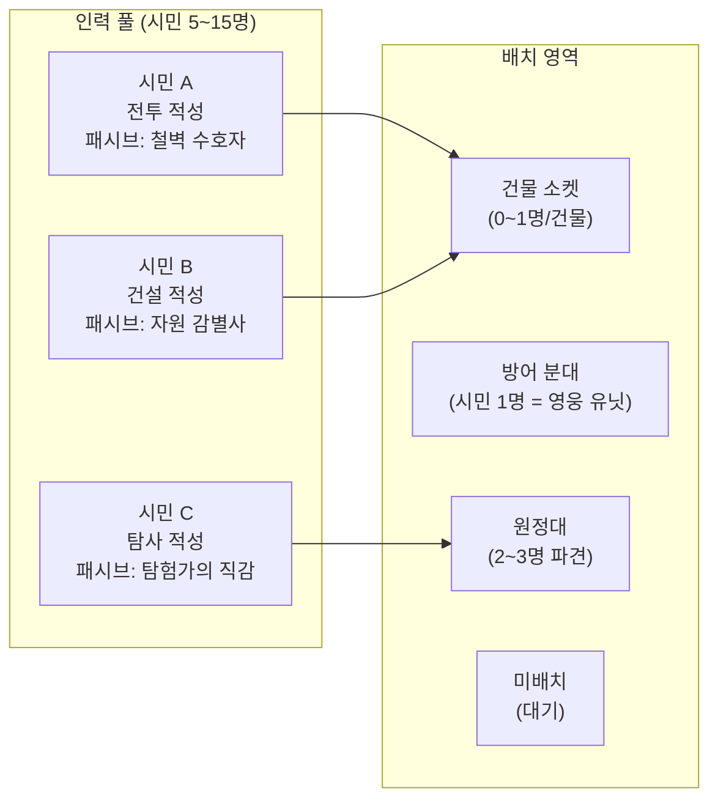
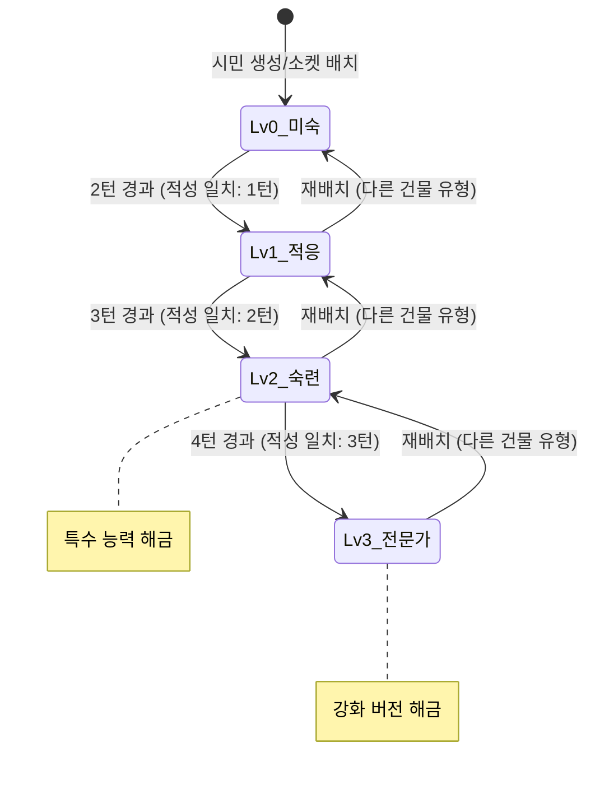
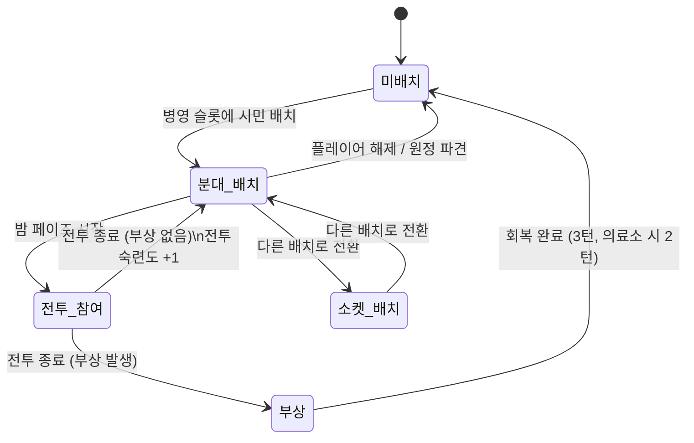
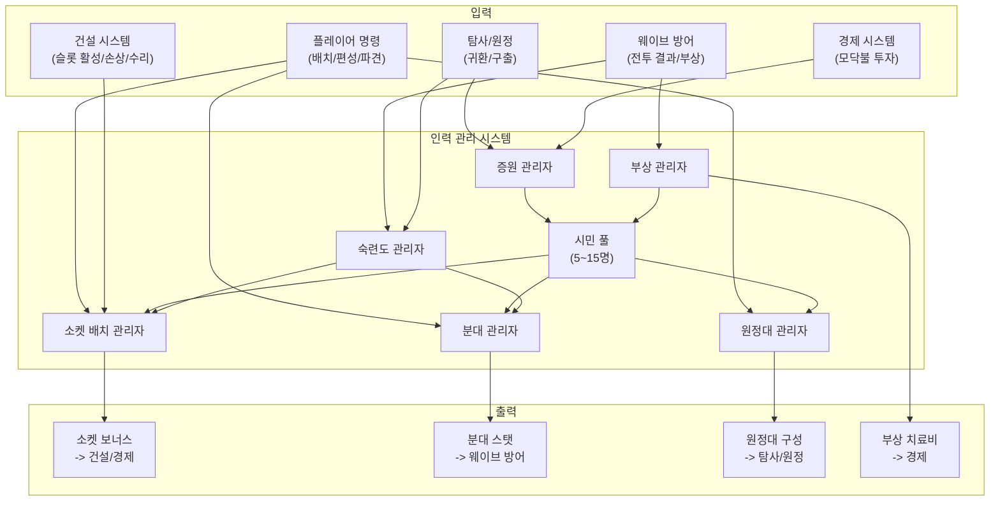

# 인력 관리 시스템 GDD

- **작성일**: 2026-04-02
- **담당**: system-designer-v2
- **상태**: draft
- **버전**: v0.2
- **우선순위**: P0-core
- **참조 문서**: Vision.md v2.6 (섹션 3.4, 5.2), Economy-Model.md v1.0 (섹션 4), Per-Turn-Budget.md v1.0 (섹션 6), Cross-Reference-Matrix.md revision-4, Construction.md v1.0
- **수치 안내**: 이 문서의 모든 수치는 Economy-Model.md에서 인용하거나 본 GDD에서 신규 제안한 **후보 수치(밸런스 테스트 시 조정)**이다.

---

## 1. 시스템 개요

### 1.1 Why / Objective / Volume / Detail

| 항목 | 내용 |
|---|---|
| **Why** | "내 선택이 유의미하다"는 느낌의 핵심. 소수의 생존자를 어떤 건물에 소켓 배치하여 최적의 보너스 조합을 만드느냐가 핵심 전략. 매 턴 "이 사람을 여기에 둘까 저기에 옮길까"의 의사결정이 게임의 중심 퍼즐이다 |
| **Objective** | 5~15명의 시민을 건물 소켓, 방어 분대, 원정대, 미배치 중 하나에 배치하여 기지의 생산 보너스, 방어력, 탐사력을 결정한다. 건물은 건설 완료 시 자동 활성화되므로, 인력은 필수 운영 요소가 아닌 선택적 보너스 제공자다 |
| **Volume** | 시민 5~15명/기지 (전원 개별 관리), 적성 3종, 소켓 보너스 유형 5종, 숙련도 4단계(Lv0~3), 고유 패시브 풀 15~20종 이상 |
| **Detail** | **디아블로 보석 소켓 모델** 변형. 시민은 이름, 배경, 적성, 고유 패시브를 가진 개별 캐릭터이며 각자가 건물에 배치될 때 고유한 보너스를 부여한다. 배치된 건물에서 시간이 지나면 숙련도가 성장하여 보너스가 강화되고, 재배치 시 숙련도가 하락하는 기회비용이 존재한다. 밤 전투에서는 시민이 영웅 유닛으로서 NPC 분대를 이끌며, 탐사에서는 원정대를 구성하여 파견된다. 시민은 사망하지 않으며 부상만 발생한다 |

### 1.2 핵심 경험

플레이어가 느껴야 하는 감정의 흐름:

1. **애착 형성** (턴 1~3): "이 사람은 전투에 뛰어나네, 저 사람은 건설 적성이구나" -- 5명의 시민 각각을 파악하고 이름을 기억하기 시작
2. **조합 최적화의 쾌감** (턴 4~9): "채집장에 건설 적성을 넣으니 생산이 확 뛰었다!" -- 적성 일치 배치의 효과를 체감하며 최적 조합을 탐색
3. **트레이드오프의 고뇌** (턴 10~15): "원정대를 보내고 싶은데, 소켓에서 빼면 생산이 떨어진다... 분대에 넣으면 방어는 좋아지지만..." -- 시민 수가 부족하여 모든 곳에 배치할 수 없는 긴장
4. **숙련도 투자의 보상** (턴 15~20): "시민A가 드디어 전문가(Lv3)가 됐다! 야간 채집이 해금되었다" -- 오래 투자한 배치의 질적 변화 체험
5. **위기 대응의 긴박함** (턴 20~25): "부상자가 나왔다, 소켓 재배치하자... 하지만 숙련도가 떨어진다" -- 상황 변화에 대한 즉각적 의사결정

### 1.3 핵심 재미

> "이 사람을 여기에 둘까 저기에 옮길까" -- 소수 정예의 조합 최적화 퍼즐

모든 시민이 개별적으로 중요한 존재이므로, 한 명의 배치 변경이 기지 전체의 균형을 뒤흔든다. 이것이 매 턴의 소소한 선택이 쌓여 결정적 순간의 쾌감을 만드는 핵심 메커니즘이다.

### 1.4 Vision 연결

| Vision 항목 | 연결 |
|---|---|
| **필러: 선택의 긴장감** | 시민 배치가 직접적인 선택 생성 기제. "방어 vs 경제 vs 탐사" 3방향 트레이드오프 |
| **필러: 최적화** | 적성 일치 + 숙련도 성장의 조합으로 장기적 최적화 퍼즐 제공 |
| **결핍-충족 이론 (3.2)** | 인력 부족이 의도적 결핍. 증원(탐사 구출, 모닥불)이 충족 |
| **레퍼런스 상충 해결 (3.4)** | 건설=미니멀(Thronefall), 인력=디아블로 보석 소켓식 직관적 깊이 |
| **5문항 필터 (3.3)** | (1) 핵심 재미 강화: 예 (2) 진입 장벽: 소수 정예로 최소화 (3) 내정 기둥: 예 (4) 경험 가치: 매우 높음 (5) 빼면 성립 불가: 예 (코어) |
| **"하지 않을 것" (3.5)** | Civ5급 인력 관리 복잡도 (능력치 3종 이하, 보너스 유형 5종으로 준수) |
| **복잡도 목표 4~4.5/10** | 능력치 3종, 보너스 5종, 전원 개별 관리지만 인원이 5~15명으로 제한 |

---

## 2. 시민 모델

### 2.1 시민 속성 구조

각 시민은 다음 속성을 보유한다:

| 속성 | 내용 | 비고 |
|---|---|---|
| **이름** | 고유 이름 (랜덤 생성 또는 풀에서 선택) | 서사적 개성. 플레이어 애착 형성의 기반 |
| **배경 스토리** | 1~2줄의 짧은 배경 서술 | "전직 정비공. 기계 다루는 것을 좋아한다" 등 |
| **적성** | 전투 / 건설 / 탐사 중 1종 | 소켓 보너스 강화 영역 결정 |
| **고유 패시브** | 랜덤 풀에서 1개 부여 | 시민 간 차별화의 핵심. 섹션 2.3 참조 |
| **숙련도** | 건물 유형별 Lv0~3, 전투 숙련도 Lv0~3 | 배치된 곳에서 턴이 지남에 따라 성장 |
| **상태** | 정상 / 부상 / 원정 중 | 부상 시 일정 턴 비활성 |

### 2.2 적성 3종

시민의 적성은 소켓 보너스 강화 영역과 분대/원정 보너스를 결정한다. Vision 3.4의 상충 해결 원칙("능력치 3종 이하")을 준수한다.

| 적성 | 소켓 보너스 강화 영역 | 분대 보너스 | 원정 보너스 |
|---|---|---|---|
| **전투** | 방어 건물 소켓 보너스 강화 (방어 강화 유형 +50% 효과) | 방어 분대 전투력 기여 +30% | -- |
| **건설** | 생산/효율 건물 소켓 보너스 강화 (+50% 효과) | -- | -- |
| **탐사** | 탐사 지원 소켓 보너스 강화 (+50% 효과) | -- | 원정대 성공률/속도 +25% |

**적성 일치 시**: 해당 영역의 소켓 보너스가 +50% 효과를 받으며, 숙련도 레벨업 소요가 -1턴 가속된다.

**적성 불일치 시**: 기본 소켓 보너스는 여전히 적용되지만 강화 보너스(+50%)가 없으며, 숙련도 성장이 표준 속도로 진행된다.

**초기 시민 적성 분포** (게임 시작 시 5명):

| 시민 | 적성 | 설계 의도 |
|---|---|---|
| 시민 1 | 전투 | 초기 분대 편성용 |
| 시민 2 | 건설 | 채집장 소켓 초기 배치 |
| 시민 3 | 탐사 | 원정대 파견 준비 |
| 시민 4 | 범용(전투) | 분대 보강 |
| 시민 5 | 범용(건설) | 유연한 배치 |

> 신규 합류 시민의 적성은 랜덤 결정. 후보: 전투 33% / 건설 33% / 탐사 33% 균등 분포 (후보 수치, 플레이테스트 시 조정).

### 2.3 고유 패시브

모든 시민은 생성 시 고유 패시브 1개를 랜덤으로 부여받는다. 고유 패시브는 적성과 독립적이며, 시민 간 차별화와 배치 전략의 깊이를 제공한다.

**패시브 풀 (후보, 15종 이상):**

| # | 패시브 이름 | 효과 | 영향 영역 |
|---|---|---|---|
| 1 | **야간 작업자** | 밤 생산 -50% 면제 (밤에도 100% 생산 유지) | 소켓 (생산 건물) |
| 2 | **응급 처치** | 같은 분대원 부상 회복 +20% | 분대 |
| 3 | **자원 감별사** | 소켓 배치 시 기초 자원 생산 +10% 추가 (적성 무관) | 소켓 (채집장) |
| 4 | **철벽 수호자** | 배치된 방어 건물 HP +15% | 소켓 (방어 건물) |
| 5 | **탐험가의 직감** | 원정 시 유물 발견 확률 +10% | 원정대 |
| 6 | **숙련 가속** | 숙련도 레벨업 소요 -1턴 추가 (적성 가속과 중첩) | 소켓 (전 건물) |
| 7 | **사기 진작자** | 배치된 곳에서 주변 시민 숙련도 성장 +0.5턴 가속 | 소켓/분대 |
| 8 | **절약가** | 건물 수리비 -15% (소켓 배치 시) | 소켓 |
| 9 | **전술 지휘관** | 분대 전투력 +15% | 분대 |
| 10 | **정밀 사수** | 방어 건물 소켓 배치 시 사거리 +10% | 소켓 (방어 건물) |
| 11 | **생존 본능** | 부상 확률 -25% | 분대 |
| 12 | **연구광** | 연구소 소켓 배치 시 연구 속도 +15% 추가 | 소켓 (연구소) |
| 13 | **물자 조달자** | 원정 귀환 시 기초 자원 +3~5 추가 획득 | 원정대 |
| 14 | **위기의 영웅** | 기지 방어 시 건물 3개 이상 손상되면 분대 전투력 +30% | 분대 |
| 15 | **멘토** | 같은 건물 유형에 다른 시민이 소켓 배치되어 있으면 해당 시민 숙련도 성장 +1턴 가속 | 소켓 |

**설계 의도:**

- 패시브는 적성과 독립적이다. 전투 적성이지만 "자원 감별사"를 가진 시민은 채집장에 배치해도 의미가 있다.
- 이로써 "적성을 따를 것인가, 패시브를 따를 것인가"의 추가적 의사결정 레이어가 생긴다.
- 일부 패시브는 특정 배치 영역에서만 활성화된다 (소켓 전용, 분대 전용, 원정 전용).

**확장 가능성 메모:** 시나리오별 시민 풀(특정 시나리오에서만 등장하는 고유 패시브 세트)을 추후 도입하여 리플레이성을 강화할 수 있다. 예: "화산 기지" 시나리오에서는 "내열 체질: 열 피해 면역" 같은 시나리오 한정 패시브가 등장.

### 2.4 이름과 배경 스토리

모든 시민은 이름과 1~2줄의 배경 서술을 가진다. 이는 소수 정예(5~15명) 체계에서 각 시민에 대한 애착을 형성하는 핵심 서사 요소이다.

**예시:**

| 이름 | 적성 | 패시브 | 배경 |
|---|---|---|---|
| 서윤 | 건설 | 자원 감별사 | "전직 광산 기사. 돌을 보면 품질을 단번에 구분한다." |
| 재혁 | 전투 | 생존 본능 | "경찰 출신. 위험을 본능적으로 피한다." |
| 미나 | 탐사 | 탐험가의 직감 | "대학원 고고학 전공. 폐허에서 가치를 찾아낸다." |

> 이름/배경 풀은 콘텐츠 디자인 단계에서 확정. 문화권별 다양한 이름 풀 필요 (한국어/영어/일본어 현지화 시).

### 2.5 시민 부상 및 회복

**핵심 원칙: 시민은 사망하지 않는다.** 영구 손실은 발생하지 않으며, 밤 전투에서 부상만 발생한다.

| 항목 | 스펙 | 비고 |
|---|---|---|
| **부상 발생 조건** | 밤 전투에서 해당 시민이 속한 분대가 전투에 투입되었을 때 확률적 발생 | 경미 피해 시 0~1명, 대규모 피해 시 1~2명 부상 (후보 수치) |
| **부상 시 즉각 효과** | 해당 밤에는 영향 없음 (전투 종료 후 판정) | 전투 중에는 정상 전투력 유지 |
| **부상 후 효과** | 다음 낮부터 비활성 상태. 소켓/분대/원정에서 제외 | 미배치 강제 전환 |
| **기본 회복** | 3턴 후 정상 복귀 (후보 수치) | 의료소 없이는 느린 자연 회복 |
| **의료소 회복** | 2턴으로 단축. 의료소 소켓 Lv2 "예방 접종" 시 부상 확률 -15% | -> [건설 시스템] GDD 참조 |
| **부상 치료비** | 기초 -3/부상자 (의료소 있으면 기초 -2) | Economy-Model.md 섹션 11.1 |

**시민 이탈 없음**: 시민은 이탈하지 않는다. 희망/불만 시스템이 제거되었으므로 이탈 메커니즘도 존재하지 않는다. 게임오버 조건은 "본부 파괴"이다.

> **불일치 기록**: Economy-Model.md 섹션 7.1 "대규모 피해" 행의 "시민 1~2명 사망/부상"은 본 GDD의 "시민 부상만" 결정과 불일치한다. Economy-Model.md의 해당 항목은 "시민 부상"으로 수정이 필요하다.

---

## 3. 소켓 배치 시스템

### 3.1 기본 구조



### 3.2 소켓 배치 규칙

| 규칙 | 내용 |
|---|---|
| **소켓 수** | 건물당 0~1개. 소켓이 있는 건물에만 배치 가능 |
| **배치 제한** | 1건물에 1명만 배치 가능. 이미 배치된 소켓에 다른 시민을 넣으면 기존 시민은 미배치로 전환 |
| **배치 조건** | 건물이 건설 완료 + 정상 상태일 때만 배치 가능. 손상 상태의 건물에는 배치 불가 |
| **배치 비용** | 없음. 인력 소켓 배치는 자원을 소비하지 않음 |
| **배치 타이밍** | 낮 페이즈에만 가능. 밤 전투 중에는 소켓 재배치 불가 |
| **배치 해제** | 자유롭게 해제 가능. 해제 시 소켓 보너스 즉시 소멸 |

### 3.3 소켓 보너스 유형 (5종)

Vision 3.4 상충 해결 원칙의 "보너스 유형 8종 이하" 제한을 준수한다.

| 보너스 유형 | 효과 | 적용 건물 예시 | Economy-Model.md 참조 |
|---|---|---|---|
| **생산 증가** | 건물의 기초/고급 자원 생산량 증가 | 채집장, 정제소 | 섹션 4.2 |
| **효율 개선** | 건물 운영 비용 감소 또는 연구 속도 증가 | 연구소, 방벽 | 섹션 4.2 |
| **방어 강화** | 방어 건물의 공격력/사거리/HP 증가 | 감시탑, 방벽 | 섹션 4.2 |
| **특수 능력 해금** | 건물에 새로운 기능 추가 (숙련도 Lv2 이상 필요) | 채집장(야간 채집), 감시탑(조명) | 섹션 4.3 |
| **탐사 지원** | 원정 관련 보너스 (탐사 범위, 발견 확률 증가) | 전초 기지 | 섹션 4.2 |

### 3.4 보너스 수치 구조 (후보 수치)

| 항목 | 적성 불일치 시 | 적성 일치 시 | 적성 일치 + 숙련 Lv3 |
|---|---|---|---|
| 생산 증가 | +10% | +20% | +50% |
| 효율 개선 | -10% (비용 감소) | -20% | -30% |
| 방어 강화 | +8% | +15% | +30% |
| 특수 능력 | 해금 불가 | 해금 (Lv2+) | 강화 버전 해금 |
| 탐사 지원 | +5% | +10% | +20% |

> 수치 출처: Economy-Model.md 섹션 4.2. 모두 후보 수치이다.

### 3.5 건물별 소켓 보너스 요약

건물별 상세 스펙과 소켓 보너스는 -> [건설 시스템] GDD (Construction.md)에 정의되어 있다. 아래는 인력 관리 관점에서의 요약이다.

| 건물 | 소켓 보너스 요약 | 권장 적성 |
|---|---|---|
| 채집장 | 생산 +30% (건설 일치). Lv2: 효율 채집, Lv3: 야간 채집 | 건설 |
| 정제소 | 생산 +30% (건설 일치). Lv2: 정밀 정제, Lv3: 부산물 활용 | 건설 |
| 저장소 | 효율: 캡 +20%. Lv2: 잉여 경고 시스템 | 건설 |
| 감시탑 | 공격력 +25% (전투 일치). Lv2: 조명 효과, Lv3: 경보 시스템 | 전투 |
| 방벽 | HP +25% (전투 일치). Lv2: 반격 가시 | 전투 |
| 병영 | 분대 전투력 +20% (전투 일치). Lv2: 분대 회복력 | 전투 |
| 연구소 | 연구 속도 +20~40%. Lv2: 병렬 연구, Lv3: 유레카 | 건설 (간접) |
| 의료소 | 부상 회복 가속 +50%. Lv2: 예방 접종 | -- |
| 모닥불 | 투자 효율 +30% (투자 비용 감소) | -- |
| 전초 기지 | 탐사 범위 확대, 발견 확률 +15% (탐사 일치) | 탐사 |

---

## 4. 숙련도 시스템

### 4.1 기본 구조

FTL식 "쓸수록 는다" 원리를 소켓 시스템에 적용한다. 시민이 특정 건물 소켓에 배치된 채로 턴이 지나면, 해당 건물 유형에 대한 숙련도가 증가한다.

| 항목 | 스펙 | 설계 의도 |
|---|---|---|
| **숙련도 레벨** | 0(미숙) -> 1(적응) -> 2(숙련) -> 3(전문가) | 4단계. 비선형 보너스 제공 |
| **보너스 배율** | Lv0: x1.0 -> Lv1: x1.15 -> Lv2: x1.3 -> Lv3: x1.5 | 레벨이 올라갈수록 보너스 증가폭이 커짐 |
| **레벨업 소요 (표준)** | Lv0->1: 2턴, Lv1->2: 3턴, Lv2->3: 4턴 (총 9턴) | 25턴 게임에서 중반~후반에 전문가 등장 |
| **적성 일치 가속** | 레벨업 소요 -1턴 (총 6턴으로 전문가 도달) | 적성에 맞는 배치의 추가 보상 |
| **레벨별 질적 변화** | Lv2에서 특수 능력 해금, Lv3에서 강화 버전 | 양적 보너스 + 질적 변화의 이중 보상 |
| **재배치 페널티** | 다른 건물 유형으로 이동 시 숙련도 1레벨 하락 (최저 0) | 이동의 기회비용. "옮기면 손해지만 때로는 필요하다" |

### 4.2 숙련도 성장 타임라인

```
숙련도 레벨 (적성 일치 시)

 Lv3 |                        *  *  *  *  *  *  *  (전문가)
 Lv2 |              *  *  *  *                      (숙련)
 Lv1 |        *  *  *                                (적응)
 Lv0 |  *  *  *                                      (미숙)
     +--+--+--+--+--+--+--+--+--+--+--+--+--> 턴
     0  1  2  3  4  5  6  7  8  9  10 11

     적성 일치: 1턴 + 2턴 + 3턴 = 총 6턴에 Lv3 도달
     적성 불일치: 2턴 + 3턴 + 4턴 = 총 9턴에 Lv3 도달
```

### 4.3 질적 변화 (Lv2 특수 능력 / Lv3 강화)

| 건물 유형 | Lv2 특수 능력 | Lv3 강화 |
|---|---|---|
| 채집장 | "효율 채집": 생산 시 10% 확률로 고급 자원 1 추가 획득 | "야간 채집": 밤 전투 중에도 50% 생산 유지 |
| 정제소 | "정밀 정제": 고급 자원 생산 +20% | "부산물 활용": 고급 생산 시 기초 +2 추가 획득 |
| 감시탑 | "조명 효과": 주변 방어탑 공격력 +10% | "경보 시스템": 웨이브 시작 시 적 경로 1개 추가 표시 |
| 연구소 | "병렬 연구": 연구 속도 +25% | "유레카": 연구 완료 시 15% 확률로 다음 연구 비용 -30% |
| 병영 | "진지 구축": 분대 방어력 +15% | "전투 고무": 분대 전투력 +25% |
| 전초 기지 | "선발대 파견": 원정 1턴 단축 | "정보망 구축": 원정 미실시 턴에도 시야 +1 노드 |

> 수치 출처: Economy-Model.md 섹션 4.3. 모두 후보 수치이다.

### 4.4 재배치 페널티 상세

| 상황 | 숙련도 변화 | 예시 |
|---|---|---|
| 동일 건물 유형 내 이동 | 숙련도 유지 | 채집장 A -> 채집장 B: 숙련도 변화 없음 |
| 다른 건물 유형으로 이동 | 이전 건물 숙련도 -1레벨 (최저 Lv0) | 채집장(Lv2) -> 감시탑: 채집장 숙련 Lv2->Lv1 |
| 소켓 -> 분대/원정 | 소켓 숙련도 유지 (냉동). 분대/원정에서 복귀 시 그대로 | 숙련도 증가 없음, 감소도 없음 |
| 건물 손상으로 강제 해제 | 숙련도 유지. 수리 후 재배치 시 감소 없음 | 비자발적 해제에 페널티 없음 |

**설계 의도**: "옮기면 손해지만 때로는 필요하다"는 트레이드오프. 전문가(Lv3)를 양성하려면 9턴(적성 불일치) 또는 6턴(적성 일치)을 투자해야 하므로, 한번 배치하면 쉽게 옮기기 어렵다. 그러나 전략적 상황 변화(부상, 새로운 건물 건설, 위기 대응)로 재배치가 필요할 때 "1레벨 하락"이라는 납득 가능한 비용을 부과한다.

### 4.5 전투 숙련도

전투 숙련도는 소켓 숙련도와 동일한 시스템을 공유한다. 시민이 분대에 배치되어 밤 전투에 참여하면 전투 숙련도가 성장한다.

| 항목 | 스펙 |
|---|---|
| **성장 조건** | 분대에 배치된 상태로 밤 전투 참여 시 1턴 = 1경험 |
| **레벨업 소요** | 소켓 숙련도와 동일 (Lv0->1: 2전투, Lv1->2: 3전투, Lv2->3: 4전투) |
| **전투 적성 가속** | 전투 적성 시민은 레벨업 -1전투 가속 (총 6전투에 Lv3) |
| **효과** | 분대 규모 증가 + 전투력 보너스. 섹션 5 참조 |
| **재배치 페널티** | 분대에서 소켓으로 이동해도 전투 숙련도는 유지 (냉동) |

### 4.6 상태 다이어그램 (숙련도 성장)



---

## 5. 분대 시스템

### 5.1 기본 모델: 워크래프트 영웅 유닛

시민 1명이 분대에 배치되면 **영웅 유닛**이 된다. 배치 시 소규모 NPC 분대(5~10명 후보)가 자동으로 따라붙는다. NPC 분대는 인구를 소비하지 않는다.

| 항목 | 스펙 |
|---|---|
| **분대 구성** | 시민 1명 (영웅 유닛) + NPC 분대원 5~10명 (후보 수치) |
| **인구 소비** | 시민 1명만 인구 차지. NPC 분대원은 인구 불포함 |
| **편성 방법** | 병영 건설 -> 분대 슬롯 해금 -> 플레이어가 시민을 직접 선택하여 배치 |
| **분대 수 제한** | 병영 1개당 분대 1개. 민병 병영(업그레이드 B) 시 2개 (전투력 -20%) |
| **전투 방식** | 밤 전투 시 분대 단위로 이동/공격/정지 명령. 시민의 전투력이 분대 전체에 영향 |

### 5.2 전투 숙련도와 분대 규모

전투 숙련도가 성장하면 소규모 분대의 규모가 증가한다.

| 전투 숙련도 | NPC 분대 규모 | 전투력 배율 | 해금 능력 |
|---|---|---|---|
| Lv0 (미숙) | 5명 | x1.0 | -- |
| Lv1 (적응) | 6명 | x1.15 | -- |
| Lv2 (숙련) | 8명 | x1.3 | 분대 특수 능력 1종 (건물 유형별) |
| Lv3 (전문가) | 10명 | x1.5 | 강화 분대 능력 |

### 5.3 시민 전투력 산출

분대의 총 전투력은 시민의 속성에 의해 결정된다:

```
분대 전투력 = 기본 전투력
             x 숙련도 배율 (Lv0: x1.0 ~ Lv3: x1.5)
             x 적성 보너스 (전투 적성: x1.3, 기타: x1.0)
             + 고유 패시브 보너스 (해당 시)
             + 병영 소켓 보너스 (해당 시)
```

**설계 원칙**: 단순 전투력 합산. 역할 분담(탱커/딜러/힐러 등)은 없다. 이는 Vision 3.5 "하지 않을 것"의 "고도의 APM 요구"를 방지하고, 밤 전투의 가벼운 마이크로 원칙을 유지하기 위함이다.

### 5.4 부상 처리

| 시점 | 효과 |
|---|---|
| 밤 전투 중 | 부상 판정은 전투 종료 후. 전투 중에는 정상 전투력 유지 |
| 다음 낮 | 부상 시민은 비활성. 분대에서 자동 제외 |
| 회복 완료 후 | 다시 배치 가능. 전투 숙련도는 유지됨 |

### 5.5 상태 다이어그램 (분대 시민)



---

## 6. 원정대 시스템

### 6.1 기본 구조

원정대는 2~3명의 시민으로 구성되어 기지 외부를 탐사한다.

| 항목 | 스펙 |
|---|---|
| **구성** | 시민 2~3명. 최소 2명 필요 |
| **파견 비용** | 시민이 소켓/분대에서 빠짐 (인력 파견 비용). 자원 비용 없음 |
| **파견 기간** | 탐사 노드 거리에 따라 2~3턴 |
| **귀환** | 자동 귀환. 귀환 시 결과 보고 |
| **동시 파견** | 원정대 1팀만 파견 가능 (전초 기지 업그레이드 시 2팀 가능, 검토 중) |

### 6.2 파견 비용: 기회비용 구조

원정대 파견의 핵심 비용은 자원이 아닌 **인력의 부재**이다.

```
[원정대 파견 시]
  소켓에서 빠짐: 해당 건물의 소켓 보너스 소멸 (생산량 감소)
  분대에서 빠짐: 방어력 감소 (밤 전투 위험 증가)
  
  -> "원정을 보낼 것인가, 기지를 지킬 것인가"의 트레이드오프
```

### 6.3 원정 결과

원정은 시민의 숙련도와 패시브에 영향을 줄 수 있다.

| 결과 유형 | 효과 | 빈도 |
|---|---|---|
| **생존자 구출** | 신규 시민 +1명 합류 (랜덤 적성 + 랜덤 패시브) | 주력 경로 |
| **자원 획득** | 기초/고급/유물 자원 획득 | 빈번 |
| **탐사 숙련도 성장** | 원정에 참여한 시민의 탐사 관련 경험 축적 | 매 원정 |
| **특수 이벤트** | 패시브 변화/추가, 장비 발견, 정보 획득 | 희귀 |

**탐사 적성 보너스**: 탐사 적성 시민이 원정대에 포함되면 원정 성공률/속도 +25%.

> 원정의 상세 메커니즘 (탐사 노드 구조, 인카운터, 이벤트 분기)은 -> [탐사/원정 시스템] GDD 참조.

---

## 7. 증원 시스템

### 7.1 증원 경로

시민은 3가지 경로로 기지에 합류한다.

| 경로 | 메커니즘 | 빈도 | 비고 |
|---|---|---|---|
| **탐사 구출** (주력) | 원정대가 외부 생존자를 발견하여 구출 | 원정 1~2회마다 +1명 | 가장 안정적인 증원 경로 |
| **방어 보상** | 밤 전투 성공 시 확률적으로 "전투 후 합류자" 발생 | 완벽 방어 시 확률 부여 (후보 수치) | 방어 인센티브 |
| **모닥불 투자** | 기초+고급 자원 투자 -> 2턴 후 확률적 합류 | 투자 규모에 따라 확률 변동 | 자원 -> 인력 변환 |

### 7.2 모닥불 생존자 유인 (Economy-Model.md 섹션 5.3)

| 투자 규모 | 비용 | 결과 | 대기 시간 |
|---|---|---|---|
| 소규모 투자 | 기초 8 + 고급 3 | 생존자 1명 합류 확률 50% | 2턴 |
| 대규모 투자 | 기초 15 + 고급 6 | 생존자 1명 합류 확률 80% | 2턴 |

**모닥불 소켓 보너스**: 모닥불에 시민을 소켓 배치하면 투자 효율 +30% (투자 비용 감소).

**탐사 vs 모닥불 차별화**: 모닥불은 "확실한 투자"(자원을 지불하여 인력을 구매하는 경로), 탐사는 "불확실한 발견"(인력 외에도 자원/유물/정보를 얻을 수 있는 경로). Economy-Model.md 섹션 12 리스크 #8 참조.

### 7.3 신규 시민 생성 규칙

| 속성 | 생성 방법 |
|---|---|
| 이름 | 이름 풀에서 랜덤 선택 (중복 없음) |
| 배경 스토리 | 증원 경로에 맞는 배경 생성 ("전투 중 도움을 받고 합류", "모닥불을 보고 찾아옴" 등) |
| 적성 | 전투/건설/탐사 중 랜덤 (균등 분포 33/33/33, 후보 수치) |
| 고유 패시브 | 패시브 풀에서 랜덤 1개 부여 (중복 허용) |
| 숙련도 | 모든 건물 유형 Lv0, 전투 숙련도 Lv0 |
| 상태 | 정상 |

### 7.4 인력 규모 변동 추이 (Economy-Model.md 섹션 4.1)

| 구간 | 인력 수 | 증원 경로 | 비고 |
|---|---|---|---|
| 초기 | 5명 | 게임 시작 시 고정 | 각각 다른 적성 보유 |
| 턴 3~5 | 6~7명 | 첫 탐사 생존자 구출 (+1), 방어 보상 (+0~1) | 원정대 파견 시작 |
| 턴 6~10 | 8~10명 | 탐사 구출(+1~2), 방어 보상(+0~1), 모닥불(+0~1) | 소켓 배치 본격화 |
| 턴 11~20 | 10~13명 | 탐사 구출(+1~2), 방어 보상(+0~1) | 원정+방어+소켓 경쟁 심화 |
| 턴 21~25 | 12~15명 (최대) | 후반 탐사 보상, 특수 이벤트 | 부상으로 가용 인력 감소 |

> Per-Turn-Budget.md의 시뮬레이션에서는 5명 시작 -> 최대 11~12명까지 성장. 설계 최대 15명은 최적 플레이 시의 상한이다.

---

## 8. 폐기된 시스템

### 8.1 행정관 정보 단계 시스템 -- 폐기

| 항목 | 내용 |
|---|---|
| **원안** | Vision.md 3.1, 5.2에 기술. 행정관 능력 기반 정보 접근 단계: Lv0(좋음/보통/나쁨) -> Lv1(숫자) -> Lv2(적성 정보). QoL 기능(필터링, 정렬)도 행정관 능력에 연동 |
| **폐기 사유** | FTL/디아블로 보석 소켓 시스템이 충분히 직관적이므로, 정보를 단계적으로 숨기는 시스템이 불필요하다고 판단. 5~15명 소수 정예 체계에서 모든 정보를 즉시 공개해도 인지 부하가 관리 가능한 수준이다. 정보를 숨기는 것이 오히려 불편함을 유발할 리스크가 Vision.md 섹션 5.2에서도 "리스크"로 지적되어 있었다 |
| **대체 방안** | 모든 시민의 적성, 숙련도, 고유 패시브를 게임 시작부터 전부 공개. 진입 장벽은 소수 정예(5명 시작)로 자연스럽게 해소 |
| **Vision.md 정합성** | Vision.md 3.1의 "행정관 능력 기반 정보 접근 단계"와 불일치. Vision.md 수정이 필요하다 |

### 8.2 시민 영구 사망 -- 폐기

| 항목 | 내용 |
|---|---|
| **원안** | Economy-Model.md 섹션 7.1, 8.2, 11.1에 기술. 시민이 밤 전투 또는 대규모 피해에서 사망하며 영구 손실 |
| **폐기 사유** | 소수 정예(5~15명) 체계에서 1명의 영구 손실은 지나치게 가혹하다. 숙련도 Lv3까지 9턴을 투자한 시민의 사망은 좌절감이 쾌감을 압도한다. "부상 + 회복"으로 대체하면 긴장감은 유지하되 영구 손실의 좌절감을 제거할 수 있다 |
| **대체 시스템** | 시민 부상 (섹션 2.5). 부상 시 일정 턴 비활성 후 회복. 부상 중에도 소켓 보너스가 소멸하므로 경제적 타격은 존재 |
| **Economy-Model.md 불일치** | 아래 표에 정리 |

**Economy-Model.md와의 불일치 목록:**

| 위치 | 원본 내용 | 변경 제안 | 비고 |
|---|---|---|---|
| 섹션 7.1 "대규모 피해" 인력 효과 | "시민 1~2명 사망/부상" | "시민 1~2명 부상" | 사망 제거 |
| 섹션 7.1 "기지 붕괴" 인력 효과 | "다수 사망" | "다수 부상" (또는 "전원 부상") | 사망 제거 |
| 섹션 8.2 트리거 | "시민 사망: 희망 -8/명, 불만 +8/명" | **삭제** (희망/불만 시스템 제거) | 시스템 폐기 |
| 섹션 9.4 [4단계] | "인력 손실" | "인력 부상 (일시적 감소)" | 영구 손실 아닌 일시 감소 |
| 섹션 11.1 "사망 손실" | "없음 (인력 영구 손실). 희망 -8, 불만 +8" | **행 제거** 또는 "부상: 기초 -3/부상자"로 대체 (희망/불만 수치 삭제) | |
| 섹션 12 리스크 #4 | "1명 사망이 너무 가혹할 수 있음" | "1명 부상의 일시적 비활성이 긴장감을 유지하는지 검증" | 리스크 방향 전환 |

---

## 9. UI/UX 설계 가이드

### 9.1 인력 관리 화면 구조

```
+---------------------------------------------------------------+
| [관리 탭]                                                       |
|                                                                 |
|  +-- 시민 목록 --+    +-- 배치 현황 --+    +-- 상세 패널 --+      |
|  | 시민A [전투]   |    | 소켓 (4/6)   |    | 이름: 서윤        |   |
|  | 시민B [건설]   |    |  채집장: A    |    | 적성: 건설        |   |
|  | 시민C [탐사]   |    |  정제소: B    |    | 패시브: 자원 감별  |   |
|  | 시민D [전투]   |    |  감시탑: --   |    | 숙련도:           |   |
|  | 시민E [부상]   |    |  연구소: D    |    |  채집장 Lv2 ■■□  |   |
|  | ...           |    | 분대 (3명)   |    |  전투   Lv1 ■□□  |   |
|  |               |    |  분대1: C,F,G|    | 상태: 정상        |   |
|  |               |    | 원정 (2명)   |    |                   |   |
|  |               |    |  원정1: H, I |    | [배치 변경]        |   |
|  |               |    | 미배치 (0)   |    |                   |   |
|  +---------------+    +-------------+    +-------------------+   |
+---------------------------------------------------------------+
```

### 9.2 배치 인터랙션

| 동작 | 방법 | 비고 |
|---|---|---|
| **소켓 배치** | 시민 선택 -> 건물 소켓 선택 (또는 드래그 앤 드롭) | 배치 전 보너스 프리뷰 표시 |
| **분대 편성** | 시민 선택 -> 분대 슬롯에 추가 | 전투력 변화 프리뷰 표시 |
| **원정 파견** | 시민 2~3명 선택 -> 원정 노드 선택 -> 파견 확인 | "이 시민들이 빠지면..." 경고 표시 |
| **배치 해제** | 시민 클릭 -> "배치 해제" 버튼 | 즉시 미배치 전환 |

### 9.3 핵심 피드백 요소

| 상황 | 피드백 |
|---|---|
| 적성 일치 배치 | 소켓 주변 녹색 하이라이트 + "적성 일치!" 텍스트 |
| 적성 불일치 배치 | 소켓 주변 노란색 표시 + 보너스 수치가 낮게 프리뷰 |
| 숙련도 레벨업 | 팝업 알림 + 시민 초상화 반짝임 + 레벨 수치 상승 애니메이션 |
| 특수 능력 해금 (Lv2) | 강조된 팝업 + 새 능력 설명 표시 |
| 재배치 시 숙련도 하락 | "숙련도가 1레벨 하락합니다" 경고 팝업 + 붉은 하향 화살표 |
| 부상 발생 | 시민 초상화에 부상 아이콘 + "X턴 후 회복" 표시 |

### 9.4 분대 편성 UI

```
+-----------------------------------------------+
| [분대 편성]                                      |
|                                                 |
|  분대 1: [시민C 전투 Lv2]                         |
|    NPC 분대원: 8명                                |
|    총 전투력: ████████████ 340                    |
|                                                 |
|  분대 2: [비어있음]                                |
|    [+ 시민 배치]                                  |
|                                                 |
|  가용 시민: 시민A(전투), 시민D(건설), ...            |
|  (소켓에서 빼면 보너스 소멸 경고 표시)                |
+-----------------------------------------------+
```

---

## 10. 다른 시스템과의 연동

### 10.1 인터페이스 계약 테이블

| 연동 시스템 | 방향 | 데이터 | 트리거 |
|---|---|---|---|
| **건설 시스템** | 건설 -> 인력 | `SlotActivated(slotId, buildingType)` | 건설 완료 시. 인력 시스템에 새 소켓 슬롯 개방 통보 |
| **건설 시스템** | 인력 -> 건설 | `SocketBonusApplied(slotId, bonusType, value)` | 소켓 배치/해제 시. 건물 효과에 보너스 반영 |
| **건설 시스템** | 건설 -> 인력 | `SlotDamaged(slotId)` | 건물 손상 시. 해당 소켓 시민을 미배치로 강제 전환 |
| **건설 시스템** | 건설 -> 인력 | `SlotRepaired(slotId)` | 건물 수리 완료 시. 소켓 재배치 가능 통보 |
| **웨이브 방어 시스템** | 인력 -> 웨이브 | `SquadDeployed(squadId, combatPower, size, abilities[])` | 밤 전투 시작 시. 분대 스탯을 웨이브 시스템에 전달 |
| **웨이브 방어 시스템** | 웨이브 -> 인력 | `CombatResult(injuries[], combatExpGained[])` | 밤 전투 종료 시. 부상자 목록 + 전투 숙련도 경험치 |
| **탐사/원정 시스템** | 인력 -> 탐사 | `ExpeditionDispatched(citizenIds[], targetNode)` | 원정 파견 시. 파견된 시민 ID와 목표 노드 |
| **탐사/원정 시스템** | 탐사 -> 인력 | `ExpeditionReturned(citizenIds[], rewards[], injuries[], events[])` | 원정 귀환 시. 귀환 시민, 보상, 부상 정보, 이벤트 결과 |
| **탐사/원정 시스템** | 탐사 -> 인력 | `SurvivorRescued(citizenData)` | 생존자 구출 시. 신규 시민 데이터 전달 |
| **경제 시스템** | 인력 -> 경제 | `BonusProduction(buildingId, resourceType, bonusAmount)` | 매 턴 생산 정산 시. 소켓 보너스로 인한 추가 생산량 |
| **경제 시스템** | 경제 -> 인력 | `BonfireInvestment(investmentSize)` | 모닥불 투자 시. 투자 규모에 따른 증원 프로세스 시작 |
| **경제 시스템** | 인력 -> 경제 | `InjuryCost(citizenId, costAmount)` | 부상 치료 시. 기초 자원 소비 |

### 10.2 의존 시스템 (인력 관리가 필요로 하는 시스템)

| 시스템 | 의존 내용 |
|---|---|
| **건설 시스템** | 건설 완료된 건물 정보, 소켓 슬롯 활성화/손상/수리 통보 |
| **경제 시스템** | 모닥불 투자 처리, 부상 치료비 자원 소비 |
| **웨이브 방어 시스템** | 전투 결과(부상, 숙련도 경험) 수신 |
| **탐사/원정 시스템** | 원정 결과(생존자 구출, 이벤트) 수신 |

### 10.3 피의존 시스템 (인력 관리에 의존하는 시스템)

| 시스템 | 의존 내용 |
|---|---|
| **건설 시스템** | 소켓 보너스 데이터 수신 (생산량 보정, 특수 능력 적용) |
| **웨이브 방어 시스템** | 분대 전투력/규모/능력 데이터가 밤 전투의 유닛 스탯을 결정 |
| **탐사/원정 시스템** | 원정대 구성원의 적성/패시브가 원정 성공률에 영향 |
| **경제 시스템** | 소켓 보너스가 턴별 자원 생산의 가변 요소. 분대 장비 소모가 고급 자원 싱크 |

### 10.4 데이터 흐름 다이어그램



---

## 11. 밸런스 가이드

### 11.1 핵심 파라미터 (Economy-Model.md 섹션 6 연동)

모든 수치는 후보 수치이다.

| 파라미터 | 범위 | 기본값 | 설명 | Economy-Model 레버 |
|---|---|---|---|---|
| 초기 시민 수 | 4~6 | 5 | 게임 시작 시 시민 수 | -- |
| 최대 시민 수 | 12~15 | 15 | 설계 상한 | -- |
| 소켓 보너스 배율 (적성 불일치) | +5~15% | +10% | 기본 보너스 크기 | 레버 #2 |
| 소켓 보너스 배율 (적성 일치) | +15~50% | +20% | 적성 일치 보너스 크기 | 레버 #2 |
| 숙련도 Lv0->1 소요 | 1~3턴 | 2턴 | 미숙 -> 적응 | 레버 #7 |
| 숙련도 Lv1->2 소요 | 2~4턴 | 3턴 | 적응 -> 숙련 | 레버 #7 |
| 숙련도 Lv2->3 소요 | 3~5턴 | 4턴 | 숙련 -> 전문가 | 레버 #7 |
| 적성 일치 가속 | 0~2턴 | -1턴 | 적성 일치 시 레벨업 단축 | -- |
| 재배치 숙련도 하락 | 0~2레벨 | 1레벨 | 인력 유동성 vs 전문화 | 레버 #12 |
| 인구 증가 속도 | +1/2~4턴 | +1/3턴 | 증원 빈도 | 레버 #4 |
| 부상 회복 기간 | 2~4턴 | 3턴 | 기본 회복 (의료소 없이) | -- |
| NPC 분대 기본 규모 | 3~7명 | 5명 | Lv0 분대원 수 | -- |
| NPC 분대 최대 규모 | 8~12명 | 10명 | Lv3 분대원 수 | -- |

### 11.2 난이도별 프리셋 (Economy-Model.md 섹션 6.3 연동)

| 파라미터 | 쉬움 | 보통 | 어려움 |
|---|---|---|---|
| 소켓 보너스 배율 | x1.2 (+20%) | x1.0 (기본) | x0.8 (-20%) |
| 숙련도 성장 속도 | x1.5 | x1.0 | x0.75 |
| 인구 증가 속도 | +1/2턴 | +1/3턴 | +1/4턴 |
| 부상 확률 | 낮음 | 보통 | 높음 |
| 부상 회복 기간 | 2턴 | 3턴 | 4턴 |

### 11.3 밸런스 기준

| 항목 | 기준 | 근거 |
|---|---|---|
| 턴 8까지 소켓 배치 2개 이상 | 소켓 시스템의 재미를 초반에 경험 | Per-Turn-Budget.md 검증 포인트 #4 |
| 첫 Lv3 전문가 도달: 턴 7~14 | 중반에 질적 변화 체험 | Per-Turn-Budget.md 검증 포인트 #11 |
| 소켓 배치 대안 항상 2개+ | 배치 선택지가 1개뿐이면 의사결정 없음 | Economy-Model.md 리스크 #5 |
| 분대 편성이 소켓 보너스와 트레이드오프 | "방어 vs 경제"의 핵심 긴장감 | Economy-Model.md 섹션 11.2 |

---

## 12. 엣지 케이스

| # | 상황 | 처리 방법 |
|---|---|---|
| 1 | 모든 시민이 부상 상태 | 건물은 자동 가동이므로 기본 생산 유지. 소켓 보너스만 소멸. 분대 없이 다음 밤 전투 진행 (타워만으로 방어). 부상 회복까지 3턴 내 경제적 위기 발생 가능 |
| 2 | 원정 중 밤 전투 발생 | 원정 중인 시민은 전투에 참여하지 않음. 기지 방어 인원이 줄어든 상태로 전투 진행 |
| 3 | 건물 손상으로 소켓 시민 강제 해제 | 시민은 미배치로 전환. 숙련도 유지 (비자발적 해제이므로 페널티 없음). 건물 수리 후 재배치 시에도 숙련도 감소 없음 |
| 4 | 소켓에 배치된 시민이 부상 | 부상 판정은 분대 배치 시민에게만 발생. 소켓 배치 시민은 밤 전투에 참여하지 않으므로 부상 불가 |
| 5 | 모닥불 투자 실패 (확률 미충족) | 투자한 자원은 소멸. 재투자 가능. "기다렸지만 아무도 오지 않았다" 메시지 |
| 6 | 인력 15명 상한 도달 | 추가 증원 이벤트 발생하지 않음. 모닥불 투자 비활성. 기존 인력 최적화에 집중 |
| 7 | 분대 시민 0명으로 밤 전투 | 타워/방벽만으로 방어. Vision 5.3.1의 "타워가 전투력 70~80%" 원칙에 따라 클리어 가능하지만 어려움 |
| 8 | 원정대 파견 중 기지 공격 | 원정 중인 시민은 기지 방어에 기여하지 않음. 원정 취소/강제 귀환 메커니즘 없음 (출발하면 돌아올 때까지 기다려야 함) |
| 9 | 동일 건물 유형 간 재배치 | 숙련도 감소 없음 (채집장A -> 채집장B). 소켓 보너스는 즉시 새 건물에 적용 |
| 10 | 숙련도 가속 패시브 + 적성 일치 중첩 | 중첩 허용. "숙련 가속"(패시브) + 적성 일치 가속 = 레벨업 -2턴 (최소 1턴 보장). Lv0->1: 1턴, Lv1->2: 1턴, Lv2->3: 2턴, 총 4턴에 Lv3 도달 |

---

## 13. Vision.md 정합성 체크

### 13.1 5문항 필터 (Vision 3.3)

| # | 질문 | 판단 | 근거 |
|---|---|---|---|
| 1 | 핵심 재미를 강화하는가? | **예** | "이 사람을 여기에 둘까 저기에 옮길까"의 조합 최적화가 핵심 재미 직결 |
| 2 | 진입 장벽을 높이지 않는가? | **아니오** | 5명 시작 + 능력치 3종 + 전 정보 공개로 진입 장벽 최소화 |
| 3 | 내정-탐사-방어 3기둥 중 하나에 속하는가? | **예** | 내정 기둥의 핵심. 탐사(원정대)/방어(분대) 기둥에도 직접 연결 |
| 4 | 구현 비용 대비 플레이어 경험 가치는? | **매우 높음** | 시스템 복잡도는 중간이지만 매 턴 의사결정의 핵심 |
| 5 | 빼도 게임이 성립하는가? | **아니오** | P0-core. 인력 없이는 선택의 긴장감이 소멸 |

### 13.2 "하지 않을 것" 리스트 준수 확인 (Vision 3.5)

| 항목 | 준수 여부 | 근거 |
|---|---|---|
| Civ5급 인력 관리 복잡도 | **준수** | 능력치 3종, 보너스 5종, 인원 5~15명 |
| 고도의 APM 요구 | **준수** | 분대는 단순 전투력 합산, 역할 분담 없음 |
| RimWorld급 시뮬레이션 | **준수** | 시민 상태는 정상/부상 2종만 |

### 13.3 레퍼런스 상충 해결 필터 준수 (Vision 3.4)

| 상충 | 해결 원칙 | 본 GDD 준수 여부 |
|---|---|---|
| Thronefall 미니멀 vs 디아블로 소켓 | 건설=단순, 인력=직관적 깊이 | **준수**: 인력 복잡도를 건설과 분리. 능력치 3종, 보너스 5종 |
| 위반 징후 체크 | "능력치 3종 초과" | **미위반**: 전투/건설/탐사 3종 |
| 위반 징후 체크 | "보너스 유형 8종 초과" | **미위반**: 5종 |

### 13.4 Economy-Model.md 불일치 목록 (전체)

| # | 불일치 항목 | 위치 | 내용 | 권장 조치 |
|---|---|---|---|---|
| 1 | 시민 사망 -> 부상 변경 | 섹션 7.1, 8.2, 9.4, 11.1, 12 #4 | 본 GDD에서 사망 폐기 | Economy-Model.md 해당 항목 수정 |
| 2 | 행정관 정보 단계 폐기 | Vision.md 3.1, 5.2 | 본 GDD에서 폐기 | Vision.md 해당 항목 수정 또는 "폐기" 주석 |
| 3 | 분대 구성 변경 | Economy-Model.md 4.1, 11 | 원안 "3~5명/분대" -> 본 GDD "시민 1명 + NPC 소규모 분대(5~10명)" | Economy-Model.md 분대 모델 수정 |
| 4 | Per-Turn-Budget.md 시민 사망 | 섹션 본문 T20 "사상자 1명" | 사상자 -> 부상자로 변경 필요 | Per-Turn-Budget.md 해당 행 수정 |

---

## 14. 참고 자료

| 레퍼런스 | 차용 요소 | 차용 수준 | 비고 |
|---|---|---|---|
| **FTL: Faster Than Light** | 숙련도 성장 모델 ("쓸수록 는다"), 소수 정예 개별 관리 | 직접 차용 | Cross-Reference-Matrix 섹션 8.1 |
| **Diablo (보석 소켓)** | 소켓 배치 메커니즘, 조합 최적화 퍼즐 | 직접 차용 | Vision.md 3.4, Economy-Model.md 섹션 4 |
| **Warcraft III (영웅 유닛)** | 시민 1명 = 영웅 유닛 + NPC 분대 모델 | 영감 | 분대 시스템의 원형 |
| **StarCraft 2** | 자원 구조 (기초=미네랄, 고급=가스) | 간접 참조 | Economy-Model.md 전체 |
| **Frostpunk** | 도덕적 딜레마, 점진적 압박 구조 | 변형 차용 | Vision.md 2.1 |
| **Thronefall** | 건설 미니멀리즘 (인력과의 복잡도 영역 분리 기준) | 간접 참조 | Vision.md 3.4 |
