# V2 Work Breakdown Structure

- **작성일**: 2026-04-04
- **최종 수정일**: 2026-04-04
- **버전**: v1.1
- **담당**: wbs-planner
- **참조 문서**: Vision.md (v2.6), Economy-Model.md (v1.2), Per-Turn-Budget.md (v1.0), Construction.md (v0.2), Workforce.md (v0.2), WaveDefense.md (v0.3), Exploration.md (v0.2), Balance.md (v1.1), Content.md (v1.2), Screen-Flow.md (v1.1), Tech-Assessment.md (v1.1), _Interface-Contracts.md

---

## 0. 개요

Project_Sun V2는 1인 개발(Claude Code 보조) 환경에서 진행되는 턴제 기지 경영 + 실시간 타워디펜스 게임이다. 핵심 기술 리스크는 DOTS 기반 밤 전투 시스템(3,000개체 30fps)이며, 이를 최전방에 배치하여 조기에 검증하는 것이 전체 일정의 핵심이다.

### 0.1 개발 전략 원칙

| 원칙 | 내용 |
|---|---|
| **기술 리스크 선행 검증** | DOTS 성능 미달 시 폴백 플랜(Tech-Assessment 3.3)으로 전환해야 하므로, 기술 스파이크를 WBS 최전방에 배치 |
| **낮/밤 시스템 병렬화** | DOTS 학습 기간(스파이크 1~2) 동안 낮 페이즈 MonoBehaviour 시스템을 별도 트랙에서 병렬 개발 |
| **P0-core 2기둥 검증** | 프로토타입은 탐사 없이 "내정(건설+인력) + 방어(웨이브)"로 핵심 루프를 먼저 검증 (Vision 4.3) |
| **YAGNI 원칙** | 완벽한 아키텍처보다 작동하는 프로토타입. 리팩터는 검증 후 |
| **콘텐츠 데이터 주도** | ScriptableObject 기반 설계로 코드 수정 없이 밸런싱 이터레이션 가능 |

### 0.2 SF 크기 기준

| 크기 | 기준 | 예상 소요 |
|---|---|---|
| S | 단순 데이터 정의, 단순 UI 연결, 스크립팅 1~2일 | 0.5~1주 |
| M | 로직 구현 포함, 시스템 내부 기능 1개 | 1~2주 |
| L | 복수 서브시스템 통합, 타 시스템 인터페이스 연결 포함 | 2~3주 |
| XL | 핵심 기술 도전, 연구/스파이크 포함, 복수 시스템 연관 | 3~5주 |

---

## 1. 마일스톤 정의

### 1.1 마일스톤 전체 현황

| 마일스톤 | 목표 | 예상 기간 | 누적 기간 | 핵심 완료 기준 |
|---|---|---|---|---|
| **M0: Tech Spike** | DOTS 기술 타당성 검증 | 8~14주 | 8~14주 | GTX 1060에서 3,000개체 30fps 달성 or 폴백 판단 완료 |
| **M1: P0 Core** | 핵심 게임 루프 작동 | 6~10주 | 14~24주 | 1기지 10턴 "건설+인력+방어" 루프 플레이 가능 |
| **M2: P0 Polish** | 플레이테스트 가능 상태 | 2~4주 | 16~28주 | 탐사 스텁 통합, UI 완성, 핵심 재미 검증 |
| **M3: P1 Alpha** | Early Access 준비 | 8~12주 | 24~40주 | 인카운터/기술트리/정책 통합, 1기지 25턴 완플 가능 |
| **M4: P2 Beta** | 정식 출시 준비 | 12~16주 | 36~56주 | 다기지/시대 전환/메타 구조, 로컬라이징 |

> **비관 시나리오**: DOTS 학습이 Tech-Assessment 비관 시나리오(18~22주)에 도달하면 M0 기간이 18~22주로 확장된다. 이 경우 M1 착수 시점이 늦어지므로 총 일정은 최대 6~7.5개월 추가될 수 있다 (Tech-Assessment 8.2).

---

### 1.2 M0: Tech Spike (기술 스파이크)

- **목표**: 프로젝트의 핵심 기술 리스크를 선행 검증하여 아키텍처 방향을 확정한다
- **예상 기간**: 8~14주 (낙관 8~10주, 중립 12~14주, 비관 18~22주)

**진입 기준**:
- V2 기획 문서 전체 APPROVED 완료
- Unity 6000.x 환경 확인, V1 ECS 코드 현황 파악

**종료 기준 (DoD)**:
- [ ] 기술 스파이크 1 완료: GTX 1060에서 3,000개체 이동+타워공격 30fps 달성 or 폴백 판단 완료
- [ ] 기술 스파이크 2 완료: 플로우 필드 3,000개체 추가 프레임 비용 2ms 이내
- [ ] 기술 스파이크 3 완료: 분대 명령 입력 0.1초 이내 반응
- [ ] 기술 스파이크 4 완료: 낮/밤 전환 0.5초 이내, 데이터 손실 없음
- [ ] 기술 스파이크 5 완료: 인력 소켓 드래그앤드롭 자연스러움, 60fps UI

**핵심 검증**: "DOTS 하이브리드 아키텍처가 실현 가능한가?"

---

### 1.3 M1: P0 Core (핵심 프로토타입)

- **목표**: 내정(건설+인력) + 밤(웨이브방어) 2기둥 핵심 루프를 플레이 가능한 상태로 만든다
- **예상 기간**: 6~10주 (기존 4~6주에서 상향. S1-3 과적 해소를 위해 UI SF를 분산 배치한 결과)

**진입 기준**:
- M0 완료: DOTS 아키텍처 방향 확정 (정방향 or 폴백 방향)
- Bridge Layer 설계 확정 (BattleInitializer, BattleResultCollector, BattleUIBridge)

**종료 기준 (DoD)**:
- [ ] 1기지, 10턴 분량 플레이 가능
- [ ] 건설 시스템: 5종 이상 건물 건설/업그레이드 가능
- [ ] 인력 시스템: 5명 시민 소켓 배치, 보너스 적용 확인
- [ ] 웨이브 방어: 3개 이상 웨이브, 분대 명령 3종 작동
- [ ] 경제: 자원 생산/소비 루프 작동, 방어 보상 지급
- [ ] 낮/밤 전환 정상 작동 (데이터 손실 없음)
- [ ] 세이브/로드: 낮 페이즈 세이브 1슬롯

**핵심 검증**: "낮의 준비가 밤의 결과로 입증되는가? (Vision 4.3 P0-core 가설)"

---

### 1.4 M2: P0 Polish (플레이테스트 준비)

- **목표**: 탐사 스텁 통합, UI 완성, 외부 플레이테스트로 핵심 재미를 검증한다
- **예상 기간**: 2~4주

**진입 기준**:
- M1 완료
- 핵심 루프 버그 없이 10턴 완주 가능

**종료 기준 (DoD)**:
- [ ] 탐사 스텁 통합: 3~5노드, 3가지 고정 이벤트
- [ ] 웨이브 미리보기 화면 완성 (SCR-04)
- [ ] 전투 결과 화면 완성 (SCR-06)
- [ ] 메인 메뉴, 기지 선택 화면 완성 (SCR-01, SCR-02)
- [ ] 25턴 전체 플레이 가능 (M1의 10턴 확장)
- [ ] 외부 플레이테스터 3명 이상 테스트 완료
- [ ] 핵심 재미 3요소 검증: "물량 카타르시스 / 에이전시 / 한 턴만 더"

**핵심 검증**: "3가지 핵심 재미가 모두 작동하는가?"

---

### 1.5 M3: P1 Alpha (Early Access 준비)

- **목표**: P1 시스템(인카운터/기술트리/정책) 통합, 콘텐츠 볼륨 확보, EA 출시 가능 상태
- **예상 기간**: 8~12주

**진입 기준**:
- M2 완료
- 핵심 재미 검증 결과 긍정적 (플레이테스트)

**종료 기준 (DoD)**:
- [ ] 인카운터 시스템: 이진/3선택지 50종 이상
- [ ] 기술 트리: 공통 15~20 노드 + 기지별 5~8 노드
- [ ] 정책 시스템: 5~10개 정책 결정 포인트
- [ ] 탐사 시스템 완전판: 20~30 노드, 30종 이상 이벤트
- [ ] 적 12종 전체 구현 (WaveDefense.md 섹션 4.2)
- [ ] 밸런스 시뮬레이터 에디터 도구 구축
- [ ] 한국어/영어 텍스트 1차 완성

**핵심 검증**: "1기지 25턴 전체가 완결된 경험을 제공하는가?"

---

### 1.6 M4: P2 Beta (정식 출시 준비)

- **목표**: 다기지/시대 전환/옴니버스 내러티브 연결, 로컬라이징 완성
- **예상 기간**: 12~16주

**진입 기준**:
- M3 완료
- EA 유저 피드백 반영 완료

**종료 기준 (DoD)**:
- [ ] 1시대 2~3기지 완성
- [ ] 시대 전환 메타구조 작동
- [ ] 옴니버스 텍스트 콜백 연결
- [ ] 초기 조건 변형 (이전 기지 결과 연계)
- [ ] 한국어/영어/일본어 로컬라이징 완성
- [ ] Steam EA 빌드 제출 가능

---

## 2. 시스템별 SF 분해

### 2.0 SF 분해 공통 원칙

분해 순서: 데이터 모델 -> 코어 로직 -> 시스템 통합 -> UI -> VFX/SFX -> 테스트

---

### 2.1 기술 스파이크 (TECH)

| SF-ID | 구현 단위 | 설명 | 우선순위 | 크기 | 의존 | 마일스톤 |
|---|---|---|---|---|---|---|
| SF-TECH-001 | ECS 대규모 개체 성능 검증 | V1 EnemyMovementSystem 기반으로 3,000개체 이동+타워공격 30fps 달성 검증. NativeArray Persistent Allocation 전환 | P0 | XL | - | M0 |
| SF-TECH-002 | 커스텀 플로우 필드 구현 | 그리드 기반 플로우 필드 알고리즘 + Jobs/Burst 병렬화. 500+ 동시 경로 탐색 프레임 비용 2ms 이내 | P0 | XL | SF-TECH-001 | M0 |
| SF-TECH-003 | 분대 RTS 입력-ECS 반응 검증 | New Input System -> MonoBehaviour -> ECS Entity 명령 전달 파이프라인. 0.1초 이내 반응 검증 | P0 | L | SF-TECH-001 | M0 |
| SF-TECH-004 | 낮/밤 페이즈 전환 프로토타입 | ECS World 활성/비활성 + BattleInitializer/BattleResultCollector 데이터 교환 검증 | P0 | L | SF-TECH-001, SF-TECH-003 | M0 |
| SF-TECH-005 | UI Toolkit 핵심 화면 PoC | 인력 소켓 드래그앤드롭, 건설 패널, 60fps UI 갱신 검증 | P0 | M | - | M0 |
| SF-TECH-006 | 폴백 군중 셰이더 PoC | DOTS 실패 대비 군중 셰이더/빌보드 군중 2~3일 소규모 PoC (Tech-Assessment 3.3) | P0 | S | - | M0 |

---

### 2.2 공유 데이터 레이어 (DATA)

| SF-ID | 구현 단위 | 설명 | 우선순위 | 크기 | 의존 | 마일스톤 |
|---|---|---|---|---|---|---|
| SF-DATA-001 | GameState 런타임 데이터 구조 | 자원 잔고, 저장 캡, 시민 목록, 슬롯 상태를 보관하는 중앙 GameState. 세이브/로드의 허브 | P0 | M | - | M0/M1 |
| SF-DATA-002 | ScriptableObject 건물 정의 | BuildingDataSO: 건물 10종+본부의 비용/생산량/스탯/업그레이드 분기 데이터. Inspector 커스터마이징 포함 | P0 | M | - | M0/M1 |
| SF-DATA-003 | ScriptableObject 적 정의 | EnemyDataSO: 12종 적의 이동속도/HP/공격력/특수행동 데이터 | P0 | M | SF-TECH-001 | M0/M1 |
| SF-DATA-004 | ScriptableObject 웨이브 정의 | WaveDataSO: 서브웨이브 구성, 스폰 타이밍, 방향 데이터 | P0 | M | SF-DATA-003 | M0/M1 |
| SF-DATA-005 | 세이브/로드 시스템 | JSON 직렬화 기반 1슬롯 세이브. SaveData 구조체 (건물/시민/탐사/기술트리/웨이브 기록) | P0 | M | SF-DATA-001 | M1 |
| SF-DATA-006 | ScriptableObject 노드 정의 | NodeDataSO: 노드 유형/위험도/보상 범위/엣지 연결. 탐사 지도 데이터 | P0 | S | - | M1/M2 |
| SF-DATA-007 | ScriptableObject 인카운터 정의 | EncounterDataSO: 본문/선택지/비용/보상/발생조건 데이터. 이진/3선택지 구조 | P1 | M | - | M3 |
| SF-DATA-008 | ScriptableObject 기술트리 정의 | TechNodeDataSO: DAG 기술 노드, 연구비용/효과/해금 조건 | P1 | M | - | M3 |

---

### 2.3 건설 시스템 (CON)

| SF-ID | 구현 단위 | 설명 | 우선순위 | 크기 | 의존 | 마일스톤 |
|---|---|---|---|---|---|---|
| SF-CON-001 | 슬롯 데이터 모델 | SlotDefinition 구조체: slotId/buildingType/position/isInitiallyUnlocked/prerequisite 조건. ScriptableObject 슬롯 배열 | P0 | S | SF-DATA-002 | M1 |
| SF-CON-002 | 슬롯 상태 머신 | Locked -> Unlocked -> UnderConstruction -> Active <-> Damaged 전환 로직 | P0 | M | SF-CON-001 | M1 |
| SF-CON-003 | 슬롯 해금 체인 평가기 | 선행 건설/연구/탐사 조건 충족 시 슬롯 해금. 순환 의존 방지 검증 포함. ExplorationUnlock(SF-EXP-010), ResearchUnlock(SF-TECH-T-002) 이벤트 수신 처리 | P0 | M | SF-CON-002 | M1 |
| SF-CON-004 | 건물 건설 실행 로직 | 건설 명령 처리: 자원 소비 -> UnderConstruction -> (1턴 후) Active 전환. Economy 인터페이스 연결 | P0 | M | SF-CON-003, SF-DATA-001 | M1 |
| SF-CON-005 | 업그레이드 분기 시스템 | A/B 분기 선택 로직. 방벽 직선 강화 예외 처리. 업그레이드 시 스탯 재계산 | P0 | M | SF-CON-004 | M1 |
| SF-CON-006 | 건물 손상/수리 시스템 | BuildingDamageReport 수신 -> Damaged 전환. 수리 명령: 기초 자원 소비 -> Active 복구. 수리 우선순위 UI | P0 | M | SF-CON-002 | M1 |
| SF-CON-007 | 본부 HP 시스템 | 본부 특수 건물: HP 게이지 가시화, HP 0 = 게임오버 트리거. 일반 건물과 구분되는 파괴 로직 | P0 | M | SF-CON-002 | M1 |
| SF-CON-008 | DefenseBuildingStats 인터페이스 | 밤 전투 시작 시 방어 건물 스탯(공격력/사거리/HP)을 ECS Bridge에 전달. _Interface-Contracts 계약 이행 | P0 | S | SF-CON-005, SF-TECH-004 | M1 |
| SF-CON-009 | 건설 탭 UI (SCR-03A) | 기지 뷰: 슬롯 상태 오버레이(Locked/Active/Damaged). 건설/업그레이드 패널(PNL-01). 분기 비교 팝업(PNL-02) | P0 | L | SF-CON-006, SF-TECH-005 | M1 |
| SF-CON-010 | 건설 VFX (파티클) | 건설 완료 시 스케일팝 + 파티클 시각 피드백 (Thronefall UX 패턴). DOTween 연동. SFX는 SF-AUD-003에서 담당 | P0 | S | SF-CON-009 | M2 |
| SF-CON-011 | 건물 미리보기 오브젝트 | Locked 상태 슬롯의 비활성 외형(반투명 프리뷰 프리팹) 표시 | P1 | S | SF-CON-009 | M2 |

---

### 2.4 인력 관리 시스템 (WF)

| SF-ID | 구현 단위 | 설명 | 우선순위 | 크기 | 의존 | 마일스톤 |
|---|---|---|---|---|---|---|
| SF-WF-001 | 시민 데이터 모델 | CitizenData: 이름/배경/적성(3종)/고유패시브/숙련도(건물별+전투)/상태. 랜덤 생성 로직 포함 | P0 | M | - | M1 |
| SF-WF-002 | 소켓 배치 로직 | 건물 소켓에 시민 배치/해제. SocketBonusApplied 인터페이스 발행. 배치 유효성 검증 (부상자 배치 불가 등) | P0 | M | SF-WF-001, SF-CON-002 | M1 |
| SF-WF-003 | 소켓 보너스 계산기 | 적성 일치 보정(+50%), 숙련도 배율(Lv0~3), 고유 패시브 조합 계산. 턴 생산량 적용 | P0 | M | SF-WF-002 | M1 |
| SF-WF-004 | 숙련도 성장/하락 시스템 | 턴 종료 시 배치 건물 숙련도 +1(적성 일치 시 가속). 재배치 시 이전 건물 숙련도 하락. FTL 모델 | P0 | M | SF-WF-002 | M1 |
| SF-WF-005 | 시민 상태 관리 (부상/회복) | 부상 발생 -> 비활성(강제 미배치). 기본 회복 3턴. 의료소 보유 시 단축. InjuryCost 경제 인터페이스 | P0 | M | SF-WF-001 | M1 |
| SF-WF-006 | 분대 편성 로직 | 시민을 방어 분대에 배치. SquadDeployed 인터페이스 발행. 병영 수에 따른 분대 슬롯 결정 | P0 | M | SF-WF-001, SF-CON-004 | M1 |
| SF-WF-007 | CombatResult 수신 처리 | 밤 전투 종료 후 부상자 목록 + 전투 경험치 수신. 시민 상태 갱신 | P0 | S | SF-WF-005, SF-TECH-004 | M1 |
| SF-WF-008 | 원정대 배치 로직 | 시민을 원정대에 편성. ExpeditionDispatched 인터페이스 발행. 파견 중 소켓/분대 제외 | P0 | M | SF-WF-001 | M1/M2 |
| SF-WF-009 | 관리 탭 UI (SCR-03B) | 시민 카드 목록 + 소켓 배치 드래그앤드롭. 분대 편성 패널. 시민 상세 팝업(PNL-03). 2일차 탭 해금 | P0 | L | SF-WF-003, SF-TECH-005 | M1 |
| SF-WF-010 | 시민 합류 처리 | SurvivorRescued 이벤트 수신 시 신규 시민 생성+추가. 탐사 귀환 팝업 연동 | P0 | S | SF-WF-001 | M2 |
| SF-WF-011 | 고유 패시브 풀 (15종) | 패시브 데이터 정의 + 랜덤 부여 로직. Vision 5.2의 15종 패시브 구현 | P1 | M | SF-WF-001 | M3 |

---

### 2.5 웨이브 방어 시스템 (WD)

> 이 시스템은 DOTS ECS 기반으로 구현된다. SF-TECH-001~004 완료가 전제조건이다.

| SF-ID | 구현 단위 | 설명 | 우선순위 | 크기 | 의존 | 마일스톤 |
|---|---|---|---|---|---|---|
| SF-WD-001 | ECS 적 이동 시스템 | EnemyMovementSystem: 플로우 필드 방향 벡터 기반 이동. Burst 최적화. V1 코드 리팩터 | P0 | XL | SF-TECH-001, SF-TECH-002 | M1 |
| SF-WD-002 | ECS 타워 공격 시스템 | TowerAttackSystem: 사거리 내 최근접 적 타겟팅 + DPS 계산. 공간 분할(Spatial Hashing) 적용 | P0 | L | SF-WD-001 | M1 |
| SF-WD-003 | ECS 투사체 시스템 | ProjectileSystem: 엔티티 풀링 기반 투사체 이동+충돌 처리 | P0 | M | SF-WD-002 | M1 |
| SF-WD-004 | ECS 적 HP/전투 시스템 | EnemyCombatSystem: 피해 계산, HP 0 시 엔티티 제거. 방벽 HP 처리 포함 | P0 | M | SF-WD-002 | M1 |
| SF-WD-005 | ECS 분대 이동/전투 시스템 | SquadMovementSystem: 플레이어 명령 수신(명령 대기열) -> 분대 이동/공격/정지. 일시정지 중 명령 적재 | P0 | L | SF-TECH-003, SF-WD-001 | M1 |
| SF-WD-006 | ECS 웨이브 스폰 시스템 | WaveSpawnSystem: WaveDataSO 기반 서브웨이브별 스폰 타이밍/위치/적 구성 처리 | P0 | M | SF-DATA-004, SF-WD-001 | M1 |
| SF-WD-007 | BattleInitializer (Bridge) | 낮->밤 전환: MonoBehaviour 건물/분대/웨이브 데이터를 ECS Entity로 변환. _Interface-Contracts 계약 이행 | P0 | L | SF-TECH-004, SF-CON-008, SF-WF-006 | M1 |
| SF-WD-008 | BattleResultCollector (Bridge) | 밤->낮 전환: ECS 결과(건물HP/시민부상/경험치/웨이브결과)를 MonoBehaviour로 수집. 경제 보상 트리거 | P0 | L | SF-TECH-004, SF-WD-004 | M1 |
| SF-WD-009 | BattleUIBridge (Bridge) | 전투 진행 중 단방향 ECS 읽기: 건물HP/적수/웨이브진행/분대상태. 프레임당 1회 수집 | P0 | M | SF-WD-007 | M1 |
| SF-WD-010 | 방어 결과 판정 시스템 | 피해 비율(0/경미/대규모) 계산 -> 보상 등급 결정. DefenseResult 경제 인터페이스 발행 | P0 | M | SF-WD-008 | M1 |
| SF-WD-011 | 시간 조절 시스템 | Time.timeScale: 1x/2x/0(일시정지) 전환. ECS DeltaTime 처리. 일시정지 중 명령 입력 가능 | P0 | S | SF-WD-005 | M1 |
| SF-WD-012 | 웨이브 미리보기 화면 (SCR-04) | 적 진입 방향/규모 시각화. 탐사 수준별 상세도 (기본/상세/정밀). ScoutInfo 인터페이스 수신 | P0 | M | SF-WD-006 | M2 |
| SF-WD-013 | 밤 페이즈 전투 HUD | 분대 상태 패널, 웨이브 진행 바, 건물 HP 오버레이, 배속/일시정지 버튼. BattleUIBridge 폴링 | P0 | L | SF-WD-009, SF-TECH-005 | M1 |
| SF-WD-014 | 전투 결과 화면 (SCR-06) | 방어 결과 등급, 보상 목록, 피해 건물/부상자 표시 | P0 | M | SF-WD-010 | M2 |
| SF-WD-015 | 적 AI 특수 행동 시스템 | 질주자(방벽 우회), 비대충(사망 AoE), 돌격충(방벽 x2 피해), 굴진충(방벽 무시) 등 특수 행동 ECS 구현 | P0 | L | SF-WD-001 | M1/M2 |
| SF-WD-016 | Entities Graphics 설정 | GPU Instancing + Material Override로 12종 적 렌더링. LOD 설정. 배치 깨짐 최소화 | P0 | M | SF-WD-001 | M1 |
| SF-WD-017 | 본부 HP 연동 (게임오버) | BattleUIBridge를 통해 본부 HP 실시간 표시. 0 도달 시 게임오버 트리거 | P0 | S | SF-WD-009, SF-CON-007 | M1 |
| SF-WD-018 | Bridge Layer 단위 테스트 | MB<->ECS 변환 정합성 자동 테스트. Unity Test Framework (EditMode) | P0 | M | SF-WD-007, SF-WD-008 | M1 |
| SF-WD-019 | ECS 성능 회귀 테스트 | 3,000개체 프레임 시간 측정 자동 테스트. CI 통합 | P0 | M | SF-WD-001 | M2 |
| SF-WD-020 | 적 VFX (사망/피격 이펙트) | 적 제거 시 파티클, 피격 시 플래시. 시각적 피드백 강화 | P1 | S | SF-WD-004 | M3 |
| SF-WD-021 | Final Wave 특수 연출 | 기지 최종 턴 웨이브 강화 + 드라마틱 인트로 연출. Content.md 위협 공개 4단계 연동 | P1 | M | SF-WD-006 | M3 |

---

### 2.6 탐사/원정 시스템 (EXP)

| SF-ID | 구현 단위 | 설명 | 우선순위 | 크기 | 의존 | 마일스톤 |
|---|---|---|---|---|---|---|
| SF-EXP-001 | 탐사 지도 데이터 모델 | 노드 그래프 데이터 구조: 노드 목록, 엣지 연결, 위험도, 활성화 상태. ScriptableObject 기반 | P0 | M | SF-DATA-006 | M2 |
| SF-EXP-002 | 탐사 스텁 (3~5노드) | 프로토타입용 최소 탐사: 3~5노드, 고정 이벤트 3개. 탐사 핵심 루프 검증용 | P0 | S | SF-EXP-001 | M2 |
| SF-EXP-003 | 원정대 파견/귀환 로직 | 직선 이동 모델: 기지->목표 2~3턴. 귀환 시 노드 활성화(안개 해제). ExpeditionDispatched/Returned 인터페이스 | P0 | M | SF-EXP-001, SF-WF-008 | M2 |
| SF-EXP-004 | 탐사 보상 처리 | 귀환 시 자원/시민/기술/유물 보상 지급. ExplorationReward 경제 인터페이스. SurvivorRescued 인력 인터페이스 | P0 | M | SF-EXP-003, SF-DATA-001 | M2 |
| SF-EXP-005 | 탐험 탭 UI (SCR-03C) | 노드 그래프 시각화: 안개 효과, 노드 아이콘, 위험도 표시. 원정대 편성 팝업. 귀환 보고 팝업(자동) | P0 | L | SF-EXP-003, SF-TECH-005 | M2 |
| SF-EXP-006 | 정찰 노드 -> 웨이브 미리보기 연동 | ScoutInfo 인터페이스: 탐사 수준(미탐/정찰완료/정밀정찰)에 따라 웨이브 미리보기 상세도 변경 | P0 | S | SF-EXP-004, SF-WD-012 | M2 |
| SF-EXP-007 | 탐사 지도 완전판 (20~30 노드) | P0-full: 노드 확장, 위험도별 분포, 경로 설계. 레벨 디자이너 작업 | P0 | L | SF-EXP-001 | M3 |
| SF-EXP-008 | 중요 인카운터 (3선택지) 탐사 연동 | 탐사 노드 도달 시 Scythe식 3선택지 이벤트 발생. P1 인카운터 시스템과 연동 | P1 | M | SF-EXP-003 | M3 |
| SF-EXP-009 | 전초 기지 OutpostBuilt 인터페이스 | 전초 기지 건설/업그레이드 시 동시 파견 팀 수 + 탐사 속도 보너스 전달 | P1 | S | SF-CON-004, SF-EXP-003 | M3 |
| SF-EXP-010 | ExplorationUnlock 이벤트 발행 | **[C-03 신설]** 탐사 노드 도달/클리어 시 ExplorationUnlock(unlockedSlotIds[], unlockedBranches[]) 이벤트 발행. 특정 노드 발견이 건설 슬롯/분기를 해금하는 탐사-건설 연계 구현. _Interface-Contracts 계약 이행 | P0 | M | SF-EXP-004, SF-CON-003 | M2 |

---

### 2.7 경제 시스템 (ECO)

| SF-ID | 구현 단위 | 설명 | 우선순위 | 크기 | 의존 | 마일스톤 |
|---|---|---|---|---|---|---|
| SF-ECO-001 | 자원 잔고/저장 캡 관리 | 기초/고급/유물 3종 잔고. 저장 캡 초과 방지. 음수 방지 | P0 | S | SF-DATA-001 | M1 |
| SF-ECO-002 | 턴별 자원 생산 정산 | 매 턴 시작: 채집장 기초 +8/턴, 정제소 고급 +4/턴. 소켓 보너스 적용. ResourceProduction 인터페이스 수신 | P0 | M | SF-ECO-001, SF-WF-003 | M1 |
| SF-ECO-003 | 자원 소비 처리 | 건설/업그레이드/수리/연구 등 모든 자원 소비 처리. ResourceConsumed 인터페이스. 잔고 부족 시 거부 | P0 | S | SF-ECO-001 | M1 |
| SF-ECO-004 | 방어 보상 정산 | DefenseResult 수신: 판정 등급(완벽/경미/대규모)별 기초/고급 보상 지급. 완벽 방어 시 유물 30% 확률 | P0 | M | SF-ECO-001, SF-WD-010 | M1 |
| SF-ECO-005 | 수리비 계산 시스템 | 건물 손상 수 × 구간별 계수. 기초 자원 소비. 수리 우선순위는 플레이어 결정 | P0 | M | SF-ECO-001, SF-CON-006 | M1 |
| SF-ECO-006 | 잔해 수거 시스템 | 방어 실패(대규모 피해) 시 기초 자원 +3~10 자동 지급. 데스 스파이럴 안전판 1종 | P0 | S | SF-ECO-004 | M1 |
| SF-ECO-007 | 적응형 웨이브 약화 시스템 | 연속 대규모 피해 시 다음 웨이브 강도 -15~20% 자동 보정. WaveModifier 인터페이스 발행. 안전판 2종 | P0 | S | SF-ECO-004, SF-WD-006 | M1 |
| SF-ECO-008 | 저장소 업그레이드 연동 | 저장소 건설/업그레이드 시 기초(100->160->250)/고급(40->70->110) 저장 캡 확장 | P0 | S | SF-ECO-001, SF-CON-005 | M1 |
| SF-ECO-009 | 모닥불 투자 -> 생존자 유인 | BonfireInvestment 인터페이스: 투자 규모에 따라 신규 시민 합류 확률 결정 | P0 | M | SF-ECO-001, SF-WF-010 | M2 |
| SF-ECO-010 | 탐사 자원 보상 처리 | ExplorationReward 수신: 탐사 귀환 시 기초/고급/유물 보상 잔고에 반영 | P0 | S | SF-ECO-001, SF-EXP-004 | M2 |
| SF-ECO-011 | 턴별 자원 흐름 로그 | Debug.Log 기반 턴별 수입/지출 로그. 밸런싱 이터레이션용. P0-core 에디터 도구 | P0 | S | SF-ECO-002 | M1 |
| SF-ECO-012 | 밸런스 시뮬레이터 에디터 도구 | 에디터 윈도우: 턴별 자원 흐름 시각화, 웨이브 위협도/방어력 그래프 | P1 | L | SF-ECO-002 | M3 |

---

### 2.8 턴/페이즈 관리 (TURN)

| SF-ID | 구현 단위 | 설명 | 우선순위 | 크기 | 의존 | 마일스톤 |
|---|---|---|---|---|---|---|
| SF-TURN-001 | GameDirector (턴 오케스트레이터) | 전체 게임 상태 FSM: DayPhase -> WavePreview -> NightPhase -> ResultPhase -> DayPhase. V1 DayNightController 확장 | P0 | M | SF-DATA-001 | M1 |
| SF-TURN-002 | 낮 페이즈 턴 종료 처리 | "턴 종료" 버튼 처리: 경제 정산 -> 탐사 진행 -> 인카운터 발생 -> 웨이브 미리보기 전환 | P0 | M | SF-TURN-001, SF-ECO-002 | M1 |
| SF-TURN-003 | 밤->낮 전환 처리 | BattleResultCollector 완료 후 결과 UI 표시 -> 턴 카운터 증가 -> 낮 페이즈 진입. 자동 세이브 | P0 | M | SF-TURN-001, SF-WD-008, SF-DATA-005 | M1 |
| SF-TURN-004 | 탭 점진적 해금 로직 | 1일차: 건설 탭만. 2일차: 관리 탭 추가. 탐험 탭: 전초 기지 건설 후 해금. Vision 3.1 준수 | P0 | S | SF-TURN-001 | M1 |

---

### 2.9 UX/UI 공통 (UX)

| SF-ID | 구현 단위 | 설명 | 우선순위 | 크기 | 의존 | 마일스톤 |
|---|---|---|---|---|---|---|
| SF-UX-001 | 메인 메뉴 (SCR-01) | 새 게임 / 계속하기 / 설정 / 종료. UI Toolkit 기반 | P0 | S | SF-TECH-005 | M2 |
| SF-UX-002 | 기지 선택 화면 (SCR-02) | 기지 목록 + 기지별 설명 + 선택. MVP: 1기지 | P0 | S | SF-UX-001 | M2 |
| SF-UX-003 | 낮 페이즈 허브 레이아웃 (SCR-03) | 탭 전환 구조(건설/관리/탐험), 상단 HUD(자원/턴수), 턴 종료 버튼 | P0 | M | SF-TECH-005, SF-TURN-004 | M1 |
| SF-UX-004 | 자원 HUD 위젯 | 기초/고급/유물 잔고 + 저장 캡 실시간 표시. 생산/소비 플로우 애니메이션 (DOTween) | P0 | S | SF-ECO-001, SF-UX-003 | M1 |
| SF-UX-005 | 인카운터 팝업 (이진/3선택지) | Frostpunk식 이진 선택 팝업, Scythe식 3선택지 팝업. 텍스트/선택지/비용 표시 | P1 | M | SF-TECH-005 | M3 |
| SF-UX-006 | 연구 트리 오버레이 | DAG 노드 그래프 UI. 해금된 노드/진행 중/잠긴 노드 시각화. 기술 비용/효과 표시 | P1 | L | SF-TECH-005 | M3 |
| SF-UX-007 | 설정 화면 | 해상도/사운드/키보드 단축키 설정. 언어 선택 (한국어/영어) | P1 | M | SF-UX-001 | M3 |
| SF-UX-008 | 게임오버/클리어 화면 | 게임오버(본부 파괴) 연출, 기지 클리어 연출 + 통계 표시 | P0 | S | SF-WD-017 | M2 |

---

### 2.10 P1 시스템: 인카운터 (ENC)

| SF-ID | 구현 단위 | 설명 | 우선순위 | 크기 | 의존 | 마일스톤 |
|---|---|---|---|---|---|---|
| SF-ENC-001 | 인카운터 발생 로직 | 매 턴 종료 시 발생 조건 평가 -> 풀에서 선택. 빈도 제어 (너무 빈번하지 않게) | P1 | M | SF-DATA-007, SF-TURN-002 | M3 |
| SF-ENC-002 | 이진 선택 처리 | 선택지 A/B 결과 적용: 자원 증감, 시민 상태 변화, 건물 효과 임시 변경 | P1 | M | SF-ENC-001, SF-DATA-001 | M3 |
| SF-ENC-003 | 3선택지 처리 | 안전/투자/대가(+조건부 4번째) 결과 적용. 조건부 선택지 잠금 해제 로직 | P1 | M | SF-ENC-001 | M3 |
| SF-ENC-004 | 일상 인카운터 콘텐츠 50종 | 이진 선택 이벤트 50종 작성. 각 이벤트 본문 150자 이내, 선택지 30자 이내 | P1 | L | SF-ENC-002 | M3 |
| SF-ENC-005 | 중요 인카운터 콘텐츠 20종 | 3선택지 이벤트 20종 작성. 탐사 노드 연동 | P1 | L | SF-ENC-003 | M3 |

---

### 2.11 P1 시스템: 기술 트리 (TECH-T)

| SF-ID | 구현 단위 | 설명 | 우선순위 | 크기 | 의존 | 마일스톤 |
|---|---|---|---|---|---|---|
| SF-TECH-T-001 | 기술 트리 DAG 데이터 구조 | TechNodeDataSO 기반 DAG. 선행 조건 평가, 순환 의존 검증 | P1 | M | SF-DATA-008 | M3 |
| SF-TECH-T-002 | 연구 실행 로직 | 연구소 연결. 기초+고급(+유물) 소비 -> 연구 완료 -> ResearchUnlock 인터페이스 발행 | P1 | M | SF-TECH-T-001, SF-ECO-003 | M3 |
| SF-TECH-T-003 | 공통 트리 15~20 노드 설계 | 건설/관리/방어 기본 업그레이드 노드 데이터 작성 | P1 | M | SF-TECH-T-001 | M3 |
| SF-TECH-T-004 | 기지별 고유 분기 5~8 노드 | 기지 환경/서사 연계 특수 기술 노드. MVP 기준 1기지 | P1 | M | SF-TECH-T-003 | M3 |

---

### 2.12 P1 시스템: 정책 (POL)

| SF-ID | 구현 단위 | 설명 | 우선순위 | 크기 | 의존 | 마일스톤 |
|---|---|---|---|---|---|---|
| SF-POL-001 | 정책 데이터 모델 | 정책 노드: 이진 분기, 비가역 선택, 효과 정의 | P1 | S | - | M3 |
| SF-POL-002 | 정책 선택 로직 | 특정 조건 충족 시 정책 팝업 발생. 선택 시 영구 적용. 반대 옵션 잠금 | P1 | M | SF-POL-001, SF-TURN-002 | M3 |
| SF-POL-003 | 정책 5~10종 콘텐츠 | Frostpunk 법률의 서 참고. 기지당 5~10개 정책 결정 포인트 데이터 | P1 | M | SF-POL-001 | M3 |

---

### 2.13 오디오 시스템 (AUD)

> **[C-02 신설]** Vision.md 6.3의 핵심 경험("건물 배치의 쿵 권능감", "적 물량의 압도적 사운드스케이프", "방어 성공의 안도 팡파르")을 커버하기 위한 오디오 시스템 SF. P0에는 기본 인프라 + 전투 핵심 SFX, P1에 전체 사운드스케이프 완성.

| SF-ID | 구현 단위 | 설명 | 우선순위 | 크기 | 의존 | 마일스톤 |
|---|---|---|---|---|---|---|
| SF-AUD-001 | AudioManager 인프라 | 씬 독립 AudioManager 싱글턴. BGM/SFX 볼륨 채널 분리. AudioClip 풀링. 설정 저장/복원 | P0 | M | - | M1 |
| SF-AUD-002 | 전투 핵심 SFX | 웨이브 시작 경보, 적 대량 이동 환경음(물량 압도감), 방어 성공 팡파르, 본부 피격 경고음. Vision 6.3 핵심 3종 커버 | P0 | M | SF-AUD-001, SF-WD-006 | M1 |
| SF-AUD-003 | 건설/UI 피드백 SFX | 건물 건설 완료("쿵" 권능감), 업그레이드, 수리, 버튼 클릭, 탭 전환 효과음. SF-CON-010 확장 | P0 | S | SF-AUD-001, SF-CON-009 | M2 |
| SF-AUD-004 | BGM 시스템 (낮/밤 전환) | 낮 페이즈 평화로운 BGM <-> 밤 전투 긴장 BGM 크로스페이드 전환. 위협도 연동 강도 조절 | P1 | M | SF-AUD-001, SF-TURN-001 | M3 |
| SF-AUD-005 | 전체 사운드스케이프 완성 | 탐사 이벤트 나레이션 SFX, 인카운터 팝업 효과음, Final Wave 특수 연출 오디오. 오디오 믹서 정밀 조정 | P1 | M | SF-AUD-004, SF-WD-021 | M3 |

**Vision 6.3 핵심 경험 커버리지**:
- "건물 배치의 쿵 권능감" → SF-AUD-003 (건설 완료 SFX)
- "적 물량의 압도적 사운드스케이프" → SF-AUD-002 (웨이브 시작 + 이동 환경음)
- "방어 성공의 안도 팡파르" → SF-AUD-002 (방어 성공 팡파르)

---

### 2.14 P2 시스템: 시대 전환/메타 (META)

| SF-ID | 구현 단위 | 설명 | 우선순위 | 크기 | 의존 | 마일스톤 |
|---|---|---|---|---|---|---|
| SF-META-001 | 기지 세션 완료 처리 | 기지 클리어(Final Wave 방어 성공) 시 세션 결과 저장. 다음 기지 선택으로 전환 | P2 | M | SF-TURN-001 | M4 |
| SF-META-002 | 옴니버스 텍스트 콜백 | 이전 기지 결과가 현재 기지 이벤트 텍스트에 언급. 콜백 매핑 데이터 구조 | P2 | M | SF-META-001, SF-ENC-001 | M4 |
| SF-META-003 | 초기 조건 변형 | 이전 기지 원정 결과가 다음 기지 초기 시민/자원에 영향. 기지 간 데이터 연계 | P2 | L | SF-META-001 | M4 |
| SF-META-004 | 시대 전환 화면 | 1시대 완료 -> 시대 전환 연출 + 다음 시대 기지 목록 표시 | P2 | M | SF-META-001 | M4 |

---

## 3. 의존성 그래프

```mermaid
graph TD
    %% 기술 스파이크 (M0)
    TECH001[SF-TECH-001\nECS 성능 검증] --> TECH002[SF-TECH-002\n플로우 필드]
    TECH001 --> TECH003[SF-TECH-003\n분대 입력 검증]
    TECH002 --> TECH004[SF-TECH-004\n페이즈 전환]
    TECH003 --> TECH004

    %% 공유 데이터 (M0/M1)
    DATA001[SF-DATA-001\nGameState] 
    DATA002[SF-DATA-002\n건물 SO]
    DATA003[SF-DATA-003\n적 SO]
    DATA004[SF-DATA-004\n웨이브 SO]
    DATA003 --> DATA004

    %% 건설 시스템 (M1)
    DATA002 --> CON001[SF-CON-001\n슬롯 데이터]
    CON001 --> CON002[SF-CON-002\n슬롯 상태머신]
    CON002 --> CON003[SF-CON-003\n해금 체인]
    CON003 --> CON004[SF-CON-004\n건물 건설]
    CON004 --> CON005[SF-CON-005\n업그레이드 분기]
    CON002 --> CON006[SF-CON-006\n손상/수리]
    CON002 --> CON007[SF-CON-007\n본부 HP]
    CON005 --> CON008[SF-CON-008\nDefenseStats 인터페이스]
    DATA001 --> CON004

    %% 인력 시스템 (M1)
    WF001[SF-WF-001\n시민 데이터] --> WF002[SF-WF-002\n소켓 배치]
    CON002 --> WF002
    WF002 --> WF003[SF-WF-003\n보너스 계산]
    WF002 --> WF004[SF-WF-004\n숙련도 성장]
    WF001 --> WF005[SF-WF-005\n부상/회복]
    WF001 --> WF006[SF-WF-006\n분대 편성]
    WF005 --> WF007[SF-WF-007\nCombatResult 수신]
    WF001 --> WF008[SF-WF-008\n원정대 배치]

    %% 경제 시스템 (M1)
    DATA001 --> ECO001[SF-ECO-001\n자원 잔고]
    ECO001 --> ECO002[SF-ECO-002\n생산 정산]
    WF003 --> ECO002
    ECO001 --> ECO003[SF-ECO-003\n자원 소비]
    ECO001 --> ECO004[SF-ECO-004\n방어 보상]
    ECO001 --> ECO005[SF-ECO-005\n수리비 계산]
    CON006 --> ECO005

    %% 웨이브 방어 시스템 (M1)
    TECH001 --> WD001[SF-WD-001\nECS 적 이동]
    TECH002 --> WD001
    WD001 --> WD002[SF-WD-002\n타워 공격]
    WD002 --> WD003[SF-WD-003\n투사체]
    WD002 --> WD004[SF-WD-004\n적 HP/전투]
    TECH003 --> WD005[SF-WD-005\n분대 이동]
    WD001 --> WD005
    DATA004 --> WD006[SF-WD-006\n웨이브 스폰]
    WD001 --> WD006
    TECH004 --> WD007[SF-WD-007\nBattleInitializer]
    CON008 --> WD007
    WF006 --> WD007
    TECH004 --> WD008[SF-WD-008\nBattleResultCollector]
    WD004 --> WD008
    WD007 --> WD009[SF-WD-009\nBattleUIBridge]
    WD008 --> WD010[SF-WD-010\n방어 결과 판정]
    WD010 --> ECO004
    WD005 --> WD011[SF-WD-011\n시간 조절]
    WD008 --> WF007

    %% 탐사 시스템 (M2)
    DATA001 --> EXP001[SF-EXP-001\n탐사 지도 데이터]
    EXP001 --> EXP002[SF-EXP-002\n탐사 스텁]
    EXP001 --> EXP003[SF-EXP-003\n원정대 파견/귀환]
    WF008 --> EXP003
    EXP003 --> EXP004[SF-EXP-004\n탐사 보상]
    EXP004 --> ECO010[SF-ECO-010\n탐사 보상 처리]
    EXP004 --> WD012[SF-WD-012\n웨이브 미리보기]
    EXP003 --> EXP006[SF-EXP-006\nScoutInfo 연동]
    EXP004 --> EXP010[SF-EXP-010\nExplorationUnlock 발행]
    CON003 --> EXP010

    %% 턴 관리 (M1)
    DATA001 --> TURN001[SF-TURN-001\nGameDirector]
    TURN001 --> TURN002[SF-TURN-002\n낮 종료 처리]
    ECO002 --> TURN002
    TURN001 --> TURN003[SF-TURN-003\n밤->낮 전환]
    WD008 --> TURN003
    TURN001 --> TURN004[SF-TURN-004\n탭 해금 로직]

    %% 오디오 시스템 (M1/M2/M3)
    AUD001[SF-AUD-001\nAudioManager] --> AUD002[SF-AUD-002\n전투 핵심 SFX]
    WD006 --> AUD002
    AUD001 --> AUD003[SF-AUD-003\n건설/UI SFX]
    CON009 --> AUD003
    AUD001 --> AUD004[SF-AUD-004\nBGM 시스템]
    TURN001 --> AUD004
    AUD004 --> AUD005[SF-AUD-005\n사운드스케이프 완성]
```



---

## 4. 크리티컬 패스

### 4.1 주 크리티컬 패스 (가장 긴 의존 체인)

```
SF-TECH-001 (XL, 2~3주)
  -> SF-TECH-002 (XL, 2~3주)
    -> SF-TECH-004 (L, 1~2주)
      -> SF-WD-007 [BattleInitializer] (L, 1~2주)
        -> SF-WD-009 [BattleUIBridge] (M, 1~2주)
          -> SF-WD-013 [전투 HUD] (L, 1~2주)
```

**총 최소 길이**: 8~14주 (M0 기간 전체)

이 체인이 프로젝트의 크리티컬 패스다. DOTS 기술 스파이크가 지연되면 이후 모든 M1 웨이브 방어 시스템이 연쇄 지연된다.

> **[C-01 반영]** M1 크리티컬 패스 연장: SF-WD-013(전투 HUD, L)이 S1-3에 단독 배치되고, SF-CON-009(건설 탭 UI, L)와 SF-WF-009(관리 탭 UI, L)가 각각 S1-4/S1-5로 분산됨으로써 M1 기간이 4~6주에서 6~10주로 조정된다. 크리티컬 패스의 총 길이는 M0(8~14주) + M1(6~10주) = 14~24주로 갱신됨.

### 4.2 낮 페이즈 병렬 트랙

DOTS 스파이크 진행 중 병렬로 진행 가능한 작업:

```
[병렬 트랙 A: 낮 페이즈 시스템]
SF-DATA-001/002/003/004 (각 M, 0.5~1주) 
  -> SF-CON-001~007 (M0 기간 중 진행)
    -> SF-WF-001~008 (M0 기간 중 진행)
      -> SF-ECO-001~011 (M0 기간 중 진행)
        -> SF-TURN-001~004

[병렬 트랙 B: UI PoC]
SF-TECH-005 (M, 2~3주)
  -> SF-UX-003/004 (M1과 동시 진행 가능)
```

이 병렬화 덕분에 DOTS 스파이크가 중립 시나리오(12~16주)에 해당하더라도 낮 페이즈 MonoBehaviour 시스템은 이미 준비된 상태로 M1에 진입할 수 있다.

### 4.3 M1 핵심 통합 경로

M1 진입 후 가장 빠르게 "플레이 가능한 루프"를 완성하기 위한 경로:

```
SF-TURN-001 (GameDirector)
  + SF-WD-007 (BattleInitializer)  <- TECH-004 의존
  + SF-WD-008 (BattleResultCollector)
  -> [건설+인력+경제+웨이브 전체 통합]
    -> SF-TURN-003 (밤->낮 전환)
      -> 1기지 3턴 루프 동작 확인 (M1 최초 이정표)
```

---

## 5. 스프린트 계획

> 1스프린트 = 2주. M0/M1 이후 실측 속도에 따라 재조정 필요.

### 5.1 M0 스프린트 (Tech Spike) — 낙관 기준 4스프린트

| 스프린트 | 기간 | 주요 작업 | 목표 | 병렬 트랙 |
|---|---|---|---|---|
| **S0-1** | 1~2주 | SF-TECH-001: ECS 3,000개체 성능 벤치마크. V1 EnemyMovementSystem NativeArray 패턴 전환. SF-TECH-006: 군중 셰이더 2일 PoC | 3,000개체 이동+타워 30fps 1차 수치 확보 | SF-DATA-001/002/003/004 시작 |
| **S0-2** | 3~4주 | SF-TECH-002: 플로우 필드 구현 + Burst Jobs 최적화. 2ms 이내 목표 | 플로우 필드 기반 이동 성능 검증. 폴백 판단 게이트 1 | SF-CON-001/002/003 진행 |
| **S0-3** | 5~6주 | SF-TECH-003: 분대 입력-ECS 명령 파이프라인. SF-TECH-004: 낮/밤 전환 프로토타입 | 명령 0.1초 반응. 전환 0.5초. 데이터 손실 없음 | SF-CON-004/005/006/007 진행. SF-WF-001/002 시작 |
| **S0-4** | 7~8주 | SF-TECH-005: UI Toolkit 소켓 드래그앤드롭 + 건설 패널 PoC. Bridge Layer 설계 확정 | UI Toolkit 타당성 확인. 아키텍처 방향 최종 결정 | SF-WF-003/004/005/006. SF-ECO-001/002/003 |

> **체크포인트**: S0-2 종료 시 DOTS 성능 미달이면 폴백 판단. 폴백 1단계 시 일정 +2~3주. 폴백 2단계(턴 기반) 시 아키텍처 재설계 필요.

---

### 5.2 M1 스프린트 (P0 Core) — 5스프린트

> **[C-01 수정]** 기존 S1-3(L 4개 + M 2개 + S 2개 = 추정 14~19주)을 S1-3/S1-4/S1-5 3개 스프린트로 분할. M1 총 기간이 4~6주에서 6~10주로 조정됨.

| 스프린트 | 기간 | 주요 작업 | 목표 | 검증 방법 |
|---|---|---|---|---|
| **S1-1** | M0+1~2주 | SF-WD-001/002/003/004: ECS 적 이동/타워공격/투사체/전투. SF-WD-007/008: Bridge Layer 구현. SF-WD-018: Bridge 단위 테스트 | ECS 전투 루프 독립 동작. Bridge 데이터 정합성 테스트 통과 | Unity Test Framework EditMode 테스트 실행 |
| **S1-2** | M0+3~4주 | SF-WD-005/006: 분대 이동/웨이브 스폰. SF-WD-009/010/011: BattleUIBridge/결과판정/시간조절. SF-TURN-001/002/003/004 | GameDirector 기반 낮/밤 루프 3회 순환 가능 | 1기지 3턴 내부 플레이스루 |
| **S1-3** | M0+5~6주 | SF-WD-013(L): 전투 HUD. SF-WD-016(M): Entities Graphics. SF-WD-017(S): 본부 HP 연동. SF-ECO-011(S): 자원 로그. SF-DATA-005(M): 세이브/로드 | HUD 완성. 세이브/로드 동작 확인 | 개발자 플레이 가능 상태. 10턴 루프 동작 |
| **S1-4** | M0+7~8주 | SF-CON-009(L): 건설 탭 UI. SF-WD-015(L): 적 특수행동 시스템 (핵심 4종 우선) | 건설 탭 UI 완성. 특수 행동 적 4종 작동 | 건설 탭 수동 테스트. 적 특수행동 씬 검증 |
| **S1-5** | M0+9~10주 | SF-WF-009(L): 관리 탭 UI. SF-AUD-001(M): AudioManager 인프라 (신규) | 1기지 10턴 완전 플레이 가능. 기본 오디오 인프라 완성 | 내부 10턴 완주 테스트. 버그 수 < 10건 P0 기준 |

---

### 5.3 M2 스프린트 (P0 Polish) — 2스프린트

| 스프린트 | 기간 | 주요 작업 | 목표 | 검증 방법 |
|---|---|---|---|---|
| **S2-1** | M1(S1-5)+1~2주 | SF-EXP-001/002/003/004/005/006: 탐사 스텁 + 탐험 탭 UI. SF-WD-012/014: 웨이브 미리보기 + 전투 결과 화면. SF-ECO-009/010: 모닥불/탐사 보상. SF-WF-010: 시민 합류 | 25턴 전체 루프 완성 (탐사 스텁 포함) | 내부 25턴 완주 테스트 |
| **S2-2** | M1(S1-5)+3~4주 | SF-UX-001/002/008: 메인메뉴/기지선택/게임오버. SF-CON-010: 건설 VFX/SFX. SF-WD-019: 성능 회귀 테스트. 버그 수정. 외부 플레이테스트 | 외부 플레이테스터 3명 테스트. 핵심 재미 검증 | 플레이테스트 피드백 수집. "물량 카타르시스 느꼈나?" 등 3가지 핵심 질문 |

---

### 5.4 M3 스프린트 (P1 Alpha) — 5~6스프린트

| 스프린트 | 기간 | 주요 작업 | 목표 |
|---|---|---|---|
| **S3-1** | M2+1~2주 | SF-ENC-001/002/003: 인카운터 발생/이진/3선택지 로직. SF-UX-005: 인카운터 팝업 UI | 인카운터 시스템 기본 작동 |
| **S3-2** | M2+3~4주 | SF-ENC-004/005: 인카운터 콘텐츠 50+20종 작성. SF-EXP-007: 탐사 완전판 20~30 노드 | 콘텐츠 볼륨 1차 확보 |
| **S3-3** | M2+5~6주 | SF-TECH-T-001/002/003/004: 기술 트리 DAG + 연구 로직 + 공통 트리 + 기지별 분기 | 기술 트리 완성 |
| **S3-4** | M2+7~8주 | SF-POL-001/002/003: 정책 시스템. SF-WD-020/021: 적 VFX + Final Wave 연출. SF-WF-011: 패시브 풀 15종 | 정책/VFX 완성 |
| **S3-5** | M2+9~10주 | SF-ECO-012: 밸런스 시뮬레이터. SF-UX-006/007: 연구 트리 UI + 설정 화면. SF-EXP-008/009 | P1 시스템 통합 |
| **S3-6** | M2+11~12주 | 전체 P1 통합 테스트. 밸런싱 이터레이션. 한국어/영어 텍스트 완성. EA 빌드 준비 | 1기지 25턴 완결 경험 확인 |

---

## 6. 리스크 레지스터

### 6.1 최우선 리스크 (Top 3)

#### R-01: DOTS 학습 곡선으로 인한 일정 지연

| 항목 | 내용 |
|---|---|
| **ID** | R-01 (Tech-Assessment TR-01) |
| **설명** | DOTS(ECS+Burst+Jobs) 학습이 비관 시나리오(18~22주)에 도달하면 M0 기간이 전체 일정의 40~50%를 차지한다 |
| **발생 확률** | 중간 (V1 ECS 기반 있으나 Burst 세부 최적화+플로우 필드 미경험) |
| **영향도** | 높음 (M1 이후 전체 일정 연쇄 지연) |
| **심각도** | 높음 |
| **완화 전략** | (1) DOTS 학습과 낮 페이즈 MonoBehaviour 시스템을 병렬 worktree에서 동시 진행. (2) 2주 단위 체크포인트(S0-1 완료, S0-2 완료)에서 폴백 판단. (3) S0-2 종료 시 성능 미달이면 폴백 1단계(군중 셰이더) 즉시 착수 |
| **조기 경보** | S0-1(2주 후): 1,000개체 이동에서 이미 30fps 미달 -> 즉시 폴백 검토 |

---

#### R-02: 3,000개체 30fps 목표 미달

| 항목 | 내용 |
|---|---|
| **ID** | R-02 (Tech-Assessment TR-02) |
| **설명** | GTX 1060에서 3,000개체 30fps 달성 실패 시 "물량 카타르시스"라는 핵심 차별화 요소가 손상된다 |
| **발생 확률** | 중간 (Worst-case 프레임 예산 합계가 33ms 초과) |
| **영향도** | 높음 (비전 핵심 재미 2순위 직접 영향) |
| **심각도** | 높음 |
| **완화 전략** | (1) S0-1에서 공간 분할(Spatial Hashing) + NativeArray Persistent Allocation + GPU Instancing 배치 최적화 3가지를 우선 프로파일링. (2) 폴백 1단계: 500~1,000개체 + 군중 셰이더(PoC 동시 진행: SF-TECH-006). (3) 폴백 2단계: 턴 기반 결과 연산(비전 문서 재검토 필요). (4) 폴백 2,000개체에서 30fps 미달 시 1단계 발동 |
| **폴백 기준** | GTX 1060 + Ryzen 5 2600에서 2,000개체 30fps 미달 -> 폴백 1단계 즉시 |

---

#### R-03: 1인 개발 병목 — 콘텐츠 볼륨 부족

| 항목 | 내용 |
|---|---|
| **ID** | R-03 (Tech-Assessment TR-06/TR-07 복합) |
| **설명** | 1인 개발에서 M3(P1 Alpha)의 콘텐츠 요구량(인카운터 100+종, 노드 맵, 기술 트리 25+노드)이 개발 시간을 초과할 수 있다 |
| **발생 확률** | 높음 (콘텐츠 제작은 기술보다 시간 선형 비례) |
| **영향도** | 중간 (EA 출시 품질에 직접 영향, 기술 기반은 정상) |
| **심각도** | 높음 |
| **완화 전략** | (1) 데이터 주도 설계(ScriptableObject) 확립으로 코드 수정 없이 콘텐츠 추가 가능. (2) 인카운터 템플릿 기반 대량 생산(본문 150자, 선택지 30자 제한이 생산 속도를 높임). (3) M3 진입 전 콘텐츠 최소 기준 재조정 가능(인카운터 100종 -> 50종으로 EA 1차 목표). (4) Claude Code 병렬 에이전트 활용 |
| **조기 경보** | M2 완료 시점에서 인카운터 콘텐츠 10종 미만이면 M3 콘텐츠 목표 하향 조정 |

---

### 6.2 중간 리스크

| ID | 리스크 | 발생 확률 | 영향도 | 완화 방안 |
|---|---|---|---|---|
| R-04 | ECS-MonoBehaviour 브릿지 버그 (TR-04) | 중간 | 중간 | Bridge Layer 단위 테스트 필수(SF-WD-018). 인터페이스 계약(_Interface-Contracts.md) 사전 확정 |
| R-05 | UI Toolkit 드래그앤드롭 성숙도 (TR-05) | 낮음 | 중간 | SF-TECH-005 PoC에서 조기 검증. 실패 시 UGUI 폴백(이미 프로젝트 포함) |
| R-06 | 과도한 아키텍처 설계로 개발 정체 (TR-10) | 중간 | 높음 | YAGNI 원칙 적용. 인터페이스 추상화는 시스템 경계에서만. 내부는 직접 구현 우선 |
| R-07 | 밸런스 이터레이션 시간 과다 | 중간 | 중간 | SF-ECO-011 턴별 로그(P0-core) + SF-ECO-012 밸런스 시뮬레이터(P1). 스프레드시트 병행 |

---

## 7. SF 수량 요약

### 7.1 전체 SF 통계

| 시스템 | P0 | P1 | P2 | 합계 |
|---|---|---|---|---|
| 기술 스파이크 (TECH) | 6 | 0 | 0 | 6 |
| 공유 데이터 (DATA) | 6 | 2 | 0 | 8 |
| 건설 시스템 (CON) | 9 | 2 | 0 | 11 |
| 인력 관리 (WF) | 10 | 1 | 0 | 11 |
| 웨이브 방어 (WD) | 19 | 2 | 0 | 21 |
| 탐사/원정 (EXP) | 7 | 3 | 0 | 10 |
| 경제 시스템 (ECO) | 11 | 1 | 0 | 12 |
| 턴/페이즈 관리 (TURN) | 4 | 0 | 0 | 4 |
| UX/UI 공통 (UX) | 5 | 3 | 0 | 8 |
| 인카운터 (ENC) | 0 | 5 | 0 | 5 |
| 기술 트리 (TECH-T) | 0 | 4 | 0 | 4 |
| 정책 (POL) | 0 | 3 | 0 | 3 |
| 오디오 시스템 (AUD) | 3 | 2 | 0 | 5 |
| 시대 전환/메타 (META) | 0 | 0 | 4 | 4 |
| **합계** | **80** | **28** | **4** | **112** |

### 7.2 크기별 분포

| 크기 | P0 | P1 | P2 | 합계 |
|---|---|---|---|---|
| XL | 4 | 0 | 0 | 4 |
| L | 16 | 4 | 1 | 21 |
| M | 46 | 20 | 3 | 69 |
| S | 14 | 4 | 0 | 18 |

---

## 8. 병렬 작업 매트릭스

M0 기간 중 DOTS 스파이크와 낮 페이즈 시스템은 완전 독립적으로 병렬 진행 가능하다.

| 주차 | DOTS 스파이크 트랙 (git worktree: feature/dots-spike) | 낮 페이즈 트랙 (git worktree: feature/day-phase) | UI/오디오 트랙 |
|---|---|---|---|
| 1~2주 | SF-TECH-001 (ECS 성능) + SF-TECH-006 (군중 셰이더 PoC) | SF-DATA-001~004 (ScriptableObject 정의) | SF-AUD-001 시작 (인프라) |
| 3~4주 | SF-TECH-002 (플로우 필드) | SF-CON-001~005 (슬롯/건설/업그레이드) | SF-TECH-005 시작 |
| 5~6주 | SF-TECH-003 (분대 입력) + SF-TECH-004 (페이즈 전환) | SF-CON-006~008, SF-WF-001~006 | SF-TECH-005 완료 |
| 7~8주 | Bridge Layer 설계 확정. 폴백 판단 게이트 | SF-ECO-001~011, SF-TURN-001~004 | SF-UX-003/004 연동 |
| M1 S1-1/S1-2 | ECS 전투 루프 + Bridge Layer (통합 브랜치) | (통합 후 단일 브랜치) | (통합) |
| M1 S1-3 | SF-WD-013(전투 HUD) + SF-WD-016/017 + SF-ECO-011 + SF-DATA-005 | — | SF-AUD-002 (전투 핵심 SFX) |
| M1 S1-4 | SF-CON-009(건설 탭 UI) + SF-WD-015(적 특수행동) | — | — |
| M1 S1-5 | SF-WF-009(관리 탭 UI) | — | SF-AUD-001 완료 확인 |

> Git worktree 병렬 개발 전략은 파이프라인 규약(feedback_pipeline_conventions.md)에 따른다.

---

## 9. 마일스톤별 핵심 가설 검증 매트릭스

| 마일스톤 | 검증 가설 | 검증 방법 | 성공 기준 |
|---|---|---|---|
| M0 | "DOTS 하이브리드 아키텍처가 3,000개체 30fps를 달성할 수 있는가?" | SF-TECH-001 성능 벤치마크 | GTX 1060에서 3,000개체 30fps |
| M1 | "낮의 건설/인력 배치 결정이 밤의 전투 결과에 직결되는가?" (Vision 4.3) | 내부 10턴 플레이스루. 건물 없이 vs 최적 건물 시 승률 비교 | 건물 최적 배치 시 생존률 >70%, 무배치 시 <30% |
| M2 | "3가지 핵심 재미(물량 카타르시스 / 에이전시 / 한 턴만 더)가 모두 작동하는가?" | 외부 플레이테스터 3명 피드백 | 3명 중 2명 이상이 3가지 재미 모두 긍정 평가 |
| M3 | "1기지 25턴이 완결된 경험을 제공하는가?" | 내부 + 외부 확장 플레이테스트 | 이탈 없이 25턴 완주율 >80%, 재도전 의향 >70% |
| M4 | "다기지/시대 전환이 장기 리텐션을 만드는가?" | EA 유저 리텐션 측정 | 7일 리텐션 >30% (인디 EA 평균 기준) |

---

*이 문서는 V2 기획 파이프라인의 최종 산출물이다. 모든 SF는 기획 APPROVED 상태이며, 구현 단계에서 실측 속도에 따라 스프린트 배분을 재조정한다.*

---

## 변경 이력

| 버전 | 날짜 | 변경 내용 |
|---|---|---|
| v1.0 | 2026-04-04 | 최초 작성. SF 106개, P0 76 / P1 26 / P2 4 |
| v1.1 | 2026-04-04 | [C-01] S1-3 스프린트 과적 해소 — S1-3 단일에서 S1-3/S1-4/S1-5 3개 스프린트로 분할. M1 기간 4~6주 → 6~10주 조정. [C-02] 오디오 시스템(AUD) 섹션 2.13 신설 — SF-AUD-001~005 추가 (P0 3개, P1 2개). Vision 6.3 핵심 경험 3종 커버리지 명시. [C-03] SF-EXP-010(ExplorationUnlock 이벤트 발행) 신설 — 탐사-건설 인터페이스 계약 이행. [m-01] Mermaid 중복 엣지 제거. SF 총계 106 → 112 (P0 76→80, P1 26→28) |
