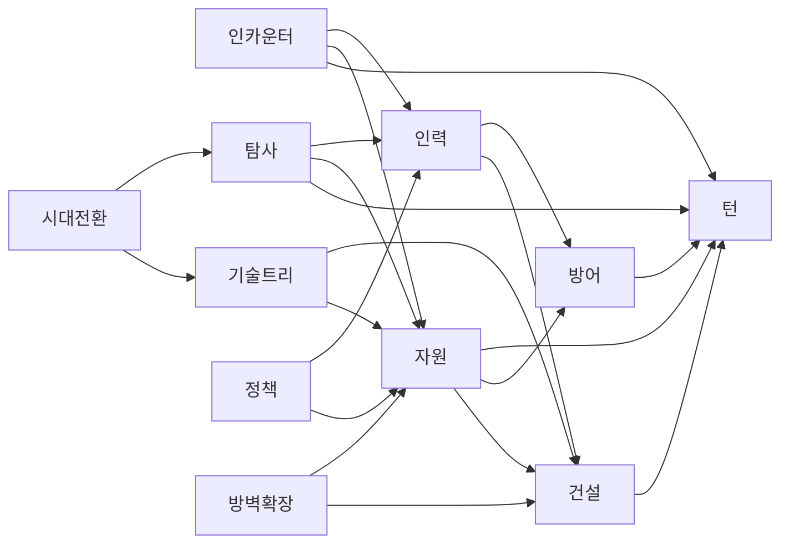

# Project_Sun WBS (Work Breakdown Structure)

- **최종 수정일**: 2026-03-26
- **버전**: v1.1

---

## 1. 프로젝트 개요

| 항목 | 값 |
|---|---|
| 전체 시스템 수 | 10 (9 게임 시스템 + 턴 시스템) |
| P0 (코어) | 건설, 인력 관리, 웨이브 방어, 탐사/원정 |
| P1 (중요) | 인카운터/이벤트, 기술 트리, 정책/법률, 방벽 확장 |
| P2 (후순위) | 시대 전환/메타 진행 |
| 인프라 | 턴 시스템, 자원 시스템 |
| 현재 마일스톤 | M1: 프로토타입 |

---

## 2. 의존성 그래프

### 시스템 간 의존성



### 의존성 매트릭스

| 시스템 | 선행 의존 | 비고 |
|---|---|---|
| 건설 | - | 독립 |
| 턴 | 건설, 방어 | 오케스트레이터 |
| 인력 | 건설 | 건물 슬롯 참조 |
| 자원 | 건설, 인력, 턴 | 경제 기반 |
| 웨이브 방어 | 건설 | DOTS ECS |
| 인카운터 | 턴, 자원, 인력 | 이벤트 효과 적용 |
| 탐사/원정 | 턴, 자원, 인력 | 원정대 파견 |
| 기술 트리 | 자원, 건설 | 해금 시스템 |
| 정책/법률 | 자원, 인력 | 전역 수정자 |
| 방벽 확장 | 건설, 자원 | 슬롯 해금 |
| 시대 전환 | 기술트리, 탐사 | 메타 진행 |

---

## 3. 마일스톤

### M1: 프로토타입
- **목표**: 핵심 루프 동작 — 낮(건설/배치) → 밤(전투) → 다음 낮
- **포함**: 건설, 인력, 방어, 턴, 자원, 인카운터
- **검증**: 15턴 플레이스루 가능, 자원 트레이드오프 체감

### M2: 알파
- **목표**: 전략 깊이 추가 — 탐사, 기술 트리, 정책
- **포함**: + 탐사/원정, 기술 트리, 정책/법률, 방벽 확장
- **검증**: 30턴 시나리오 완주, 재플레이 가치

### M3: 베타
- **목표**: 완성된 게임 루프 — 시대 전환, 희망/불만
- **포함**: + 시대 전환, 희망/불만 게이지
- **검증**: 멀티 시나리오, 난이도 밸런스

---

## 4. 시스템별 WBS

### 건설 시스템 (construction-system)
- **GDD**: Docs/GDD/systems/construction-system.md
- **우선순위**: P0
- **상태**: ✅ 완료

| SF | 서브피처 | 크기 | 상태 |
|---|---|---|---|
| SF-01 | 데이터 모델 + 열거형 | S | ✅ 완료 |
| SF-02 | BuildingSlot 상태머신 | L | ✅ 완료 |
| SF-03 | BuildingManager | L | ✅ 완료 |
| SF-04 | BuildingHealth | M | ✅ 완료 |
| SF-05 | 비주얼 + 테스트 씬 | M | ✅ 완료 |

---

### 웨이브 방어 시스템 (dots-defense-system)
- **GDD**: Docs/GDD/systems/dots-defense-system.md
- **우선순위**: P0
- **상태**: ✅ 완료

| SF | 서브피처 | 크기 | 상태 |
|---|---|---|---|
| SF-01 | DOTS 패키지 + 데이터 모델 | M | ✅ 완료 |
| SF-02 | 적 스폰 시스템 | L | ✅ 완료 |
| SF-03 | 적 이동 시스템 | M | ✅ 완료 |
| SF-04 | 적 전투 + 건물 피해 | L | ✅ 완료 |
| SF-05 | 전투 카메라 + UI | M | ✅ 완료 |
| SF-06 | 사망 이펙트 + 체력바 | M | ✅ 완료 |
| SF-07 | 타워 공격 시스템 | M | ✅ 완료 |

---

### 턴 시스템 (turn-system)
- **GDD**: Docs/GDD/systems/turn-system.md
- **우선순위**: 인프라
- **상태**: ✅ 완료

| SF | 서브피처 | 크기 | 상태 |
|---|---|---|---|
| SF-01 | 데이터 모델 (enums, SO) | S | ✅ 완료 |
| SF-02 | TurnManager 코어 + 시스템 연동 | L | ✅ 완료 |
| SF-03 | ScreenFader | S | ✅ 완료 |
| SF-04 | ToastMessage | S | ✅ 완료 |
| SF-06 | 테스트 씬 + TurnUI | M | ✅ 완료 |

---

### 인력 배치 시스템 (workforce-system)
- **GDD**: Docs/GDD/systems/workforce-system.md
- **우선순위**: P0
- **상태**: ✅ 완료

| SF | 서브피처 | 크기 | 상태 |
|---|---|---|---|
| SF-01 | 데이터 모델 | S | ✅ 완료 |
| SF-02 | WorkforceManager 코어 | M | ✅ 완료 |
| SF-03 | 부상/치료 시스템 | M | ✅ 완료 |
| SF-04 | 건설/방어 연동 | M | ✅ 완료 |
| SF-05 | 턴 시스템 연동 | M | ✅ 완료 |
| SF-06 | 배치 UI + 테스트 씬 | L | ✅ 완료 |

---

### 자원 시스템 (resource-system)
- **GDD**: Docs/GDD/systems/resource-system.md
- **우선순위**: 인프라
- **상태**: ✅ 완료

| SF | 서브피처 | 크기 | 상태 |
|---|---|---|---|
| SF-01 | ResourceManager 코어 | M | ✅ 완료 |
| SF-02 | 건설 시스템 연동 | M | ✅ 완료 |
| SF-03 | 턴 시스템 연동 | M | ✅ 완료 |
| SF-04 | 방어 시스템 연동 | S | ✅ 완료 |
| SF-05 | 자원 UI + 테스트 씬 | M | ✅ 완료 |

---

### 인카운터/이벤트 시스템 (encounter-system)
- **GDD**: Docs/GDD/systems/encounter-system.md
- **브랜치**: feature/encounter-system (PR #8)
- **우선순위**: P1
- **상태**: ✅ 완료

| SF | 서브피처 | 크기 | 상태 |
|---|---|---|---|
| SF-01 | 데이터 모델 (SO, enums) | M | ✅ 완료 |
| SF-02 | BuffManager | M | ✅ 완료 |
| SF-03 | EncounterManager (Pity) | L | ✅ 완료 |
| SF-04 | 턴 시스템 연동 | M | ✅ 완료 |
| SF-05 | UI + 기본 데이터 | L | ✅ 완료 |

---

### 탐사/원정 시스템 (exploration-system)
- **GDD**: Docs/GDD/systems/exploration-system.md
- **PR**: #10 (머지 완료)
- **우선순위**: P0
- **상태**: ✅ 완료

| SF | 서브피처 | 크기 | 상태 |
|---|---|---|---|
| SF-01 | 데이터 모델 (노드, 맵 SO) | M | ✅ 완료 |
| SF-02 | ExplorationManager 코어 (맵, 안개, 이동) | XL | ✅ 완료 |
| SF-03 | 인카운터/전투 연동 | M | ✅ 완료 |
| SF-04 | 턴/자원/인력 연동 | M | ✅ 완료 |
| SF-05 | 탐사 UI + 테스트 씬 | L | ✅ 완료 |

---

### 기술 트리 시스템 (tech-tree-system)
- **GDD**: Docs/GDD/systems/tech-tree-system.md
- **PR**: #9 (머지 완료)
- **우선순위**: P1
- **상태**: ✅ 완료

| SF | 서브피처 | 크기 | 상태 |
|---|---|---|---|
| SF-01 | 데이터 모델 (노드 SO, 카테고리) | M | ✅ 완료 |
| SF-02 | TechTreeManager 코어 | L | ✅ 완료 |
| SF-03 | 건설/방어/자원 연동 | M | ✅ 완료 |
| SF-04 | 턴 시스템 연동 (연구 진행도) | M | ✅ 완료 |
| SF-05 | 기술 트리 UI + 테스트 씬 | L | ✅ 완료 |

---

### 정책/법률 시스템 (policy-system)
- **GDD**: Docs/GDD/systems/policy-system.md
- **PR**: #11 (머지 완료)
- **우선순위**: P1
- **상태**: ✅ 완료

| SF | 서브피처 | 크기 | 상태 |
|---|---|---|---|
| SF-01 | 데이터 모델 (정책 노드 SO) | M | ✅ 완료 |
| SF-02 | PolicyManager 코어 | L | ✅ 완료 |
| SF-03 | PolicyEffectResolver (수정자) | M | ✅ 완료 |
| SF-04 | 시스템 연동 | M | ✅ 완료 |
| SF-05 | 정책 UI + 테스트 씬 | L | ✅ 완료 |

---

### 방벽 확장 시스템 (wall-expansion-system)
- **GDD**: Docs/GDD/systems/wall-expansion-system.md
- **PR**: #12 (머지 완료)
- **우선순위**: P1
- **상태**: ✅ 완료

| SF | 서브피처 | 크기 | 상태 |
|---|---|---|---|
| SF-01 | 데이터 모델 (확장 레벨 SO) | S | ✅ 완료 |
| SF-02 | WallExpansionManager 코어 | M | ✅ 완료 |
| SF-03 | 건설/자원 연동 + 슬롯 해금 | M | ✅ 완료 |
| SF-04 | UI + 테스트 씬 | M | ✅ 완료 |

---

### 시대 전환/메타 진행 (era-transition-system)
- **GDD**: Docs/GDD/systems/era-transition-system.md
- **우선순위**: P2
- **상태**: GDD작성

| SF | 서브피처 | 크기 | 상태 |
|---|---|---|---|
| SF-01 | 데이터 모델 (시대, 기지 SO) | M | 미시작 |
| SF-02 | MetaProgressManager 코어 | M | 미시작 |
| SF-03 | 시대 전환 이벤트 + 연동 | L | 미시작 |
| SF-04 | UI + 테스트 씬 | M | 미시작 |

---

## 5. 병렬 작업 매트릭스

| 조합 | 병렬 가능? | 조건 |
|---|---|---|
| 탐사 + 기술트리 | ✅ | 서로 독립, 공통 의존(자원)은 완료 |
| 탐사 + 정책 | ✅ | 서로 독립 |
| 탐사 + 방벽확장 | ✅ | 서로 독립 |
| 기술트리 + 정책 | ✅ | 서로 독립 |
| 기술트리 + 방벽확장 | ✅ | 서로 독립 |
| 정책 + 방벽확장 | ✅ | 서로 독립 |
| 시대전환 + 기술트리 | ❌ | 시대전환이 기술트리에 의존 |
| 시대전환 + 탐사 | ❌ | 시대전환이 탐사에 의존 |

---

## 6. 진행 현황 요약

```
M1 프로토타입:                   ████████████████████ 100% (36/36 SF)
  건설          ████████████████████ 100% (5/5)  ✅ 완료
  방어          ████████████████████ 100% (7/7)  ✅ 완료
  턴            ████████████████████ 100% (5/5)  ✅ 완료
  인력          ████████████████████ 100% (6/6)  ✅ 완료
  자원          ████████████████████ 100% (5/5)  ✅ 완료
  인카운터      ████████████████████ 100% (5/5)  ✅ 완료 (PR #8)
  탐사          ████████████████████ 100% (5/5)  ✅ 완료 (PR #10)

M2 알파:                         ████████████████████ 100% (14/14 SF)
  기술트리      ████████████████████ 100% (5/5)  ✅ 완료 (PR #9)
  정책          ████████████████████ 100% (5/5)  ✅ 완료 (PR #11)
  방벽확장      ████████████████████ 100% (4/4)  ✅ 완료 (PR #12)

M3 베타:                         ░░░░░░░░░░░░░░░░░░░░  0% (0/4 SF)
  시대전환      ░░░░░░░░░░░░░░░░░░░░   0% (0/4)  GDD작성
```

### 다음 추천 작업
1. → **시대 전환/메타 진행**: M3 유일 남은 시스템, GDD 작성됨 → `/implement` 가능
2. → **통합 테스트 + 밸런스**: M1+M2 전체 시스템 통합 플레이 검증
